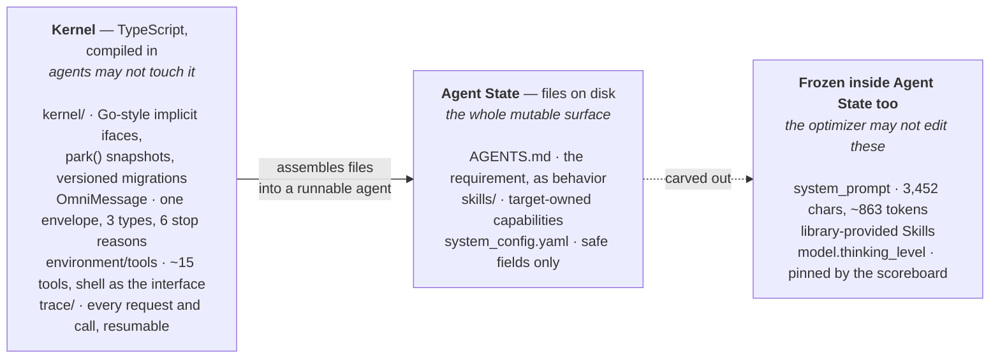
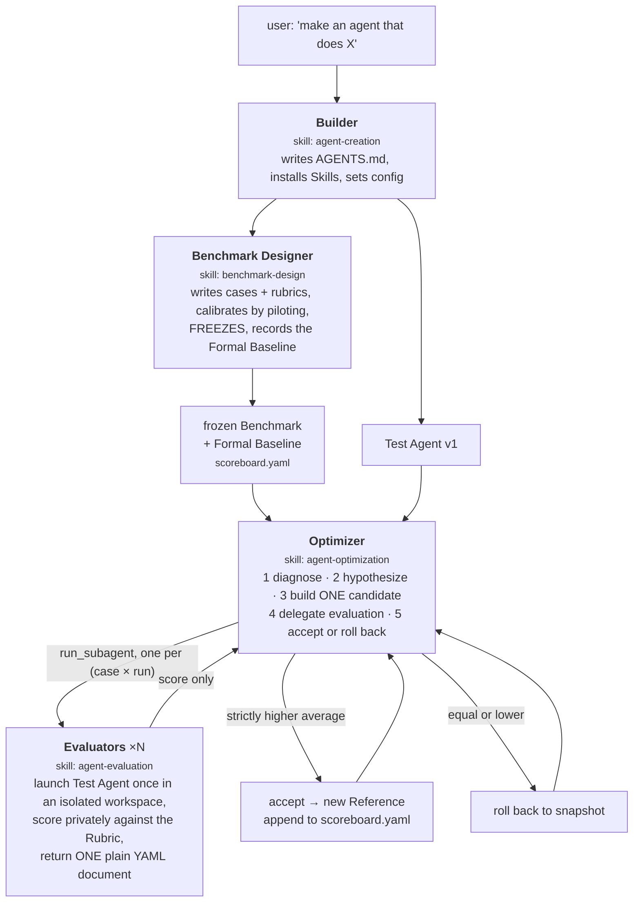

Two posts ago I argued that self-evolving agents split on **where the update is written** — weights or text — and that whether either works depends on the gap between generating an answer and checking one. [Last post](/blog/2026/neolabs-of-self-evolving-agents/) surveyed six labs betting nine figures on that thesis, and found that the ones with the most capital had published the least.

[PenguinHarness](https://github.com/Prism-Shadow/penguin-harness) is the other end of that spectrum: Apache-2.0, 1,583 stars, from the author of LlamaFactory, with the self-evolution loop shipped as four skills you can read in an afternoon. Its GitHub description is three sentences and one of them is the thesis: *"Harness for RSI. Let AI Build AI. Everything is Transparent."*

I read the kernel, all four RSI skills, and the benchmark paper underneath. This is what is actually there.

## TL;DR

**The philosophy is one sentence: the filesystem is the only source of truth.** An agent *is* a directory. Prompts are files, skills are files, config is a file, history is files. The framework's job is to assemble files into a runnable agent object; **creating a new agent is copying a directory.**

**That is not an aesthetic choice — it is the enabling condition for RSI.** If an agent is files, then self-modification is file editing, and every hard safety property of self-modification collapses into a solved problem:

| Self-modification needs | Files give you |
| :-- | :-- |
| a way to undo a bad change | `tar.gz` snapshot per version |
| a record of what changed | a diff |
| a boundary on what may change | path permissions |
| an audit trail a human can read | the files themselves |

**RSI shows up at four places**, and only three of them are automated:

```text
0 → 1     agent-creation      write AGENTS.md + install skills + config     ← automated
the ruler benchmark-design    build cases, calibrate, freeze a baseline     ← automated
1 → 100   agent-optimization  diagnose → patch → evaluate → accept/rollback ← automated
the meta  the harness itself  its own dev skill, its own repo               ← humans, so far
```

**The mechanism that makes it credible is an information barrier, stated as a hard rule.** The Test Agent sees the task statement and never the rubric. The Optimizer sees public statements, scores and traces — and never rubrics, gold answers, or evaluator state. And if private evaluation information leaks into the Optimizer's context, the skill says: **restore the candidate and stop as contaminated.** That is the anti-reward-hacking design, and it is enforced by scoping rather than by good intentions.

**The one gap that matters.** The Optimizer accepts a candidate when its average score is *strictly higher* than the reference. There is no significance test. HarnessBank — the research system from [the previous post](/blog/2026/neolabs-of-self-evolving-agents/) — exists essentially to argue that a paired test is the difference between a real gain and a measurement artifact. PenguinHarness will accept noise; snapshots and rollback bound the damage but do not detect it.

**The most honest number in the whole stack is in their own benchmark paper.** GDPevo's fully-informed oracle ceiling is **91.6%**, and the best evolved agents land far below it. Their own ruler says today's self-evolution captures a modest fraction of what the training experience is worth.

---

## 1 · The bet

> "Changing agents is easy; improving them is hard."

That line, from the project's author, is the whole thesis compressed. An agent is a pile of code and files; editing it is trivial. Making the edit an *improvement* requires a ruler, and a ruler is the expensive part. Everything in this harness is downstream of taking that seriously.

The design consequence is a commitment most frameworks do not make: **nothing that defines an agent is allowed to live in code.** From the project's own contract:

> **Editable files** — An Agent's prompts, Skills and configuration live as editable files on disk, never as constants baked into code. What you can see, the Agent can improve; what you can edit, it can learn.

An agent directory:

```text
agents/<agent_id>/
├── agent_state/
│   ├── system_config.yaml     # the stable system layer — version, model.thinking_level
│   ├── AGENTS.md              # the requirement, as behavior — injected into the system prompt
│   ├── skills/                # target-owned capabilities
│   ├── memory/
│   └── tools/
├── benchmarks/<benchmark_id>/ # cases, rubrics, scoreboard.yaml
├── snapshots/v<N>.tar.gz      # one per accepted version
├── traces/                    # every request and tool call, replayable
└── workspaces/                # isolated per evaluation run
```

Read that layout against the table in the TL;DR and the RSI story writes itself. `snapshots/` is rollback. `traces/` is the audit log. `agent_state/` versus everything else is the permission boundary. The optimizer does not need a special mechanism for any of it.

The counterpart commitment is the **contract** — published as a copyable `CONTRACT.md` on their landing page, which is itself a statement about what they think the artifact is:

> Evolution needs boundaries. The contract is the covenant between harness and Agent: capability grows within; the boundary holds without.

Ten clauses; the ones that carry the RSI weight:

- **Working boundary** — "self-improvement happens only inside Workspace and Skills, while the harness kernel and its safety mechanisms never change."
- **Version control** — "Before each optimization, the Agent State is snapshotted."
- **Full tracing** — every model request and tool call written to the Trace: tokens, duration, failure reason, replayable line by line.
- **Approvals & audit** — every tool call passes approval before it runs.
- **Credential isolation** — keys live in hidden files, move only through system interfaces, "never entering model context."

And the closing line, which is the best sentence on the page:

> The contract does not cap what an Agent can become — only how it gets there.

## 2 · The architecture

Three layers, and the split between the first two is the one that matters.



**The kernel is small and deliberately boring.** `packages/core` is 20,681 lines; the whole monorepo is ~180k across CLI, server, web, desktop, docs and skills. The kernel uses a Go-interface-in-spirit design — a descriptor is pure data (method set + context schema + children shape + migration table), implementations satisfy an interface implicitly, checked at compile time and again at boot by comparing the method set against the returned API object. Every node implements one minimal interface, `park()`, which returns a pure snapshot. Migrations ship with the code, keyed by `fromVersion`, and chain automatically.

That matters for self-evolution for a specific reason: **the thing the contract forbids agents from touching is a component with versioned state and a snapshot primitive.** The boundary is not just a rule; it is drawn around code that already knows how to be checkpointed and migrated.

**OmniMessage is the one protocol.** Every message shares an envelope — `timestamp`, `type`, `payload` — with three outer types: `session_meta`, `model_msg`, `event_msg`. Six stop reasons, and the enum comments are load-bearing:

```ts
export type StopReason = "completed" | "failed" | "aborted" | "timeout" | "malformed" | "auth";
```

`malformed` and `timeout` are the only two that trigger a context-engine reconnect. `auth` is called out as "a `failed`-shaped stop that no in-run retry can fix" — hosts disable input until the key is updated, then the session continues. A protocol that distinguishes *retryable* from *fatal* at the type level is what lets the contract's error-handling clause — "no task dies of a single failure" — be more than a slogan.

Nested sessions are tracked by an `origin` chain of child session ids, ordered outer-to-inner, one hop prepended per forwarding layer. Absent `origin` means the main session. That is how a four-agent RSI run stays legible in one trace view.

**The toolset is deliberately thin.** Roughly fifteen tools: `exec-command`, `read-file`, `write-file`, `edit-file`, `diff`, `read-image`, `describe-image`, `run-subagent`, background and command subsystems. Shell is the universal interface; subagents are treated as a core performance target rather than a feature. I measured the default system prompt: **3,452 characters, ~863 tokens, 37 lines** — against the ~15,000 tokens the project cites for Claude Code. Its whole content is role, personality, success criteria, constraints, stop rules, tool use. No tool tutorials.

## 3 · The RSI loop

Four agents, three of them spawned by the loop itself.



The division of labor is strict and worth spelling out, because each boundary is doing work:

**The Benchmark Designer never runs the Test Agent** and never optimizes it. It writes a *Capability Contract* first — "the observable process to measure, common weaker behavior, and the general Agent State improvement the Benchmark should train" — then plans cases and, per case, privately states *the intended behavior, a plausible shortcut a strong agent might take, and how the case distinguishes them*. That third item is anti-shortcut design done at authoring time. It calibrates by piloting at one run per case, freezes the first valid revision that hits the desired baseline, and stops. **It does not begin optimization.**

**The Optimizer never runs or scores the Test Agent** — "never run or score the Test Agent directly" — it delegates every single `(case × run)` cell to an `agent-evaluation` subagent and assembles the returned matrix.

**Each Evaluator handles exactly one execution.** One case, one run, one score, one protocol document. It launches no subagents, modifies no agent or benchmark, and never writes `scoreboard.yaml`. Its instruction is to "operate silently" — no narration, no headings, no markdown fences, no scoring details.

## 4 · Where RSI actually lives

Mapped onto the substrate framing from two posts ago, everything here is **context-space**: the update is written to `AGENTS.md`, to skills, and to safe config fields. No weights move. Within context-space it spans three of the routes:

| Layer | Skill | Route | What is written |
| :-- | :-- | :-- | :-- |
| 0 → 1 construction | `agent-creation` | scaffold synthesis | `AGENTS.md`, skill installs, `system_config.yaml` |
| the ruler | `benchmark-design` | **verifier engineering** | cases, rubrics, a frozen baseline |
| 1 → 100 improvement | `agent-optimization` | whole-scaffold search (B5) | a candidate diff per round |
| the meta level | `penguin-harness-dev` | — | the harness's own repo, by humans |

Two observations about that table.

**The second row is the unusual one.** In the previous post I argued that verifier engineering dominates method choice — that building a cheap grounded checker for a domain beats picking a better optimizer. PenguinHarness is the only harness I have read that ships **building the ruler** as a first-class automated skill, on equal footing with building and improving the agent. Whether it works is a separate question; that it is treated as a peer of the other two is the correct instinct.

**The fourth row is honest by omission.** The repo has `.agents/skills/penguin-harness-dev/` — a skill for developing PenguinHarness itself, covering the two-repo symlink layout, the CI-parity chain, and which narrow test to run for which change. It is real dogfooding, and its guidance is unusually specific ("do not reach for `pnpm test` by reflex — it is nine packages and ~2500 tests"). But it is a skill *humans and coding agents use on the repo*, not a loop the harness runs on itself. **The meta-improvement layer is a practice here, not a mechanism** — the same place every lab in the previous post also stops.

## 5 · The mechanisms that make it not-fake

This is the part worth reading the source for. Eight guards, in roughly descending order of how much I think they matter.

**1 · The information barrier, with a contamination rule.** The Test Agent's workspace receives `statement/` only — never `rubric/`, gold answers, scoring rules, or evaluator reasoning. The Optimizer is scoped to "the Agent State, public Statements, Scoreboard, and score-linked Test Traces," and explicitly forbidden from inspecting "Rubrics, Gold answers, private scoring conditions, Evaluator State, Workspace, or Trace." Then the clause that turns a policy into a mechanism:

> If private evaluation information enters the Optimizer context, restore the active Candidate and stop as contaminated.

Not "avoid" — *stop*. The loop is designed to fail closed on the one failure mode that would silently invalidate everything downstream.

**2 · Snapshot before edit, and versions that only go up.** Before changing any reference state, `snapshots/v<version>.tar.gz` must exist; reuse it if present, otherwise create it by atomically archiving `agent_state/` while excluding the credential vault, validate the archive, and **never overwrite an existing same-version snapshot**. If snapshot creation fails, stop *before* touching agent state. Candidate versions start at reference+1 and a rejected version is never reused.

**3 · Runtime pinning.** Every scored result must report a `provider`, `model_id` and `thinking_level` equal to the reference runtime. A mismatch does not just discard that cell — it "invalidates the Candidate matrix and stops optimization." The optimizer is forbidden from editing `model.thinking_level` at all, because the scoreboard fixes it. This closes the cheapest possible fake win: improving the score by quietly improving the model.

**4 · Protocol purity, with a beautiful detail.** The worker's response must be exactly one plain YAML document. Narration, headings, code fences and summaries "are not valid protocol." When the response is malformed, the rule is to ask the *same* evaluator to resend clean YAML from its existing result — and:

> do not rerun the Test Agent for a formatting repair and do not extract YAML from the invalid response yourself.

Two failure modes closed in one clause. Rerunning would resample the score; parsing it yourself would let the optimizer interpret its own grader's output. The optimizer is not permitted to become a lossy reader of the thing judging it.

**5 · Accept on strictly higher, else restore.** Not `≥`. Ties roll back.

**6 · Acceptance is recorded separately from whether the hypothesis was right.** Step 3 of the loop demands a *falsifiable* hypothesis — "state which observable decisions or artifacts should change and why," and "a change that only adds analysis steps without predicting a behavioral change is not a useful hypothesis." Then step 7: a higher score accepts the candidate *even when the stated hypothesis was not supported*, and the two facts are reported separately. Score decides; the story is kept as evidence, not as justification.

**7 · Bounded modification scope.** Behavioral guidance goes in `AGENTS.md`; reusable capability goes in a focused, target-owned skill; limits go in safe `system_config.yaml` fields. Not `system_prompt`, not library-provided skills, not the kernel.

**8 · Round accounting that cannot be gamed by retrying.** A round counts only once a candidate has a complete valid evaluation. Corrected requests, validity repairs and evaluation retries do not consume the round limit — but a fully evaluated *rejected* candidate does.

Read together, these are the same instinct as HarnessBank's *"diagnosis proposes, measurement disposes"* — the model owns semantics, deterministic rules own the verdict — arrived at independently and expressed as skill prose rather than as a research pipeline.

## 6 · The ruler

The loop is only as good as the benchmark, and here the benchmark has a paper: [**GDPevo: Evaluating Agent Self-Evolution on Real Business Tasks**](https://arxiv.org/abs/2608.03764), with a [public repo](https://github.com/Prism-Shadow/GDPevo).

<div class="row justify-content-sm-center">
  <div class="col-sm-10 mt-3 mt-md-0">
    
  </div>
</div>

**The problem it names** is the one that makes most self-evolution results unfalsifiable: existing benchmarks ship a test set with no training set, so you cannot tell whether an agent evolved or memorized. This matches the diagnosis in the article that prompted this post — the team spent over half a year on it, and the obstacle was exactly that.

**The mechanism is rule hybridization.** Decompose each enterprise workflow into atomic business rules; distribute *subsets* of those rules across training tasks; recombine them in held-out test tasks. So a test task requires rules the agent met separately during training, in a combination it never saw — which makes a test-time gain **attributable** to training experience rather than to recall.

V1 is 120 tasks in 12 groups, five training and five held-out test per group, across CRM, ERP, finance, healthcare, legal and data-centric workflows. Because the pipeline is fully automated, they regenerated to 240 tasks in 24 groups within two days — offered explicitly as a contamination response, which is the right way to think about benchmark rot.

<div class="row justify-content-sm-center">
  <div class="col-sm-10 mt-3 mt-md-0">
    
  </div>
</div>

**The results are the most useful part, and they are not flattering to the field.** Self-evolution consistently improves held-out accuracy — by up to **16.44 percentage points**. And the best evolved agents remain *far below* the fully-informed oracle ceiling of **91.6%**. The oracle is what you would score if you simply knew the rules; the gap between it and the best evolved agent is the fraction of the available information that self-evolution currently fails to extract.

> A team publishing the ceiling that makes their own product look incomplete is doing evaluation correctly.

## 7 · Against HarnessBank

Both systems evolve a frozen model's scaffold. Both separate the proposer from the measurer. They differ in what they are optimizing *for*, and the differences are instructive rather than a ranking.

| | **HarnessBank** (research) | **PenguinHarness** (product) |
| :-- | :-- | :-- |
| Form | a research pipeline | four skills, in the shipped library |
| Search | Gated Semantic MAP-Elites over (where × why) | one candidate per round from the current reference |
| Diversity | an archive of elites per failure pathology | none — a single reference lineage |
| Acceptance | **paired per-task test, z ≥ 1.96** | **strictly higher mean** |
| Held-out | sealed test split, scored once | held-out lives in GDPevo, not in the loop |
| Anti-hacking | activation beacons, kernel unwritable | information barrier + contamination stop |
| Rollback | git tree of branches | `tar.gz` per version |
| Runs unattended on your laptop | no | yes |

**The acceptance rule is the real gap.** With `runs` samples per case and a decision rule of "strictly higher average," some fraction of accepted candidates will be noise — that is arithmetic, not a criticism of the implementation. HarnessBank exists in large part to argue this exact point, and its answer is a per-task paired test that a mean comparison cannot substitute for. PenguinHarness's mitigations are real but different in kind: multiple runs per case reduce variance, rollback bounds the cost of a bad accept, and the scoreboard records every accepted version so a human can audit the trajectory. What is missing is *detection*.

The reasonable defence is that they are optimizing different loss functions. A research harness must produce a number that survives review; a product must produce a loop a user can run unattended without it destroying their agent. The second problem is better served by snapshots than by significance tests. But the first would cost them very little to add — the scoreboard already stores per-run scores per case, which is exactly the input a paired test needs.

**The diversity gap is the second one.** HarnessBank keeps an elite per failure pathology precisely because greedy single-lineage search collapses; the Darwin Gödel Machine's own ablation shows the same thing. PenguinHarness's loop is single-lineage by construction: each round starts from the current reference. Its escape hatch is instruction rather than structure — "if the current diagnosis is exhausted, use the remaining public evidence and prior attempts to construct a different admissible Candidate," and rejected candidates are explicitly retained as evidence for later hypotheses. That is a reasonable low-cost approximation of an archive. It is not an archive.

## 8 · What I would check before believing the demo

The numbers in the launch article — an agent built for ¥0.2, a score moving 53 → 95 for ¥0.5 — come from videos in a promotional piece, not from a paper. What I can verify from the repository stands up: Apache-2.0, 1,583 stars, 18 shipped skills of which four are the RSI loop, a ~863-token base system prompt, and a benchmark with a paper and a public repo behind it. That is a lot more substance than most projects in this space carry.

Three things I would want before running it on anything I cared about:

**Ask what the significance was, not just the delta.** A 53 → 95 move across rounds is large enough that noise is unlikely to explain all of it. A 78 → 81 will be much more common in practice, and the loop as written will accept it. Read `scoreboard.yaml` — the per-run scores are all there — and check the spread yourself.

**Watch the case count.** Every guard in section 5 is about *validity*, not *power*. A frozen benchmark with few cases and few runs produces a confident-looking scoreboard with wide error bars, and nothing in the loop will tell you that.

**Remember what generalizes.** GDPevo's own finding is that evolved agents sit far below the informed oracle. The loop moves an agent along its benchmark; whether that transfers is what the held-out design exists to measure, and the answer so far is *partly*.

> The best-designed self-evolution loop I have read in a shipping product, missing one line of statistics that its own data already supports. Everything else in it — the file substrate, the contract, the information barrier, the contamination stop — is what the rest of the field should copy.
