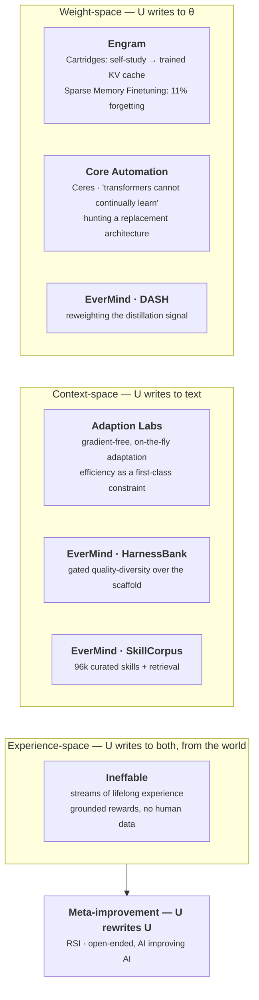
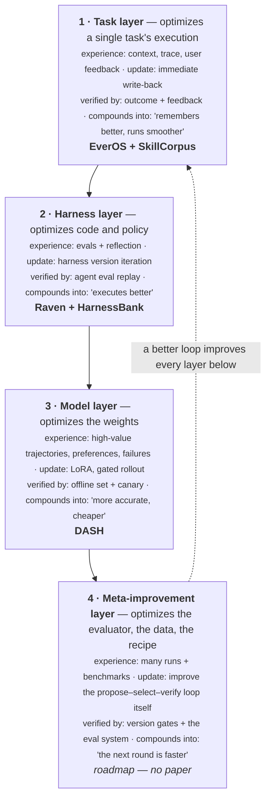

In the [previous post](/blog/2026/two-substrates-of-self-evolving-agents/) I argued that self-evolving agents split on one question — where the update operator writes, into weights or into text — and that the thing which actually decides whether either works is the gap between generating an answer and checking one.

This is the case study. A Chinese team called EverMind published three papers in roughly six weeks, one per layer, and claims the first full-stack answer. Around them, five NeoLabs have raised something north of $900M on adjacent bets with, between them, one public benchmark result. Both halves are worth reading carefully, and for opposite reasons.

## TL;DR

**The landscape.** Five well-funded labs are betting on self-improvement, and every one picked a *different, non-overlapping layer*. RSI ($4.65B) bets on **open-endedness** — AI that improves AI. Ineffable ($5.1B, David Silver) bets on the **Era of Experience** — no human data, grounded rewards. Engram ($600M) bets on **memory in the weights** (Cartridges + sparse memory finetuning). Adaption Labs ($1B) bets **against scaling**, on gradient-free real-time adaptation. Core Automation (~$4B) makes the most aggressive claim of all — **transformers structurally cannot continually learn** — and is hunting a replacement architecture.

**Published technical substance, aggregated across all five: two papers that predate one of the companies, one manifesto, one essay, and one GPU-kernel leaderboard result.** Engram is the outlier — its thesis is fully reproducible today, because its founders published it before founding the company.

**EverMind's actual contribution** is not any single layer — it is *taking all three layers seriously at once and instrumenting them*. Read against the two-substrate framing:

| Their layer | My framing | Paper | What it really is |
| :-- | :-- | :-- | :-- |
| Task / skill | context-space, route B4 | **SkillCorpus** | 821k crawled → 96,401 curated SKILL.md files + a retrieval stack |
| Harness | context-space, route B5 | **HarnessBank** | evolutionary search over the scaffold with statistical gating |
| Model weights | weight-space, route A1 | **DASH** | a free reweighting of on-policy self-distillation |
| Meta-improvement | the frontier | *(none)* | a roadmap slide |

**The best idea in the three papers** is HarnessBank's separation of duties: the LLM diagnoses failures and writes patches; **deterministic code owns every number** — sampling, gating, significance testing, aggregation. Their phrase for it is *"diagnosis proposes, measurement disposes."* Most self-improvement work lets the model be athlete and referee at once, which is exactly how you manufacture hallucinated gains.

**The second-best idea** is what they index the archive on. Not "which task did this fix" but **(where × why)** — which surface the patch touched, and which *failure pathology* it addresses. Search organized by pathology rather than by training-task identity is a structural anti-overfitting bias, and it is why their gains survive a sealed test.

**The most useful negative result** is in SkillCorpus: give two harnesses the *identical* retrieved skills and one realizes 2× the gain of the other. **Skill utility is a joint property of the corpus and the harness**, not of the corpus. If you are building a skill library without instrumenting whether your harness can actually execute what it reads, you are optimizing the wrong half.

**Where the marketing runs ahead of the artifacts.** The source is an authorized promotional piece, and its competitor table is EverMind's own framing. Three checkable gaps: the mem0 star comparison is first-month-vs-first-seven-months presented as a level comparison (mem0 is at 63.7k today against EverOS's 12.3k); the 96,401-skill corpus is released as a **1,000-skill demo**; HarnessBank's code is "available upon acceptance," i.e. not yet.

**What earns them credit anyway.** They ran SWE-bench, got a real-looking +pp on held-out, found it did not clear their own significance bar at n=50, and **reported it as preliminary rather than moving the bar**. That is a costly signal, and it is rarer than it should be.

**The connection nobody frames correctly.** HarnessBank's two baselines are GEPA and the Darwin Gödel Machine. **DGM's author, Jeff Clune, is an RSI co-founder**; so is Promptbreeder's author, Tim Rocktäschel; and RSI's own site names quality-diversity and AI-generating algorithms as its founding heritage. This is not an unknown team versus unproven labs — it is **one algorithmic lineage, where one group published the ablations and the other raised $650M to scale it.**

---

## 1 · The NeoLab landscape

"NeoLab" describes research-first teams spun out of OpenAI, DeepMind, Meta and Cohere, betting on a frontier technique rather than a product. In 2026 the money went overwhelmingly to one thesis: *models that keep improving after deployment.*

Laid side by side, each lab picked a **different, non-overlapping layer** — and their published technical substance varies by two orders of magnitude.

| Lab | Raised / valuation | Layer | Named technical artifact |
| :-- | :-- | :-- | :-- |
| [Recursive Superintelligence](https://recursive.com/) | $650M @ $4.65B | meta-improvement | open-endedness + quality-diversity; kernel SOTA |
| [Ineffable Intelligence](https://sequoiacap.com/article/partnering-with-ineffable-intelligence-a-superlearner-for-the-era-of-experience/) | $1.1B @ $5.1B | experience / RL | the *Era of Experience* manifesto |
| [Engram](https://www.cnbc.com/2026/06/23/ai-memory-startup-focused-on-cutting-token-costs-raises-98-million.html) | $98M @ $600M | weight-space | **Cartridges** + **Sparse Memory Finetuning** |
| [Adaption Labs](https://adaptionlabs.ai/research) | $50M @ $1B | context-space | *The Slow Death of Scaling* + open-world evals |
| [Core Automation](https://app.dealroom.co/news/note/core-automation-eyes-300m-500m-raise-at-4b-valuation-six-weeks-after-launch) | seeking $300M–1B @ ~$4B | architecture | *Ceres* |
| EverMind | Shanda-incubated, early | all three | 3 papers + a 12.3k-star repo |

### Recursive Superintelligence — open-endedness as the engine

**The bet**, in their own words: *"the fastest path to superintelligence will be realized by AI that recursively improves itself, and does so via open-ended algorithms that drive endless innovation."* First target the science of AI itself — AI that improves AI — then port the playbook to every other discipline.

**The stack** is legible from the founder list, and it is not a generic all-star team. Tim Rocktäschel co-invented RAG and wrote **Promptbreeder** and **Rainbow Teaming**. **Jeff Clune wrote the Darwin Gödel Machine**, and before that the AI-generating-algorithms agenda and much of the quality-diversity literature. Alexey Dosovitskiy co-authored ViT; Josh Tobin led ChatGPT Agents, Codex and Deep Research at OpenAI; Yuandong Tian led RL at Meta. Their own site names the heritage precisely: *"open-ended algorithms, quality diversity algorithms, AI-generating algorithms, self-improving coding agents, automated red teaming, generating learning challenges and environments."*

**Evidence.** One public result: state-of-the-art GPU kernel optimization on NVIDIA's official leaderboard. A "Level 1" autonomous training system is targeted for mid-2026.

> The clearest thesis of the six, and the one whose founders wrote most of the prior art the rest of the field benchmarks against.

### Ineffable Intelligence — the Era of Experience, capitalized

**The bet** is a published manifesto: Silver and Sutton's [*Welcome to the Era of Experience*](https://storage.googleapis.com/deepmind-media/Era-of-Experience%20/The%20Era%20of%20Experience%20Paper.pdf), which argues the next leap comes not from human data but from agents that learn continuously by acting. Sutton, on the launch: *"David Silver's new company will fulfil the promise of the Era of Experience."*

**The stack** is that paper turned into four pillars: **streams of lifelong experience** rather than static datasets; **sensor-motor actions** so the agent observes consequences and learns causally rather than correlationally; **grounded rewards** measured against reality rather than human preference; and **non-human modes of reasoning**, on the argument that human data constrains the solution space. World models are central — internal simulation to predict consequences before acting. Silver's word for the target is a *superlearner*.

**Evidence.** None public. What there is instead is a strong prior: this is the person who built AlphaGo and AlphaZero, and AlphaZero is the existence proof that the four pillars can beat human data in at least one domain.

> The most ideologically coherent bet, and the one that most directly refuses the field's current fuel: if you take no human data, you also take no cheap verifier, and you had better be in a domain that supplies its own.

### Engram — memory that lives in the weights

**The bet.** Enterprises re-teach models their context on every single query. Put it in the weights once instead. Their claim: ~100 tokens to answer what costs a frontier model ~100k.

**The stack** is unusually traceable, because the founders published it before founding the company.

[**Cartridges**](https://arxiv.org/abs/2506.06266) (Eyuboglu, Arora, Ré et al.) trains a small KV cache offline per corpus and loads it at inference. Naive next-token training on the corpus does not work; what works is **self-study** — generate synthetic conversations *about* the corpus and train the cartridge with a context-distillation objective. Result: matches in-context learning on long-context benchmarks with **38.6× less memory and 26.4× higher throughput**, extends effective context from 128k to 484k on MTOB, and — the surprising part — the cartridges compose at inference without retraining.

[**Continual Learning via Sparse Memory Finetuning**](https://arxiv.org/abs/2510.15103) (Lin, Zettlemoyer et al.) attacks forgetting. Using memory-layer models, update *only* the memory slots highly activated by the new knowledge relative to their usage on pretraining data, ranked TF-IDF-style. The numbers are the argument: after learning new facts, NaturalQuestions F1 drops **89% with full finetuning, 71% with LoRA, and 11% with sparse memory finetuning** — at the same level of new-knowledge acquisition.

**Evidence.** Two strong papers predating the company, plus early partnerships with Notion, Microsoft and Harvey. Nothing published under the company name yet.

> The most technically specified of the five, and the only one whose thesis you can already reproduce. Its structural constraint is equally specific: writing memory into weights needs white-box access to those weights, which forecloses serving on a frontier API — where most enterprise agent workloads actually run.

### Adaption Labs — betting against scale

**The bet** is contrarian and stated as such: *"We are betting against scaling."* Sara Hooker's essay *The Slow Death of Scaling* argues compute, data and energy constraints are closing off brute force, and that adaptation is the cheaper axis. The product framing is sharper than the research framing: *"Why have we become elevated prompt engineers?"*

**The stack**, from their research page: gradient-free and continual learning, on-the-fly malleable datasets, real-time adaptation. The design commitment I find most credible is treating **latency, memory, cost and energy as first-class design inputs rather than downstream considerations**, and co-designing algorithms against serving constraints. They also list **open-world evaluations** — "the case for long, messy, real-world tasks" — as a research line in its own right, which given the previous post's argument about the measurement crisis is the right thing to be working on.

**Evidence.** An essay and a research page. No papers under the company name.

> The correct diagnosis of where the field's costs are, with the least public evidence that they have solved it. Note that "eliminate prompt engineering" and EverMind's HarnessBank are the same goal reached from opposite directions — one by making the model adapt, the other by making the scaffold evolve.

### Core Automation — the architecture is the problem

**The bet** is the most aggressive claim on this page: **transformers cannot continually learn.** Not "do not yet" — cannot, structurally. So Ceres aims to replace not just the training recipe but the architecture, targeting continual learning with **100× less training data** and weight updates during production operation.

**The stack.** New learning algorithms intended to supersede large-scale pretraining *and* RL; architectures where memory emerges from novel attention mechanisms rather than being bolted on; and — the part I find most telling — **automating kernel generation** to search the architecture space efficiently. That is the same move as RSI's kernel work, used as a means rather than a demo: if you are hunting for a post-transformer architecture, the bottleneck is how fast you can make candidate architectures run fast.

**Evidence.** None. The lab was six weeks old when it sought funding at $4B.

> The highest-variance bet of the six. If it is right, everything above it in this table is a workaround for a fixable architectural defect.

### Two observations the funding numbers obscure

**The field is smaller than it looks — and EverMind is competing inside RSI's lineage, not outside it.** HarnessBank's archive is a gated variant of MAP-Elites, and its two named baselines are GEPA and the **Darwin Gödel Machine**. DGM's author, Jeff Clune, is an RSI co-founder. Promptbreeder's author, Tim Rocktäschel, is an RSI co-founder. RSI's own site lists quality-diversity and AI-generating algorithms as its founding heritage. So the framing of "an unknown Chinese team versus unproven American labs" is wrong twice over: **it is the same algorithmic lineage, and the difference is that one group published the ablations while the other raised $650M to scale it.** Both facts matter, and neither is the one the press release wants you to take.

**Everyone is betting on the same fuel, and only two labs are honest about where it comes from.** In the $$\Delta$$ framing from the previous post, a self-improvement loop runs on the gap between generating and checking. RSI's one public result — kernel optimization — sits in the domain where the verifier is a compiler and a stopwatch, which makes it either the most encouraging datapoint available or the easiest. Core Automation uses the *same* domain, but as infrastructure rather than as a headline. Ineffable's grounded-rewards pillar is a direct statement that the verifier must come from reality. And EverMind's contribution, read at this level, is not a new source of fuel — it is a meter, a gate and an audit log on the fuel line.

## 2 · EverMind's four layers

The framework they present is a four-tier ladder, each tier with its own optimization target, experience source, update action, and verification method. Redrawn:

The framework is well-constructed, and I want to be precise about *why* — because "we have a four-layer stack" is the easiest slide in the world to draw.

What makes it non-vacuous is the fourth column: **each layer names its own verification method, and they are different.** Task layer verifies against outcome and user feedback. Harness layer verifies against replayed agent evals. Model layer verifies against an offline set plus a canary rollout. That is the $$\Delta$$ argument applied per layer — each layer is only as trustworthy as the checker attached to it, and they knew to attach a different one to each.

The honest caveat: **layer 4 has no paper.** The three papers cover layers 1–3. Layer 4 — the loop that improves the loop — is where RSI is aiming and where nobody, EverMind included, has shipped anything.

## 3 · HarnessBank — the harness layer

_Luo, Xue, Wang, Hu, Deng · 2026 · [arXiv:2607.13683](https://arxiv.org/abs/2607.13683) — Semantic Gene-Bank Search with Gated Verification for Agent-Harness Self-Evolution_

  

    
  

**The problem.** In deployment the weights are frozen, so the harness — prompts, injected knowledge, control loop, config — is the only mutable surface. Prior work evolves it with greedy selection over noisy self-generated feedback, which produces three failure modes: search collapse, task-specific overfitting, and gains you cannot verify.

**The bet.** Take the numbers away from the model.

**Method.** Three pieces.

*Partition the surface.* The harness splits into a **kernel** evolution may not touch — the measurement and evaluation code, the self-evolution machinery itself, and the product interface contract — and a mutable surface. A kernel-touching patch is rejected at apply time. Every accepted patch is env-gated and defaults off, so the unevolved harness stays byte-identical to vanilla. This is the detail that makes the whole thing trustworthy: **the agent cannot edit its own grader.**

*Index by pathology, not by task.* Every edit gets a two-axis semantic coordinate. `where` — one of four levers: prompt, knowledge, runtime, config — is bound *mechanically* from the edited file. `why` — the failure pathology it addresses (`method lock-in`, `thinking-runaway`, `premature finalization`, …) — is assigned by the diagnosing model. The archive is a MAP-Elites grid over (where × why), which they call **GSME, Gated Semantic MAP-Elites**, with quality-biased selection plus cross-cell recombination. The archive's substrate is a git tree: each candidate is a branch and a commit with a per-node ledger.

  

    
  

*Gate everything.* Four sequential filters of increasing cost — validity, activation, paired significance, gain. The **activation gate** is the one I had not seen before: every mechanism emits an activation beacon, a ledger records per trial whether it actually fired, and effects on trials where it did not fire are not credited to it. You cannot get paid for a patch that never ran.

**Evaluation.** Seven benchmarks — Terminal-Bench-2, LiveCode, Omni-MATH, BrowseComp+, GDPval, AppWorld, SWE-bench — with the task agent frozen at Qwen3.6-27B and Claude Opus 4.8 as the evolver, against GEPA and DGM. Six domains credited on **disjoint train/sealed-test splits**; the train-selected harness is scored once on the sealed test and never consulted during evolution. Gains of 5.1–15.4pp, every one clearing a per-task paired z ≥ 1.96 on tasks the evolving agent never saw. Sealed lift retains most of train lift with no overfitting collapse, and pass@3 rises too — so the harness expands the solvable set, not just the per-attempt hit rate.

**Why it is clever.** Three things, in ascending order.

The **division of labor** is the headline. The evolver owns semantics — reading trajectories, assigning `why`, authoring patches. Deterministic scripted code owns sampling, gates, aggregation, the paired test. The paper is explicit that the model *"never performs the quantitative judgments; they are computed, not estimated."* Their summary — **"diagnosis proposes, measurement disposes"** — is the single sentence I would put on the wall of anyone building a self-improving system.

The **anti-overfitting bias is structural, not a regularizer.** Because the archive is keyed on pathology rather than on task, what the system learns is *how to fix this class of failure*, not *how to pass these tasks*. And because `why` only steers exploration while credit comes solely from the gate, a wrong diagnosis costs at most a rejected candidate. They demonstrate this rather than assert it: on AppWorld the loop diagnosed a knowledge gap, proposed a knowledge injection, and the gate rejected it — the real bottleneck was capability.

The **cross-model dissociation** is the finding with the longest legs. Cold-started on different frozen models, the loop evolves *different* harnesses, each targeting that model's own dominant pathology. There is no universally optimal harness; there is a **pathology → patch matching law** that repeats across model families. Which means the diagnostic loop is a transferable meta-capability even though its outputs are not.

One ablation deserves its own line, because it kills the obvious objection. Thinking-runaway is the dominant pathology on four of six domains — so is the loop just re-fixing one Qwen quirk? On LiveCode, a 2× larger token budget lifts pass@1 by a little; a blanket thinking-off toggle by a little; the evolved **selective, sticky** recovery policy by substantially more. Neither a bigger budget nor a one-line global toggle reproduces it.

> The most methodologically careful self-improvement paper I have read. Its contribution is less the search algorithm than the audit trail around it.

## 4 · SkillCorpus — the task layer

_Wang, Yao, Sun, Hu, Xiao, Luo, Han, Chen, Sun, Deng · 2026 · [arXiv:2607.15557](https://arxiv.org/abs/2607.15557) — Consolidating and Evaluating the Open Skill Ecosystem for Real-World LLM Agents_

  

    
  

**The problem.** The community `SKILL.md` ecosystem exploded, and the resulting pile is fragmented, redundant and wildly uneven. Prior evidence is contradictory: hand-picked oracle skills help on average with sharply heterogeneous per-domain effects, while *uncurated* community libraries sometimes fail to beat a no-skill baseline at all.

**The bet.** Curation and retrieval are the whole game, and both are measurable.

**Method.** A crawl across a machine-readable registry spanning five ingestion mechanisms — cloned repos, awesome-list scrapes, marketplace index APIs, sitemap crawls, JSON catalogs — yields ~821k raw files. Six stages: parse, length/form, dedup, LLM-judge quality scoring, safety + OSI-licence hard gate, then indexing.

Two design choices are worth extracting.

**Deduplication is the steepest part of the funnel**, in two tiers — an exact tier on content and name fingerprints, then a semantic tier that embeds survivors and adjudicates borderline pairs with an LLM judge. The ecosystem replicates the same artifacts across repositories to a startling degree. This is the unglamorous finding that anyone building on community skills needs: *most of the pile is the same pile.*

**Quality is three independent facets, not one score.** *Utility* scores the description alone — is the task class well-scoped with clear triggers? *Robustness* scores the body and its consistency with what the description promised; a body that is internally coherent but silently narrower than promised is penalized here. *Safety* covers prompt injection, command injection, credential leakage, unsafe execution. Nineteen flags are partitioned across the three; five are **hard gates** that force the score to zero and eject the skill. Their own correlation analysis shows safety is markedly more independent of the other two than they are of each other — a well-crafted skill can still be unsafe, and collapsing these into one number would hide exactly that.

**Evaluation.** Three third-party benchmarks (SkillsBench, GDPVal, QwenClawBench), two independently-developed harnesses (OpenClaw and their own Raven), two open backbones, plus a Claude Opus frontier robustness check — four cells × three benchmarks × two conditions × three runs. Gains on all three benchmarks, largest on SkillsBench at +7.5pp, with task-clustered standard errors so repeated measurements of the same task are not treated as independent.

  

    
  

**Why it is clever.** The paper's real contribution is §4.6, which is about **where it does not work**, and it names two boundaries.

The **coverage boundary** is unsurprising but well-measured: gains track the relevance of the best-retrieved skill, climbing monotonically across retrieval-score bins, and where the corpus lacks a category the gain floors at *zero rather than going negative*. Their read is the right one — this is a supply problem, not a retrieval problem, and the fix is generating or self-evolving the missing skills rather than better matching over what exists.

The **harness boundary** is the one that should change how people build. Both harnesses receive *identical pre-computed skill selections*, and traces confirm both actually read them. Raven realizes roughly double OpenClaw's gain on SkillsBench anyway. Trace inspection suggests why: OpenClaw stops after the reasoning phase — writing scripts it never executes, ending without running the verifier — while Raven completes an execute–verify–fix loop. And the gap *closes* on GDPVal, whose LLM-judged writing tasks reward output quality rather than a verifier-passing loop.

That is a precise, falsifiable mechanism, and it generalizes past this paper: **procedural knowledge converts into measured success only through an execution loop.** A skill library bolted onto a harness that cannot run and check things is a library of good intentions.

> The most useful skills paper because it is the one willing to publish its own ceiling. Note also the self-serving direction of the harness finding — their harness wins — which is exactly why the identical-selections control matters.

## 5 · DASH — the weight layer

_Hou, Tang, An, Zhang, Wang, Han, Li, Hao, Guo, Hu, Wang, Deng · 2026 · [arXiv:2608.06243](https://arxiv.org/abs/2608.06243) — Divergence-Adaptive Supervision Horizons for On-Policy Self-Distillation_

  

    
  

**The problem.** RLVR gives a sparse, sequence-level signal. On-policy self-distillation densifies it: the same model acts as student (sees only the problem) and as **privileged teacher** (also sees the reference solution), and the teacher is queried at the student's own visited prefixes for token-level supervision. But vanilla OPSD assigns *every* local divergence the same coefficient, regardless of position or of what came before it. The same divergence magnitude can follow completely different discrepancy histories, and a local scalar cannot distinguish them.

**The bet.** The temporal structure of the rollout is free information that OPSD is discarding.

**Method.** Map each local signal's gap from the sequence-level mean to an **adaptive propagation gate**, then use those gates to control backward multi-step aggregation. A step whose divergence exceeds the sequence mean is a high-risk fork: open the gate wider, let its supervision propagate further back. Below the mean: narrow the gate. The motivation is a fixed-horizon decomposition showing that the exact gradient contains a trajectory term with future-divergence coefficients, which vanilla OPSD's constant coefficients cannot express — though the paper is careful that this is *structural motivation only*, and DASH does not estimate that term or do future-to-past credit assignment.

**Evaluation.** Qwen3 at 1.7B / 4B / 8B, trained on OpenThoughts-Math-30K, evaluated Avg@12 on AIME 2024, AIME 2025 and HMMT Feb 2025, against seven baselines including GRPO, vanilla OPSD, EOPD, AVSD and PW-OPSD. Four training seeds.

| Average across the three benchmarks | 1.7B | 4B | 8B |
| :-- | --: | --: | --: |
| Base | 37.10 | 61.17 | 61.77 |
| GRPO | 37.70 | 62.70 | 64.00 |
| vanilla OPSD | 41.87 | 63.60 | 64.80 |
| best other baseline | 43.43 | 63.60 | 65.23 |
| **DASH** | **45.07** | **65.00** | **66.40** |

So +1.4 to +3.2 over vanilla OPSD, and +1.2 to +1.6 over the strongest competing baseline at each scale. Consistent, and modest.

**Why it is clever.** The economics, not the size of the gain. **DASH reuses the teacher and student distributions OPSD already computes** — no extra teacher forward pass, no extra student forward pass. The gains are, in compute terms, free. A +1.4pp that costs nothing is a different object from a +1.4pp that costs a training run, and this is the layer where that distinction matters most.

I would also flag the honest reporting: they rerun the baselines themselves rather than quoting published numbers, mark which rows are external, and describe their checkpoint selection as *"best-within-200-step reporting rather than held-out validation selection."* Saying that out loud is unusual.

> The least exciting and most reusable of the three. Anyone already running on-policy distillation can take this and lose nothing.

## 6 · Checking the claims

The source is an authorized promotional piece in a tech outlet, and its competitor comparison table is EverMind's own framing of five rivals. That does not make it wrong, but it makes it checkable. Here is what I checked.

**GitHub, as of writing:**

| Repo | Stars | Created |
| :-- | --: | :-- |
| EverMind-AI/EverOS | 12,295 | 2025-10-28 |
| EverMind-AI/Raven | 3,582 | 2026-05-21 |
| EverMind-AI/MSA | 3,516 | 2025-10-29 |
| EverMind-AI/SkillCorpus | 55 | 2026-08-11 |
| EverMind-AI/EvoAgentBench | 33 | 2026-04-14 |
| mem0ai/mem0 | **63,748** | 2023-06-20 |

**Three gaps worth naming.**

*The mem0 comparison.* The article says EverOS has 12k stars "against mem0's 7k in the same period." The underlying fact is real and impressive — EverOS crossed 10k in roughly a month, which took mem0 about seven. But the sentence as written invites the reader to conclude EverOS has overtaken mem0, and mem0 is at 63.7k today, more than 5× EverOS. Velocity is a legitimate claim; the level comparison is not.

*The corpus.* The paper curates **96,401** skills. What is on Hugging Face is `skillcorpus-demo-1k` — a **1,000-skill demo** — plus a 0.6B embedding model and a 0.6B reranker, each with single-digit downloads. The paper says the dataset will be released upon acceptance, which is normal for a preprint; the article's framing of a shipped 100k-skill library is ahead of the artifact.

*HarnessBank's code.* "Will be publicly available upon acceptance." There is no HarnessBank repo under the org. So the most methodologically interesting of the three papers is currently unreproducible from the outside — which matters more here than usual, because the paper's central claim is *about* verifiability.

*And EvoAgentBench*, described as first in downloads among comparable benchmarks in its launch month, is at 311 total dataset downloads and 33 GitHub stars. The relative claim may well be true; the absolute scale should be read alongside it.

**What earns credit anyway.** HarnessBank ran SWE-bench under the same loop, got a strongly-credited training gain and a held-out lift in the same direction — and then wrote:

> we credit only what the sealed test confirms, and at n=50 even a real effect sits below the paired-z bar; we report SWE-bench as preliminary rather than stretch the bar to fit.

Reporting a seventh benchmark you could have quietly dropped, and refusing to move your own threshold to capture it, is a costly signal. It is the same instinct as SkillCorpus publishing its coverage and harness boundaries, and as DASH describing its checkpoint selection honestly. **The papers are consistently more careful than the press release about them** — which is a much better failure mode than the reverse, and is why I take the work seriously despite the framing around it.

## 7 · What I take from this

**A full-stack claim is only interesting if each layer has its own verifier — and here it does.** The four-layer framework survives scrutiny not because the layers are cleanly separated but because each one names a different verification method. Task layer: outcome and feedback. Harness layer: replayed evals with paired significance. Model layer: offline set plus canary. That is the $$\Delta$$ discipline applied per layer, and it is what separates this from a taxonomy slide.

**Take the arithmetic away from the model.** If you build one thing from these three papers, build HarnessBank's separation: the model diagnoses and proposes, deterministic code samples, gates, tests and aggregates. Add the activation beacon so a patch cannot be credited for a run in which it never fired. This costs a weekend and removes the single largest source of fake self-improvement results.

**Index your archive on failure pathology, not on task.** "How do I fix this class of pathology" generalizes; "how do I pass these tasks" does not. And keep the label advisory — let it steer search, never credit.

**Instrument the harness before expanding the corpus.** SkillCorpus's identical-selection control shows the same skills yielding double the gain through a harness that completes an execute–verify–fix loop. Most teams are building the library. The measurement says build the loop.

**The layer nobody has is layer 4.** Every lab in section 1 with a big valuation is ultimately selling the meta-improvement layer — the loop that improves the loop. EverMind's framework names it and has no paper for it. RSI has raised $650M for it and published one kernel-optimization result. That is the honest state of the frontier: **the layer with the most capital has the least evidence, and the layers with evidence attract the least capital.**

> Three careful papers, one promotional frame, and five labs betting nine figures on the layer none of them has published. Read the papers; discount the table.
