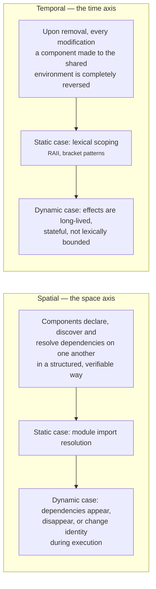
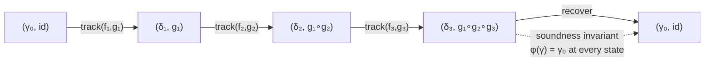
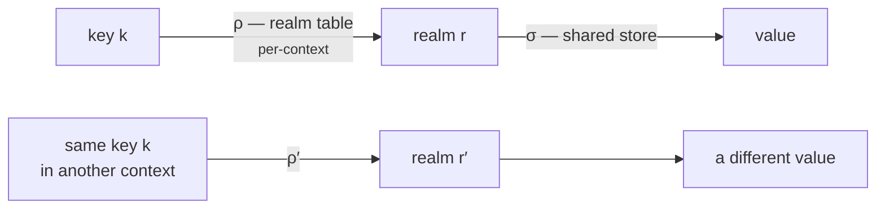
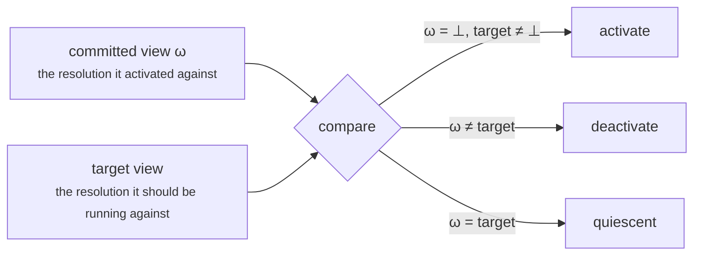
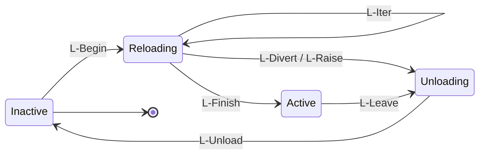
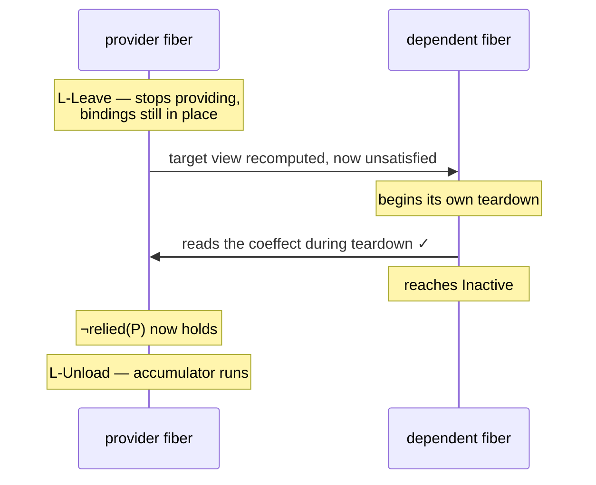

_Yifan Shi, Wei Zhang, Tianyi Cui · Peking University and DeepSeek-AI · 2026 · [cordiverse/paper](https://github.com/cordiverse/paper) — A Programming Paradigm for Spatiotemporal Composability_

## TL;DR

**The problem.** Every plugin system can install. Almost none can *un*install — 87 of VSCode's top 100 extensions need a full host restart to remove. Our universal workaround is "restart the process," which is not a solution but an admission that an abstraction is missing. For a self-evolving agent harness that rewrites its own components while serving traffic, that workaround is a recovery hazard: the thing you would restart is the thing that would perform the recovery.

**The diagnosis.** "Composability" is two problems wearing one name, and each already has a mature static theory nobody thought to run at runtime.

| | Question | Static theory | Static answer | What breaks when dynamic |
| :-- | :-- | :-- | :-- | :-- |
| **Temporal** | can a component's effects be undone? | effect systems | lexical scoping, RAII | effects outlive any lexical scope |
| **Spatial** | can components declare and resolve dependencies? | coeffect systems | module imports | dependencies appear, vanish, change identity |

**The move.** Lift both from compile-time annotations to runtime mechanisms. The entire temporal half is one type:

$$
\mathfrak{E}_\Gamma \mathrel{:=} \Gamma \to \Gamma \times (\Gamma \to \Gamma)
$$

An effect returns the new context **and the function that undoes it**. Tracking is then a monoid homomorphism, so a component's teardown is *computed from* its loading instead of written alongside it — which is exactly what `activate`/`deactivate` pairs fail to guarantee. The spatial half declares dependencies as a specification and classifies every context change as activating / deactivating / neutral, so load order is derived rather than authored.

**The three ideas worth stealing even if you never use the framework.**

1. **Order-insensitive work goes in effects; order-sensitive work becomes a declared dependency.** That single rule is what makes teardown reorderable, and it needs no framework to apply.
2. **The effect system is what makes reactivity well-defined.** Because every mutation passes through an effect function, every change in dependency satisfaction is observable at an effect boundary. Most systems bolt change-notification on the side; here it is a consequence.
3. **A thing can be *typed* as an effect but *realized* without an inverse.** Per-context policy (isolation, interception) derives a child context whose recovery is dropping a reference — which is why it can be reconfigured at runtime without perturbing anything.

**The proof obligation it discharges.** The temporal metatheory needs an assumption — that effects commute — which Section 3.1 cannot supply. Section 3.3 earns it: operations at distinct keys commute outright, so the paradigm's ergonomic discipline ("bind every shared location at its own key") *is* its formal precondition. That is the most satisfying move in the paper.

**The catch.** Inverses are only as good as the system boundary: `write` and `send` push data where no inverse reaches, and compensating actions compose but break the metatheory. The runtime never checks that a supplied inverse actually inverts. Dependency cycles are reportable but their fix costs quadratically many glue components. And linking is by key *name* only, so interface drift and key collision both remain open.

**Why now.** The paper names self-evolving agent harnesses as the validation it most wants — and [DeepSeek Harness](/blog/2026/three-coding-agent-harnesses/) shipped on Cordis the same season, with the agent loop itself demoted to a YAML row. Two of the three authors are at DeepSeek-AI. Theory and product in the same quarter, which is rare enough to note.

---

Composition has a rich theory when it happens at compile time. Function calls, module imports, class inheritance — all resolved before the program runs, all with decades of formal treatment behind them. Composition that happens *while the program runs* has almost none, and we have papered over the gap with a workaround so universal that we stopped noticing it was one.

The workaround is: restart the process.

This paper argues that restarting is not a solution but an admission that the abstraction is missing, and then supplies the abstraction. Its wager, stated plainly:

> The two things dynamic composition needs — undoing a component's effects, and managing its dependencies — are exactly what effect systems and coeffect systems already formalize. They only fail because they were built as compile-time instruments. Lift them to runtime mechanisms and dynamic composability follows as a theorem rather than as a discipline.

Eighty-eight pages later it has a calculus with a metatheory, an implementation called Cordis, and a four-year-old production case study with four thousand community plugins.

## 1 · The bet

The paper stakes everything on one claim about where correctness should live. Two ways to make a plugin system unload cleanly:

**By discipline.** Every plugin author writes an `uninstall` that undoes whatever `install` did. This is what VSCode's `activate`/`deactivate` pair asks for. It fails for a reason the paper names precisely: it *separates effect disposal from effect creation*, so the two drift apart and completeness is unverifiable. Nobody can look at an `uninstall` and know it is complete.

**By construction.** Make every context modification carry its own inverse at the point of modification, and let the runtime compose those inverses. Teardown is then *derived from* loading rather than written alongside it.

The bet is that the second is achievable without destroying ergonomics — and the whole paper is the argument that it is.

The evidence that the first has already failed is quantitative. Of the top 100 VSCode extensions by install count, **87 contain executable code** and therefore require a full extension-host restart to remove. Of those same 100, **only 7 declare a dependency** on a non-built-in extension. The first number says temporal composability does not exist there; the second says spatial composability is not even attempted.

## 2 · Two dimensions

The paper's first move is to split "composability" into two orthogonal axes that the literature had been treating as one.



The pairing with existing theory is immediate once you see it. Effects describe how a computation modifies its environment; coeffects describe how it depends on its environment. Temporal composability is an effects problem. Spatial composability is a coeffects problem. Both bodies of theory exist. Both are static.

### Why the coarse-grained workaround is not enough

The reason nobody noticed the gap is that operating systems and container orchestrators supply a substitute: the OS gives temporal composability at the granularity of a *process*, and Kubernetes gives spatial composability at the granularity of a *service*.

The paper's objection is a granularity mismatch, and it is sharp:

- Temporally, each restart discards all process-local accumulated state — caches, connections, partial computations — and rebuilding takes seconds to minutes. Staying available meanwhile requires redundant replicas: **resource overhead paid to compensate for the inability to recover a single component.**
- Spatially, container orchestration cannot express dependencies between components sharing an address space, and imposes network overhead on what could have been a function call.

Both mechanisms operate at process and container boundaries. Modern systems compose far below that.

### The motivating case that is not a plugin system

Section 1.2.2 names the application that makes this urgent, and it is the reason this paper is worth reading even if you never touch a plugin API:

> A future harness may generate and deploy modifications to its own components while continuously serving requests. […] Because these modifications occur continuously and with limited or no human oversight, dynamic composability becomes indispensable. Without temporal composability, each self-modification forces a full restart that discards all process-local accumulated state; at such frequency the cumulative unavailability becomes substantial […] **even worse, a faulty self-modification can disable the very process needed to recover.**

A self-evolving agent harness is a program that rewrites itself while running. Restart-to-reconfigure is not merely inefficient there; it is a recovery hazard, because the thing you would restart is the thing that would perform the recovery.

## 3 · Revertible effects

Here is the entire idea of temporal composability, as a type:

$$
\mathfrak{E}_\Gamma \mathrel{:=} \Gamma \to \Gamma \times (\Gamma \to \Gamma)
$$

An effect takes a context and returns the modified context **together with the function that undoes it**. That is it. Everything in Section 3.1 is working out the consequences.

### The accumulator

To track effects the paper wraps the context:

$$
\partial\Gamma \mathrel{:=} \Gamma \times (\Gamma \to \Gamma)
$$

A pair $$(\gamma, \varphi)$$ where $$\gamma$$ is the current state and $$\varphi$$ is the **accumulator** — the composite of every inverse applied so far. The initial state is $$(\gamma_0, \mathrm{id}_\Gamma)$$. Tracking and recovery are two one-line definitions:

$$
\mathrm{track}_\Gamma(f, g) = (\gamma, \varphi) \mapsto (f(\gamma),\, \varphi \circ g)
$$

$$
\mathrm{recover}_\Gamma = (\gamma, \varphi) \mapsto (\varphi(\gamma),\, \mathrm{id}_\Gamma)
$$



Note the order. Forward maps compose left-to-right; inverses accumulate in the **opposite** order, so recovery runs LIFO automatically. The paper packages this as the *twisted composition monoid*:

$$
(f_1, g_1) \circ (f_2, g_2) \mathrel{:=} (f_1 \circ f_2,\; g_2 \circ g_1)
$$

and then proves the payoff (Theorem 5): $$\mathrm{track}_\Gamma$$ is a **monoid homomorphism**. Composing two tracked effects equals tracking their composite. This is the formal content of "teardown is derived from loading" — you never write the composite inverse, because the homomorphism computes it.

The quantity $$\varphi(\gamma) = \gamma_0$$ is named the **soundness invariant**, and it holds at every reachable state. A system satisfying it can always get home.

### Two refinements that matter

The naive model fixes the inverse $$g$$ before any state is seen. Two problems, both fixed by moving to *witnessed effect functions* $$\mathfrak{E}_\Gamma^*$$:

**The inverse is chosen per state.** An effect returns $$(\delta, g)$$ with the constraint $$g(\delta) = \gamma$$ — the inverse must undo the effect *where it was applied*, and is unconstrained everywhere else. This matters because real inverses close over what they captured: `close(fd)` needs the specific `fd` that `open` returned.

**Recovery becomes selective.** The output side is lifted too, so one effect can be undone while the others stand — which is what withdrawing one component from a running system actually requires.

### The subtle part: independence

This is where the paper earns its length, and it is the section I would point someone to first.

LIFO recovery is easy. But a running system does not unload in LIFO order. Two situations break it:

1. An inverse runs while **later effects are still in place** — that is exactly what withdrawing one component from a live system means.
2. One sequence **interleaves the effects of several components**, each holding its own inverses, so one component's inverses are separated by another's applications.

In both, an inverse meets a state that foreign effects have moved. Does it still undo what it was built to undo? The accumulator cannot help — it is a single composite that runs everything it holds in one order, all at once.

The answer is a commutation condition. Two effects are **independent** when every transformation of one commutes with every transformation of the other — forward map and yielded inverse alike — and neither disturbs the inverse the other yields. Under independence (Corollary 21):

> Applying the $$n$$ inverses in the order of **any permutation** reaches $$\gamma_0$$.

That is the theorem the whole system rests on. LIFO is one permutation; independence buys you every other one, and with it the interleaved trace of a real multi-component system.

There is a lovely worked example of what independence does and does not cover:

- A key whose value is a **table of entries** — registering a route, adding an event listener — *is* commutative. Two registrations in either order leave a table that answers every test alike, and either can be withdrawn while the other stands.
- A key whose value is an **ordered chain** — middleware — is *not*. Middleware inserted before another sees a different request, and neither order can be withdrawn without disturbing the other.

And the allocator case splits on what the interface publishes: if handles are compared by no operation, $$\simeq$$ may relate two heaps up to renaming and allocation is commutative; if addresses are outcomes compared by equality, no equivalence makes the two allocation orders agree.

## 4 · Reactive coeffects

The spatial half. The coeffect context is a dependent partial function — an IoC container, formalized:

$$
\Sigma \mathrel{:=} (k : K) \rightharpoonup \mathcal{V}_k
$$

Then comes the observation that ties the two halves together. The provision operation is

$$
\mathrm{set}(k,v) = \sigma \mapsto (\sigma[k \mapsto v],\; \lambda\sigma'.\,\sigma' \setminus k)
$$

which has type $$\mathfrak{E}^*_\Sigma$$ — **it is itself a revertible effect**. So dependency registration inherits tracking and recovery for free. As the paper puts it: *coeffect operations are effects, and effects are revertible.* No separate machinery for undoing a service registration; it is the same machinery.

### Notification

A component declares a specification $$d \subseteq K$$. Satisfaction is $$\sigma \models d \mathrel{:=} \forall k \in d.\, k \in \mathrm{dom}(\sigma)$$, which is decidable. Every context change is then classified:

$$
\mathrm{notify}_d(\sigma, \sigma') \mathrel{:=}
\begin{cases}
\text{activating} & \sigma \nvDash d \wedge \sigma' \vDash d\\
\text{deactivating} & \sigma \vDash d \wedge \sigma' \nvDash d\\
\text{neutral} & \text{otherwise}
\end{cases}
$$

The reason this is well-defined is worth stating: *all* mutations to $$\sigma$$ pass through effect functions, whose inverses recover the previous domain. So satisfaction changes are detectable at each effect boundary. The paper calls this "the algebraic basis of reactivity" — **the effect system is what guarantees every coeffect change is observed.** The two mechanisms are not merely compatible; the first is load-bearing for the second.

A component then activates only at a state satisfying its specification, so it never reads an absent binding. Load order is not written down anywhere — it is derived from the dependency declarations.

### Isolation and interception

Two extensions, and the distinction between them is a genuinely nice piece of design.

**Isolation** adds a realm indirection, so the same key resolves to different values in different contexts:

$$
\Sigma^{\mathrm{iso}} \mathrel{:=} (K \rightharpoonup R) \times ((r : R) \rightharpoonup \mathcal{V}_r)
$$



The paper calls this "a runtime ad-hoc polymorphism system," which is exactly right. Multi-tenancy, test doubles and component sandboxes all fall out of one indirection.

**Interception** attaches metadata to dependency *access* without touching the value, merged from context-carried and component-declared sources, right-biased so an enclosing context wins.

The design point sits in Definition 27, which distinguishes an effect's *denotation* from its *realization*:

- **In-place realization** mutates the context and returns a nontrivial inverse.
- **Derived realization** leaves the input intact, returns a fresh child context, and takes the identity as its inverse — recovery just discards the child.

Isolation and interception get derived realization outright. Nothing in the shared table changes, so **there is no inverse to track at all**. Recovery is dropping a reference. This is why interception can be reconfigured at runtime without triggering any reload: it changes how a dependency is invoked, never whether it is satisfied, so it perturbs no part of the dependency graph.

## 5 · The unification, and the trick inside it

Section 3.3 is the paper's conceptual centre. The context type:

$$
\Gamma^\infty \mathrel{:=} \mu\Gamma.\; \Gamma \times (\Gamma \to \Gamma) \times \Sigma
$$

Recursive, self-similar, carrying state, accumulator, and coeffects at once. The $$\partial$$-tower collapses into a single type that effects map to itself. Since the value family $$\mathcal{V}$$ is unconstrained, **any** shared mutable state can be encoded as a coeffect — $$\Sigma$$ subsumes shared state generally, not just inter-component dependencies. Every interaction between a component and its environment passes through one entity.

### Observational equivalence, which is not a technicality

Theorem 7 asserts an *equality* of states after recovery. That is a fiction, and the paper says so:

> `free` releases a block to the allocator without restoring the layout the heap had before `malloc`; and a generative name is not restored by the inverse that discards it, since the next creation draws a fresh one.

So every equality is read up to an observational equivalence $$\simeq$$: two states are related when no observer can distinguish them. What is an observer of a context given to work with? **The coeffects it carries.** Each key arrives with an equivalence of its own, and the relation on contexts is assembled from theirs:

$$
\gamma \simeq \gamma' \mathrel{:=} \sigma_\gamma \simeq \sigma_{\gamma'}
$$

The part of a state that no key binds is *forgotten* — which is precisely what lets the heap layout and the generative name drop out.

Now the move I find genuinely elegant. Section 3.1 leaves independence as an open assumption: a condition on effects, not something the construction provides. Section 3.3.2 discharges it. Theorem 40 shows operations at **distinct keys are independent outright** — each reads and writes one key, and two such maps commute trivially. Theorem 42 extends it: coeffect-mediated effect functions are independent as long as every key where both operate is commutative.

So the discipline "bind every shared location at a key of its own" *buys* the independence hypothesis that the whole temporal metatheory needed. The paradigm's ergonomic rule and its formal precondition are the same rule.

The paper then states what the decomposition actually divides, and this is the sentence to take away:

> The commuting part is carried by the **effects**: a component performs them in whatever order its task calls for, and Corollary 21 reverts them in whatever order the system finds convenient, no two components constraining each other. The order-sensitive part is carried by the **coeffects**, since a key whose operations do not commute is one whose order has to be imposed from outside.

Order-insensitive work goes in effects. Order-sensitive work becomes a declared dependency. That is a design rule you can apply tomorrow, in any language, with no framework at all.

### Where the paradigm sits

The paper positions itself against two poles:

| | Effects | Coeffects | Cost |
| :--- | :--- | :--- | :--- |
| **Explicit state threading** (functional) | State monad threads $$S \to (A, S)$$ | — | Every function in the chain carries the state even when passing it through; monad stacking proliferates |
| **Implicit mutation** (imperative/OOP) | React's `useEffect` — target and registration are invisible, identified by call-order position in hidden runtime state | Spring's `getBean(...)` — process-wide registry, null checks and casts at each call site | Understanding what `f()` does requires reading it transitively |
| **Context paradigm** | `ctx.effect(cb)` | `ctx.get(k)` / `inject` | One explicit context parameter |

The claim is that routing both directions through one explicit `ctx` gives the traceability of the functional pole with the ergonomics of the imperative one: every operation is attributable to the context it was invoked on, and hence to the component that context belongs to.

## 6 · The calculus

Sections 3 establishes both properties in *local* form — read of one component's effects taken alone. Section 4 carries them to a whole system of interleaved components.

A **component** is a triple:

$$
\mathfrak{C}_\Gamma \mathrel{:=} \mathfrak{D}_\Gamma \times \mathfrak{P}_\Gamma \times \mathfrak{E}^*_\Gamma
$$

what it *reads* ($$d$$, the specification), what it *writes* ($$p$$, the provision), and what it *does* ($$e$$, the witnessed effect function). Reads and writes are the two directions of one interface.

A **fiber** is one instantiation of a component, carrying its own lifecycle state. Fiber names are atoms — no rule computes one or inspects its structure — which is the standard discipline of dynamically created local names, used here for identity that survives mutation.

### The comparison that drives everything

Every rule in the calculus fires on one comparison. Each fiber holds a **committed view** $$\omega$$ — which fiber provided each declared key at the moment it activated. Against that stands the **target view**:

$$
\mathrm{target}_n(\gamma) \mathrel{:=}
\begin{cases}
\bot & \text{if } \tau_n \vee \neg(\gamma \vDash d_n)\\
(k \in d_n) \mapsto \mathrm{provider}_k(\gamma) & \text{otherwise}
\end{cases}
$$



Recording a *provider* rather than a *value* is the detail that makes this work: a different fiber providing an equal value would otherwise compare equal, and the replacement would go unnoticed.

Everything answers to exactly two things — retirement, and coeffect resolution. Nothing else can move a fiber.

### Five rules, then four realities

The base calculus assumes each transition is **atomic, immediate, and infallible**. Five rules: `O-Insert`, `O-Retire`, `O-Remove` for the orchestrator; `L-Reload` and `L-Unload` for the lifecycle. Section 4.3 then drops all three assumptions plus adds one thing Section 3.2 required but the base calculus could not express.



**Withdrawal** is the subtlest, and it is the piece I would call the paper's best engineering. The requirement sounds obvious — a dependency must not withdraw until its dependents have deactivated — but the reason is not:

> A component being torn down because its provider is going away is running its own teardown code, which may need the very coeffect that is being withdrawn; closing a connection pool typically means handing the connections back to whatever provided them.

The base calculus removes the provisions and runs the inverse in *one step*, leaving no interval for a consumer's teardown to occupy. So the step is split:



`L-Leave` records the decision to deactivate **without acting on it**. The fiber stops providing, dependents notice and start their own teardown, and only when `relied(n)` is false does `L-Unload` run the accumulator. The consumer can read the dying dependency throughout its own death.

**Iteration** admits effects that yield inverses progressively, checked at each boundary — so a target change mid-transition rolls back partially rather than not at all. **Asynchrony** adds *inertia*: once launched, an iteration lands and its landing cannot be declined, so a target change during flight must be answered by deactivating afterwards rather than by aborting. **Failure** routes a raise into `Unloading` carrying the error, so the accumulator built up to the failing step still runs — the fiber arrives at `Inactive(ξ)` **having installed nothing**. A failure is recorded per fiber rather than propagated to the parent, so a failing component leaves its siblings running.

### The metatheory

Five results, and what each one buys:

| Result | Statement | What it licenses |
| :--- | :--- | :--- |
| **Preservation** (Thm 59) | Well-formed registries stay well-formed | The tree and the single-provider discipline are invariants |
| **Recovery exactness** (Thm 61) | Applying $$n$$'s accumulator yields the state those same steps would have produced had $$n$$ never begun | A departing fiber's contribution is exactly nothing |
| **Ordering** (Thm 63) | A fiber begins a transition only where its dependencies are provided, and reads the same bindings for as long as it is loaded | Teardown can use its dependencies |
| **Progress** (Thm 66) | No deadlock, and $$S(n) \le (K+4)(V(n)+1)$$ | Every maximal sequence ends quiescent — reconfiguration terminates |
| **Confluence** (Thm 73) | Any two sequences taking the same orchestration steps reach $$\simeq$$-related states | **The quiescent state is a function of the final configuration alone** |

Confluence is the one with practical teeth. It says the order in which you apply configuration changes does not matter: the system quiesces where a load of the final configuration from scratch would have left it. That is what makes incremental reconciliation sound, and it is why the loader can rebuild one entry without reasoning about the rest.

## 7 · Cordis

The implementation is three tiers: core library, component loader, and application frameworks on top. What I appreciate is that the paper prints the correspondence table rather than gesturing at one:

| Theory | Implementation |
| :--- | :--- |
| $$\Gamma^\infty$$ | `ctx`, the first-class context |
| $$\mathfrak{E}_\Gamma$$, $$\mathfrak{E}^{\mathrm{iter}}_\Gamma$$ | effect callback returning / yielding inverses |
| $$\mathrm{effect}_\Gamma(e)$$ | `ctx.effect(callback)` |
| $$\Sigma$$, $$\Sigma^{\mathrm{iso}}$$, $$\Sigma^{\mathrm{inter}}$$ | `ctx[@@store]`, `ctx[@@isolate]`, `ctx[@@intercept]` |
| $$d : \mathfrak{D}_\Gamma$$ | `fiber.inject` |
| $$e : \mathfrak{E}^*_\Gamma$$ | `fiber.apply` |
| accumulator $$g$$ | `fiber.dispose` |
| $$\omega$$, committed view | `fiber.committed` |
| $$\mathrm{target}(\gamma, n)$$ | `fiber.target`, recomputed by `refresh` |
| `L-Leave` | `refresh` marking the fiber `UNLOADING` |
| guard on `L-Unload` | `unload` awaiting the notified dependents |

Every context mutation flows through **one primitive**, `ctx.effect`. Coeffect provision, component instantiation, everything. Two details in its construction are worth extracting:

**Self-disposal.** The returned `dispose` flips an `armed` flag which is also the iteration guard, so disposing simultaneously halts any in-flight iteration and makes recovery fire at most once. The reason given is exact: *firing twice would apply an inverse at a state no application of the effect produced, where nothing holds it to reverting anything.*

**Parent composition.** `dispose` is prepended to the enclosing context's accumulator, so a child effect's inverse is itself an effect on the parent. That is $$\partial^2\Gamma$$ made operational, and it is what makes unloading a parent cascade to its children with no cascade logic anywhere.

### The proxy is a capability system

`ctx.get(key)` is a plain store lookup that never fails. But Cordis also exposes coeffects as *properties* — `ctx.tools` — through a Proxy, and the trap does something different:

```
resolve(ctx, key):
    fiber ← ctx.fiber
    repeat
        if key ∈ fiber.committed then return fiber.committed[key]
        if key ∈ fiber.inject   then throw INACTIVE_ACCESS
        if fiber = root         then throw UNDECLARED_ACCESS
        fiber ← fiber.parent.fiber
```

It resolves against the accessing fiber's **committed view**, not the store, and enforces the specification at the point of use. Two consequences fall out. Reading the view is what keeps a dependency readable to a component whose teardown was triggered by that dependency going away — Theorem 63, operationally. And an undeclared access is *rejected*, which the paper notes is structurally capability-based security: `inject` is a capability request, the proxy is the capability mediator, and because requests are declared statically the orchestrator can review and approve the full set before the component runs.

### HMR without acceptance boundaries

The nicest practical payoff. Webpack and Vite need developer-annotated `accept` boundaries because the bundler cannot know what a module's side effects were. Cordis needs none:

> Because a fiber already bounds all of its component's effects and coeffects, a module that is itself a component can be replaced through fiber operations alone: disposing the old fiber recovers everything the component installed, and a new fiber instantiated from the reloaded module reinstalls it.

The engine classifies changed modules to a fixed point (accepted once an import is accepted, declined once all imports are declined, cycles default to declined), detects stale entries, and reloads transactionally with a cache backup so a syntax error rolls the whole swap back rather than leaving a half-reloaded process.

### Koishi

Four years, 4000+ community plugins, an open ecosystem of independently authored code. Two claims it substantiates:

**Expressiveness.** Koishi's server *and* its web console are two independent Cordis applications — one composing server primitives, one composing browser and UI primitives. The model fixes how effects and coeffects compose while leaving their meaning to the application, so it presupposes neither a domain nor a runtime.

**Composition across authors.** The point that matters most: *a plugin and its dependencies are typically written by different authors who coordinate on nothing beyond the coeffect that connects them.* Reactive coeffects keep the assembly consistent across contributors who never speak.

The threats-to-validity paragraph is honest — single ecosystem, single language, observational rather than controlled, an existence-and-adoption result rather than a quantitative one. Overhead and productivity against a baseline remain unmeasured.

## 8 · What I find most elegant

Four things, ranked.

**1 · Independence is bought, not assumed.** Section 3.1 needs a commutation hypothesis and cannot supply it. Section 3.3.2 supplies it from the coeffect discipline — distinct keys commute outright, so "bind every shared location at its own key" is simultaneously the ergonomic rule and the formal precondition. A paper that needed an assumption and then earned it three sections later.

**2 · The effect system is load-bearing for the coeffect system.** Reactivity is well-defined *because* all mutations pass through effect functions, so every satisfaction change is observable at an effect boundary. Most frameworks would have bolted a change-notification mechanism on the side. Here it is a consequence.

**3 · Denotation versus realization.** Isolation and interception have the type of context transformations but take derived realization — fresh child context, identity inverse, recovery is dropping a reference. Recognizing that a thing can be *typed* as an effect while being *realized* without any inverse is what makes per-context policy free.

**4 · `L-Leave`.** Splitting deactivation into "stop providing" and "run the inverse", with `relied(n)` guarding the gap. It exists because a connection pool's teardown needs the very thing being withdrawn. That is a bug you only find by shipping, and the paper found it and then gave it a rule.

An honourable mention for the failure design: `L-Raise` routes into `Unloading` so **every outcome is reachable only through `L-Unload`**, which is the single fact preservation turns on. Making the error path the normal path is why the metatheory stays small.

## 9 · What is left open

The paper is unusually forthright about its edges.

**The system boundary.** Every inverse is only as good as the boundary. A location is *inside* when the system can modify it exclusively and restore it; *outside* when either ability fails, in which case the operation acts as $$\mathrm{id}_\Gamma$$ and is neither tracked nor recovered. Operations reaching outside split into **acquisition** (installs a record inside the boundary — `open`, `malloc`, `fork` — and is revertible) and **emission** (pushes data through the channel — `write`, `send` — and is not). Recovery from an emission needs either withholding (the output-commit problem) or compensation, and while compensations compose LIFO like inverses, **the metatheory does not transfer**: commutation was proved against $$\simeq$$ and must be re-established against the coarser equivalence.

**No verified witness.** `ctx.effect` does not check that the supplied inverse actually inverts. That obligation sits with the component author; Theorem 61 is where the calculus appeals to it.

**Cycles cost quadratically.** A dependency cycle leaves both components permanently inactive — better than deadlock, since it is predictable from declarations alone and reportable at load time. The fix is decomposing bidirectional interaction into unidirectional bindings, but for $$n$$ mutually interacting components the integration components can grow quadratically. The paper is candid that mitigating this is engineering (bundling, convention-based wiring, scaffolding), not theory.

**Nominal linking only.** A dependency is established by key identity, which admits two failure modes: **interface drift** (provider changes the interface, key stays the same, satisfaction holds but the value no longer conforms) and **key collision** (two unrelated providers pick the same name). Three partial answers are surveyed — key namespacing, peer dependencies (what Cordis does today, limited by unenforceable semver and single-version resolution), structural compatibility (language-agnostic but undecidable once bounded quantification enters) — and unified into none.

## 10 · Why this lands now

There is a straight line from this paper to what I was reading last week.

The paper names self-evolving agent harnesses as its motivating case in Section 1.2.2 and returns to them in the conclusion as the *future validation* it most wants:

> Applying Cordis in such a setting would validate the temporal guarantees of complete recovery under rapid component replacement, as well as the spatial guarantees of dependency coordination under frequent topological change.

That validation already shipped. [DeepSeek Harness](/blog/2026/three-coding-agent-harnesses/) is built on Cordis, with 227 packages in which the model adapter, the tool registry, the session log and **the agent loop itself** are ordinary plugins — the loop is a row with an `id` in a YAML file. Its per-agent scoping is coeffect isolation with a parent chain. Its guarded tool pipeline is a chain of interception points. Its hot module replacement is `@cordisjs/hmr` mounted as a config row, working for exactly the reason Section 5.2.2 gives.

Two of the three authors are at DeepSeek-AI. The paper is dated 13 August 2026; the harness is at `0.1.1-rc.1`. This is theory and product shipping in the same season, which is rare enough to note.

Whether the bet pays is still open — the harness is a developer preview, and the paper's own threats-to-validity apply doubly to a system with no users yet. But the shape of the claim is the interesting part, and it is falsifiable in a way most architecture papers are not: if a harness can rewrite its own components while serving requests, and recover completely when one of those rewrites is wrong, the calculus was worth the eighty-eight pages.

> Every plugin system ever built has an `install`. The ones that work have an `install` from which the `uninstall` can be computed.
