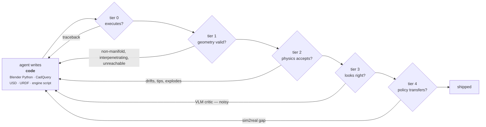
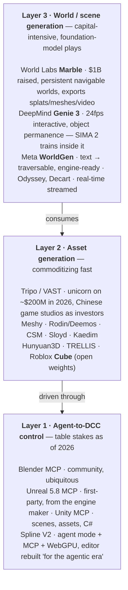
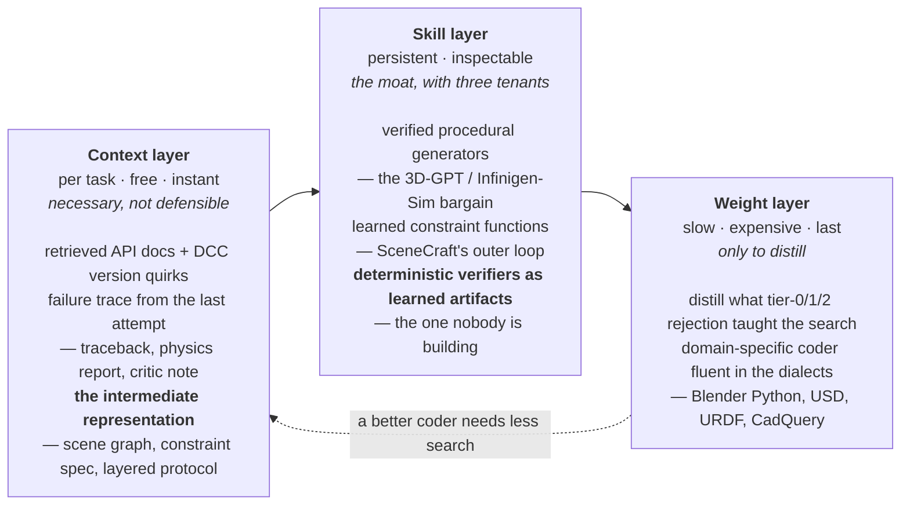

Three posts ago I argued that every self-improving agent runs on one quantity:

$$
\Delta \;=\; \text{cost}(\text{generate a good answer}) \;-\; \text{cost}(\text{recognize a good answer})
$$

When $$\Delta$$ is large the loop compounds; when it goes to zero the loop drifts. Code self-improves because a test suite is free. Open-ended writing does not, because checking is as hard as writing.

**Programmatic 3D has the largest $$\Delta$$ of any generative domain I know of**, and almost nobody frames it that way. The output is code. Code either executes or it does not. Geometry is either manifold or it is not. A scene either survives being dropped into a physics engine or it explodes. A policy trained on it either transfers or it does not. That is four free or cheap verifiers stacked on top of each other, and they catch different classes of failure.

This post maps who is doing what across two downstreams that pull on the same core — **content** (games, interactive film-games) and **embodied** (simulation environments, policy brains) — and argues that they are the same technical problem separated by which rung of the ladder binds.

## TL;DR

**The asset is a ladder, not a metric.** Five verifiers, ordered by cost:

| Tier | Verifier | Cost | Catches | Misses |
| :-- | :-- | :-- | :-- | :-- |
| 0 | does the code run? | free, binary | syntax, API misuse | everything else |
| 1 | is the geometry valid? | free, deterministic | non-manifold, interpenetration, unreachable placement | intent |
| 2 | does physics accept it? | cheap, deterministic | instability, floating objects, bad mass/joints | semantics |
| 3 | does it look/behave right? | VLM, **noisy** | semantic mismatch | its own errors |
| 4 | does a trained policy transfer? | expensive, **ground truth** | everything | nothing, but too slow to loop on |

**The two downstreams weight the ladder differently, and this is the whole strategic story.** Content binds on tier 3 — *does it look right, is it fun* — which is the one noisy rung. Embodied binds on tiers 2 and 4 — *does it stand up, does the policy transfer* — which are grounded. **Embodied has better fuel for a self-evolving agent than content does.** Content is a better business today; embodied is a better loop.

**The frontier is not tier 0 and it is not tier 4. It is the silent-failure gap between tier 1 and tier 3.** Two 2026 papers name it precisely. V-CAGE: language-driven programs *"frequently succeed without satisfying task semantics."* SimWorlds: *"verifying motion correctness from rendered video is fundamentally harder than judging a single image."* Whoever builds cheap deterministic verifiers for *dynamics and semantics* — not renders, not execution — owns the rung everyone is currently skipping.

**The layer everyone is racing for is not the one that is scarce.** Asset generation is commoditizing fast (Tripo/VAST at unicorn, Meshy, Rodin, CSM, Sloyd, Hunyuan3D, Roblox's open-sourced Cube). World models are getting a billion dollars a company (World Labs, Genie 3, Cosmos). Both are foundation-model plays. **The orchestration-and-verification layer between them has almost no dedicated players**, and it is the layer that turns either into something a downstream can actually ship.

**The single most on-thesis paper for anyone doing self-evolving coding agents in 3D is two years old.** SceneCraft (2024) already ran a **dual loop**: an inner loop that revises one scene against a critic, and an **outer loop that learns a reusable function library** from what worked. That is context-layer and skill-layer self-evolution in a 3D DSL, published before either term was fashionable. Very little since has improved on the outer loop.

---

## 0 · The ladder

Read it as a cost gradient. Tiers 0–2 are **free, deterministic, and unlimited** — you can run them thousands of times inside an inference-time search. Tier 3 costs a model call and is wrong sometimes. Tier 4 costs a training run and is the only one that is actually the objective.

The design principle that falls out: **push as much rejection as possible down to tiers 0–2, because those are the rungs where more compute buys more correctness.** Any failure class you can move from tier 3 to tier 1 is a permanent multiplier on how far the loop can search.

## 1 · Line A — programmatic 3D for content

### 1.1 · The code-as-scene lineage

The research line that matters here treats a DCC application as the runtime and the LLM as a program synthesizer against its API. Four generations, and the arc is worth seeing as one thing.

#### 3D-GPT

_ANU / Adelaide · 2023 · [arXiv:2310.12945](https://arxiv.org/abs/2310.12945) — Procedural 3D Modeling with Large Language Models_

  

    
  

**The move.** Do not generate geometry; generate *calls into a procedural generator*. 3D-GPT sits on top of Infinigen's Python-Blender function library and splits the work across a task-dispatch agent, a conceptualization agent that enriches an underspecified instruction, and a modeling agent that picks and parameterizes functions.

**Why it matters to this thesis.** The output space is a **typed API, not free-form geometry**. That collapses tier 1 almost entirely: if the function ran with valid parameters, the geometry is valid by construction, because a human wrote the generator. The trade is that you can only make what the library can make.

> The cheapest possible way to buy tier-1 correctness: make the action space something a human already verified.

#### SceneCraft

_Google DeepMind / Michigan · 2024 · [arXiv:2403.01248](https://arxiv.org/abs/2403.01248) — An LLM Agent for Synthesizing 3D Scene as Blender Code_

  

    
  

**The move.** Two loops. The **inner loop** builds a relational scene graph from the query, turns spatial relations into numerical constraints, writes a Blender script, renders it, and revises against a vision critic. The **outer loop** takes what worked and updates a **library of reusable spatial-skill functions** — the paper's own example is refining a `parallelism_score` constraint function.

**Why it matters.** This is the exact architecture of a self-evolving agent, in 3D, before the vocabulary existed: the inner loop is inference-time refinement, the outer loop is **skill-layer** persistence. In the substrate framing from [an earlier post](/blog/2026/two-substrates-of-self-evolving-agents/), the library *is* the improvement, written to text, re-read on every subsequent scene.

**The gap.** The critic is a render-based VLM — tier 3. So the outer loop is learning against the noisiest rung. Everything I would build on top of this starts by moving that critic down to tier 1.

> The most on-thesis paper in the whole content line, and the one whose outer loop nobody has meaningfully improved.

#### SimWorlds

_2026 · [arXiv:2607.01766](https://arxiv.org/abs/2607.01766) — A Multi-Agent System for Dynamic 3D Scene Creation_

  

    
  

**The move.** Extend text-to-scene from static to **dynamic 4D** — flowing liquids, particle emitters, cascading rigid bodies, articulated mechanisms — with a planner-coder-reviewer workflow over a fixed ordered construction sequence.

**Why it matters — and this is the sentence to underline.** The paper states the verification problem exactly:

> verifying motion correctness from rendered video is fundamentally harder than judging a single image

Their answer is two mechanisms that are *not* renders: a **deterministic verifier** over a layered scene protocol, and a **runtime-state inspection tool suite** that catches mechanism failures the rendered image cannot reveal. They ship `4DBuildBench` to measure both visual fidelity and physical consistency.

> The first content-side paper I have read that treats tier-1 verification as the research contribution rather than as plumbing.

**Also in this lineage.** [Infinigen](https://arxiv.org/abs/2306.09310) (Princeton) is the substrate several of these stand on — hand-written procedural generators for Blender with exact ground truth, and the argument that procedural beats sampled when you need labels. *BlenderAlchemy* iteratively refines materials under VLM feedback. *LL3M* composes planner, retrieval and coder agents over a Blender RAG knowledge base. *SceneAssistant* ([arXiv:2603.12238](https://arxiv.org/abs/2603.12238)) adds visual feedback for open-vocabulary generation. *DI-PCG* ([arXiv:2412.15200](https://arxiv.org/abs/2412.15200)) runs the inverse direction — diffusion to recover procedural parameters from an image, which is the missing half of any library-learning loop.

### 1.2 · The parametric branch — where tier 1 is already solved

CAD is the same problem with a much better-behaved verifier, and it is worth watching precisely for that reason.

**The setup.** Generate an executable parametric program — CadQuery, a B-Rep operation sequence — rather than a mesh. The kernel then tells you, for free and deterministically, whether the solid is valid, watertight and manufacturable. **Tier 1 is a solved, shipped, industrial-grade verifier.**

**The benchmarks are unusually honest about the state of it.** [BenchCAD](https://arxiv.org/abs/2605.10865) contains **17,900 execution-verified CadQuery programs** across 106 industrial part families, and its headline finding across 10+ frontier models is the one that generalizes to all of line A:

> current systems often recover coarse outer geometry but fail to produce faithful parametric CAD programs

Failure modes named: missing fine 3D structure, misinterpreting engineering parameters, and replacing essential operations — sweeps, lofts, twist-extrudes — with approximations. That is a *program-structure* failure that a render will never catch and an execution check will never catch. It is exactly the tier-1-to-tier-3 gap, in the domain that has the best tier-1 verifier available.

**The rest of the branch.** [Text2CAD-Bench](https://arxiv.org/abs/2605.18430) establishes text-to-parametric baselines. *CAD-Coder* adds chain-of-thought plus geometric reward RL for code validity; *CADCodeVerify* and *CAD-Llama* work the refine-and-validate loop. [Zero-to-CAD](https://arxiv.org/abs/2604.24479) synthesizes interpretable CAD programs at million-scale **without real data** — a synthetic-data play that only works because tier 1 is free. [Embodied CAD](https://arxiv.org/abs/2606.31252) grounds LLM agents in the solver itself for B-Rep assembly. [TOOLCAD](https://arxiv.org/abs/2604.07960) adds RL over tool use. On the product side, **Zoo** (KittyCAD) is the one shipping a GPU-native geometric kernel behind text-to-CAD with real B-Rep out.

> If you want to know what programmatic 3D looks like once tier 1 is free, read the CAD papers. The answer: the bottleneck immediately moves to program *structure*, and nobody has a cheap verifier for that yet.

### 1.3 · The product landscape

Three layers, and they are consolidating at very different speeds.

**Layer 1 stopped being a differentiator in 2026.** Every major DCC and engine now ships or has an MCP server — Unreal 5.8 from Epic itself, Unity first-party, Blender by community consensus, and Spline rebuilt its whole editor around agent mode. One survey line captures the situation better than any market map:

> The interesting competition in 2026 isn't MCP versus something else; it's how well each server closes the loop between what an agent did and what it thinks it did.

That is a verification statement dressed as a product observation. Access is solved; **feedback fidelity is not.**

**Layer 2 is commoditizing.** Tripo's parent VAST hit unicorn on ~$200M raised in 2026, with Chinese game studios (4399, Giant Network) putting *industrial* capital in — the tell that assets are becoming a supply-chain input rather than a differentiator. Roblox open-sourced Cube, a 1.8B-parameter shape-token model. When the incumbent open-sources the model, the model is not the moat.

**Layer 3 is where the money went** — World Labs at $1B raised, Genie 3 inside a consumer subscription, Cosmos open from NVIDIA. And the most interesting datapoint in the whole layer is from DeepMind in late 2025: **SIMA 2 improved at tasks inside Genie-generated worlds with no new human examples.** An agent got better inside a world another model invented. That is tier-4 verification arriving as a product feature.

## 2 · Line B — programmatic 3D for embodied

### 2.1 · The three roles

The best single organizing document here is [**3D Generation for Embodied AI and Robotic Simulation: A Survey**](https://arxiv.org/abs/2604.26509), which splits the field by the *role* generated 3D plays rather than by method.

  

    
  

Its diagnosis is the one sentence anyone entering this line should internalize:

> the field is shifting from **visual realism toward interaction readiness**

and its named bottlenecks are, in order: limited physical annotations, **the gap between geometric quality and physical validity**, fragmented evaluation, and the sim-to-real divide. Every one of those is a tier-1/tier-2 verification problem wearing different clothes.

The survey's infrastructure figure is the most useful single page for anyone deciding what format to emit:

  

    
  

**The format is the interface.** URDF, MJCF and USD are where a content-side pipeline either connects to the embodied world or does not. A mesh with a nice texture is worth very little here; a mesh with joint topology, mass, friction and actuator limits is worth a great deal.

### 2.2 · Simulation-ready assets — the articulation problem

This is the most concrete gap in the whole landscape and the most tractable one.

**The problem.** Generative 3D produces surfaces. Embodied AI needs **kinematic structure**: which parts move, around which axes, with what limits, mass and friction. A generated cabinet is useless until its doors are joints.

**The approaches, by philosophy:**

- **Procedural** — [Infinigen-Sim](https://arxiv.org/abs/2505.10755) writes a procedural generator per object class; ground truth articulation is exact by construction, and the human cost is per-class rather than per-asset. This is the 3D-GPT bargain again, applied to physics: **buy tier-1 and tier-2 correctness by making the action space a verified generator.**
- **Agentic code** — [Articulate-Anything](https://articulate-anything.github.io/) has VLM agents write Python that constructs URDF assets from text, images or video, retrieving part meshes from a library. [Articraft](https://arxiv.org/abs/2605.15187) is the 2026 agentic-system version at scale.
- **End-to-end generative** — [URDF-Anything+](https://arxiv.org/abs/2603.14010) autoregressively predicts link geometries *and* joint parameters part-by-part from a single RGB image. [PhysX-Anything](https://arxiv.org/abs/2511.13648) predicts geometry, articulation and physical attributes together. [Artiverse](https://arxiv.org/abs/2605.24403) supplies the physically-grounded dataset.

**The read.** The procedural and agentic-code branches are the ones a coding-intelligence player can own; the end-to-end branch is a foundation-model play. And the procedural branch has a structural advantage that is easy to miss: **its output is a generator, not an asset** — which means it composes with an outer-loop library-learning agent in a way a diffusion model does not.

### 2.3 · Task, scene and reward generation

Here the code-writing agent is generating not the world but the *curriculum*.

#### Eureka / DrEureka

_NVIDIA / UPenn · [eureka-research.github.io](https://eureka-research.github.io/)_

**The move.** Feed unmodified environment source code plus a task description to a coding LLM; have it zero-shot write an executable **reward function**; evaluate on GPU-accelerated RL; reflect; evolve. Across 29 environments and 10 robot morphologies it beat human experts on **83% of tasks**, average normalized improvement 52%. DrEureka extends it to generating domain-randomization distributions for sim2real.

**Why it belongs in this post.** The reward function is code, its verifier is a training run, and the search is in-context evolutionary. It is the tier-4 rung being used as the fitness function for a code-writing agent — expensive per evaluation, but grounded, and the results say the loop is worth its cost.

> The clearest existing proof that a coding agent plus a grounded verifier beats human experts in this domain. Everything else in line B is an argument about how to make that verifier cheaper.

#### RoboGen and GenSim2

_[RoboGen](https://arxiv.org/abs/2311.01455) · [GenSim2](https://arxiv.org/abs/2410.03645)_

RoboGen runs the full generative-simulation pipeline — task proposal, scene generation, training-supervision generation, skill learning — as an automated loop. GenSim2 scales it with multimodal reasoning LLMs to long-horizon **articulated-object** tasks: 100 tasks over 200 objects, **42.5% zero-shot sim2real**, 57.5% with sim+real co-training.

Those transfer numbers are the honest state of tier 4. They are also the number any content-side pipeline should be measured against the moment it claims to serve embodied.

#### SAGE — the closest thing to the intersection

_2026 · [arXiv:2602.10116](https://arxiv.org/abs/2602.10116) — Scalable Agentic 3D Scene Generation for Embodied AI_

  

    
  

**The move.** Given an embodied task in natural language, orchestrate multiple generators against **three critics** — semantic plausibility, visual realism, and **physical stability** — self-refining until the scene satisfies intent *and* physics.

And this is what the third critic buys, in one picture:

  

    
  

**Why it matters.** SAGE is the clearest published instance of **putting a physics engine in the inner loop as a critic** rather than as a downstream consumer. Policies trained purely on its output show scaling trends and generalize to unseen objects and layouts. They release SAGE-10k: 10k scenes, 50 room types, 50 styles.

> Tier 2 used as a critic instead of as a customer. That single architectural choice is what separates embodied-grade scene generation from content-grade scene generation.

**Also here.** [V-CAGE](https://arxiv.org/abs/2601.15164) enforces geometric consistency during synthesis by maintaining a live map of prohibited spatial regions — a *tier-1 verifier running during construction rather than after it* — plus a VLM critic doing rejection sampling to filter **"silent failures where code executes but fails to achieve the visual goal."** [Genesis](https://genesis-embodied-ai.github.io/) bundles a generative data engine on top of a Python physics engine claiming 10–80× over Isaac Gym / MJX, with natural language proposing tasks, spawning scenes and writing rewards.

### 2.4 · Coding agent *as* the policy

One paper deserves its own section because it is the most direct statement of the coding-intelligence thesis applied to embodiment.

#### Act-Observe-Rewrite

_2026 · [arXiv:2603.04466](https://arxiv.org/abs/2603.04466) — Multimodal Coding Agents as In-Context Policy Learners for Robot Manipulation_

**The claim.** An LLM agent improves a manipulation policy by **synthesizing entirely new executable Python controller code between trials**, guided by visual observations and structured episode outcomes. No gradient updates, no demonstrations, no reward engineering.

**The argument, quoted because it is the thesis:**

> interpretable code as the policy representation creates a qualitatively different kind of in-context learning from opaque neural policies: the agent can diagnose systematic failures and rewrite their causes

Unlike prior work that grounds an LLM in a predefined skill library or uses code generation for one-shot planning, **the full low-level motor control implementation is the unit of reasoning** — the agent changes not just what the robot does but how.

> If you believe coding intelligence is the right substrate for 3D, this is the paper that says the same thing about control. The policy is a program; the sim is the verifier; improvement is a rewrite.

### 2.5 · The labs and the money

| Player | Position | Scale | What they actually own |
| :-- | :-- | :-- | :-- |
| **NVIDIA** | full stack | — | Isaac Sim/Lab, **Cosmos 3** (open, omnimodal WFM), Omniverse, the GPUs |
| **DeepMind** | world model as environment | — | **Genie 3** + SIMA 2 training inside it |
| **World Labs** | spatial FM | $1B raised | **Marble**: persistent worlds, splat/mesh export, hybrid 3D editor |
| **Skild AI** | robot brain | $1.4B @ $15B | Skild Brain, plug-and-play across embodiments |
| **Physical Intelligence** | robot brain | $400M | π-series, open base-model strategy |
| **Genesis AI** | full stack, sim-first | $105M seed, raising ~$500M | own physics engine + GENE model family |
| **Lightwheel** | **sim data infrastructure** | ¥2B+ in H1 2026 | synthetic sim data, industrial sim evaluation, 25k environment nodes |
| **VAST / Tripo** | assets | unicorn | production-grade generation, game-studio capital |

**Two observations.**

The lab list is barbelled: **foundation models at one end (Cosmos, Genie, Marble, Skild Brain, π) and data/infrastructure at the other (Lightwheel, Genesis AI's engine)** — with the orchestration layer between them owned by nobody in particular. That is where a non-FM player lives.

And Lightwheel is the most instructive company on the list for a coding-intelligence player, because its product is neither a model nor an asset — it is **simulation data plus industrial-grade simulation evaluation.** Selling the ruler, not the thing being measured.

## 3 · Where the two lines actually differ

Same core, different binding constraint. Laid out honestly:

| | **Content** (games, interactive film-games) | **Embodied** (sim envs, policy brains) |
| :-- | :-- | :-- |
| Output format | glTF/USD, engine scene, shader, gameplay script | **URDF / MJCF / USD with physics annotation** |
| Tier 1 means | manifold, UV-sane, poly budget | manifold **+ collision-consistent + reachable** |
| Tier 2 means | optional | **mandatory** — the asset is worthless without it |
| Binding rung | **tier 3** — looks right, is fun | **tier 4** — policy transfers |
| Verifier quality | noisy (taste) | grounded (physics, success rate) |
| Loop speed | seconds | minutes to hours |
| $$\Delta$$ | moderate | **large** |
| Buyer | studios, creators, platforms | robot labs, sim vendors, OEMs |
| Commoditization risk | **high** — asset gen is already a price war | lower — physical annotation is scarce |

The uncomfortable implication: **the line with the better business today has the worse learning signal, and vice versa.** Content pays now and its critic is taste. Embodied pays later and its critic is physics.

The reconciliation, if you serve both, is not to average them. It is to **build the loop against the embodied verifier and sell the artifacts to content** — because a scene that survives Isaac Sim is trivially also a scene that renders, while the converse is false. Physics-first is a strictly stronger position that happens to also produce content-grade output.

## 4 · What an orchestration player actually owns

Mapping the three self-evolution substrates onto this domain — context, skill, weights — and where each attaches:

**Context layer — necessary, not defensible.** Everyone will have retrieval over DCC APIs and failure traces in context. The one context-layer choice that *is* differentiating is the **intermediate representation**: SceneCraft's relational scene graph, V-CAGE's prohibited-region map, SimWorlds' layered scene protocol. An IR that a deterministic verifier can check is worth more than an IR that reads well.

**Skill layer — this is the moat, and it has three tenants.** Verified procedural generators (buy tier 1/2 by construction). Learned constraint functions (SceneCraft's outer loop, still under-explored). And **deterministic verifiers themselves**, which is the one almost nobody treats as a first-class learned artifact. A verifier library that grows as the agent discovers new failure classes is a compounding asset in a way a prompt library is not — and it directly widens $$\Delta$$, which is the only thing that makes the rest of the loop scale.

**Weight layer — last, and only to distill.** Not to compete with foundation models on 3D generation. To make a small coder fluent in the specific dialects — Blender Python versions, USD schemas, URDF conventions, CadQuery idioms — so that the same inference-time budget searches deeper. In the earlier framing: a weight update is **amortized**, a context update is **rented**. What you want in the weights is whatever the search has to re-derive on every single run.

**Inference-time scaling has an unusually clean story here.** Most agentic-coding test-time scaling ([arXiv:2604.16529](https://arxiv.org/abs/2604.16529)) has to compare rollouts through summaries because there is no cheap oracle. In programmatic 3D there *is* one — tiers 0 through 2 are free, deterministic, and reject most of the candidate pool before any model call is spent on judging. **Best-of-N is much better here than it is in general agentic coding, and for a structural reason.**

## 5 · The gaps I would build into

**1 · A verifier library, treated as the product.** Every paper in this survey hand-rolls its checks: V-CAGE's prohibited-region map, SimWorlds' runtime-state inspection suite, SAGE's Isaac Sim stability pass, BenchCAD's execution harness. Nobody has factored these into a reusable, composable, *growing* library. This is the SkillCorpus of 3D, and it is unclaimed.

**2 · Dynamic verification.** SimWorlds names the hole: motion correctness cannot be judged from a render. Everything anyone ships in interactive content or embodied simulation is dynamic. Cheap deterministic checks over *trajectories and runtime state* — not frames — is the highest-leverage unsolved verifier.

**3 · Program structure, not just program output.** BenchCAD's finding — coarse geometry right, parametric program wrong — is the general case. Two programs producing identical geometry can differ completely in editability, which is the whole value proposition of programmatic over generative. **Nobody has a cheap verifier for "was this built the way it should have been built."**

**4 · The outer loop.** SceneCraft's library learning is two years old and remains the state of the art in the content line. Given how much has happened in self-evolving agents since, that is a striking amount of unclaimed ground — especially with the gate discipline that [HarnessBank and PenguinHarness](/blog/2026/everything-is-a-file-including-the-agent/) have since worked out for accepting or rejecting a candidate change.

**5 · The format bridge.** Content pipelines emit meshes; embodied consumes URDF/MJCF/USD with physics annotation. Whoever makes that crossing automatic and *verified* connects the commoditizing supply of layer 2 to the scarce demand of line B.

## 6 · Reading list

If you read six things:

**Framing.** [3D Generation for Embodied AI and Robotic Simulation: A Survey](https://arxiv.org/abs/2604.26509) — the three-role taxonomy and the interaction-readiness thesis.

**The on-thesis ancestor.** [SceneCraft](https://arxiv.org/abs/2403.01248) — read Figure 2 and ask why the outer loop stopped there.

**The verification frontier.** [SimWorlds](https://arxiv.org/abs/2607.01766) for dynamics, [V-CAGE](https://arxiv.org/abs/2601.15164) for silent failures.

**The intersection.** [SAGE](https://arxiv.org/abs/2602.10116) — physics engine as inner-loop critic.

**The control analogue.** [Act-Observe-Rewrite](https://arxiv.org/abs/2603.04466) — the policy is a program.

**The honest scoreboard.** [BenchCAD](https://arxiv.org/abs/2605.10865) — what frontier models actually get wrong when tier 1 is free.

> Every generative domain is looking for a verifier. Programmatic 3D came with four. The bet worth making is not on generating better 3D — it is on being the layer that knows, cheaply and deterministically, whether the 3D is any good.
