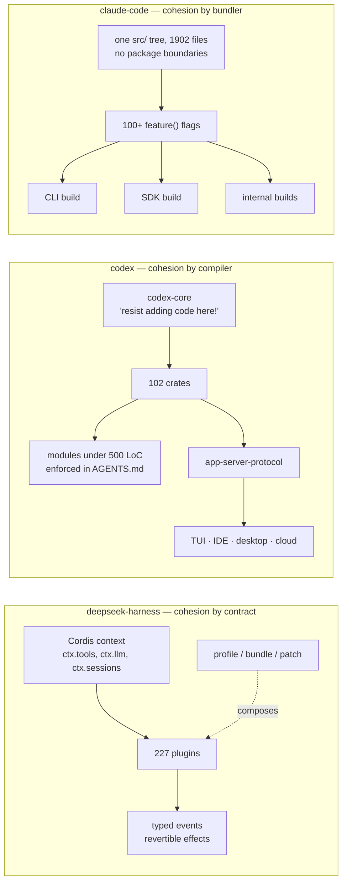
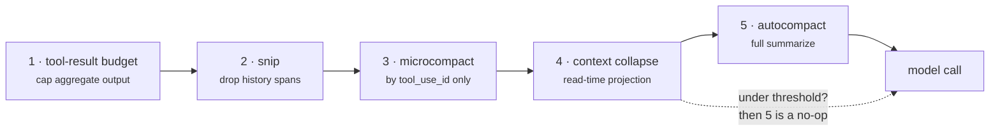
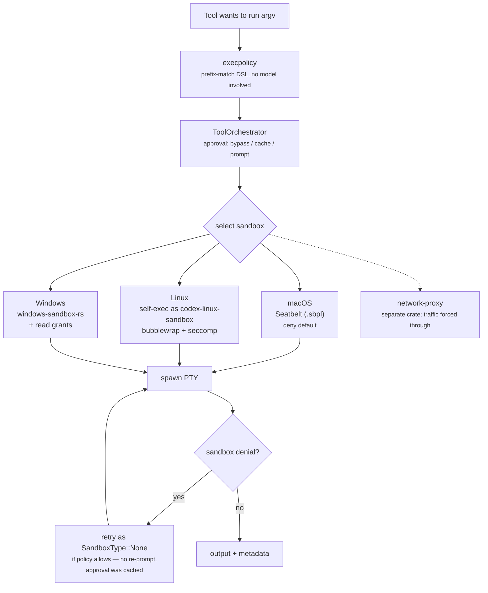
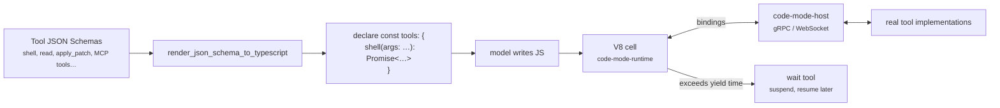
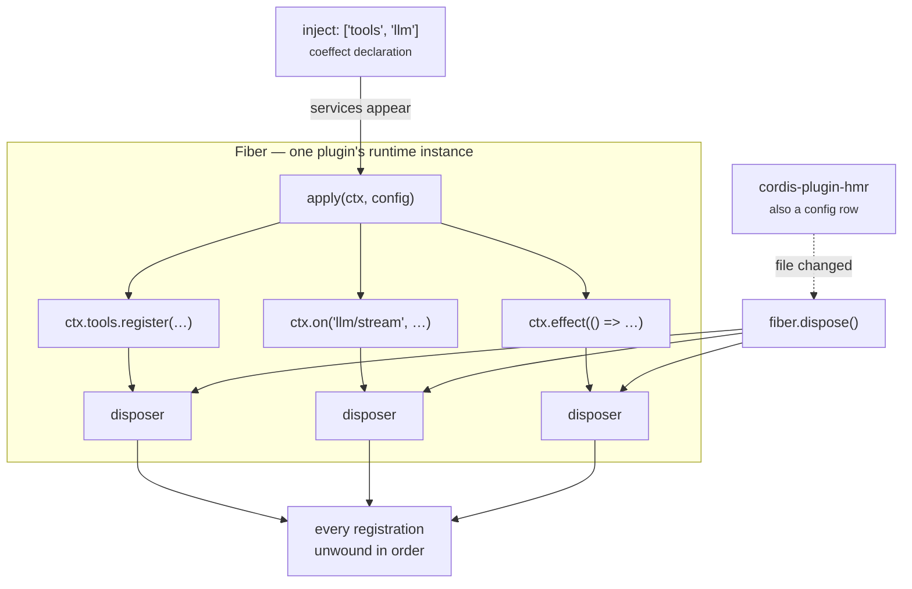
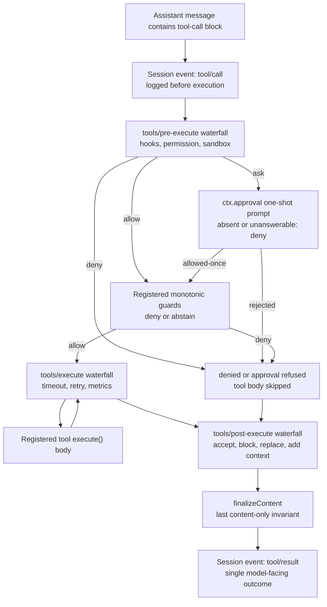
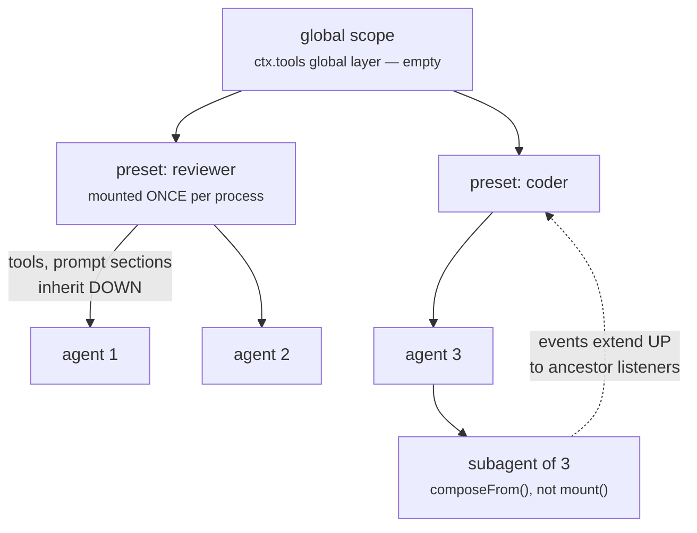

Every coding agent starts from the same picture. This is Anthropic's, from the Claude Code docs:

<div class="row justify-content-sm-center">
  <div class="col-sm-10 mt-3 mt-md-0">
    
  </div>
</div>

Twenty lines of code. You can write it in an afternoon:

```
while (true):
    context  = assemble(history, instructions, tool schemas)
    response = model(context)
    if no tool calls: break
    results  = [dispatch(call) for call in response.tool_calls]
    history += response, results
```

Nobody disagrees about that diagram. What separates a weekend project from a shipped harness is everything the diagram omits: who decides a command may run, what confines it once it does, what happens when the history no longer fits, and what the whole thing looks like to a program that is not a terminal.

Three implementations are readable today. They omit nothing, and they disagree profoundly.

|                 | **claude-code**                     | **codex**                          | **deepseek-harness**                 |
| :-------------- | :---------------------------------- | :--------------------------------- | :----------------------------------- |
| Origin          | Anthropic, leaked 2026-03-31        | OpenAI, Apache-2.0                 | DeepSeek, MIT, developer preview     |
| Language        | TypeScript on Bun                   | Rust                               | TypeScript on Node                   |
| Size            | 512,664 lines, 1,902 files          | 1,444,881 lines, 102 crates        | 559,212 lines, 227 packages          |
| **The bet**     | **the model can judge safety**      | **the kernel must enforce it**     | **a harness is not an application**  |
| Decomposed by   | build flags                         | crates                             | plugins                              |
| Loop lives in   | one 1,400-line `while (true)`       | `codex-core`, spread over types    | a YAML row you can delete            |

That middle row is the post. Everything else follows from it.

A note on the first column: that source is Anthropic proprietary code that escaped through a `.map` file in a published npm package. Reading it is how this comparison is possible; none of it is licensed for reuse. Treat it as a specimen.

## 1 · Where does the architecture live?

Before the philosophies, one structural fact, because it predicts almost everything else. All three codebases are roughly half a million to one and a half million lines. None of them can be held in a head. So each picked a different mechanism to stay comprehensible — and the mechanism it picked is its architecture.



Claude Code stays coherent because the bundler deletes what a given build does not need. Codex stays coherent because the compiler refuses to let a crate reach where it should not. DeepSeek stays coherent because nothing imports anything — plugins find each other by service key, and every registration knows how to undo itself.

Three answers to one problem. Now the philosophies.

## 2 · claude-code — the bet on the model

> If the model is smart enough to write your code, it is smart enough to judge whether a command is dangerous.

That sentence is not written anywhere in the source, but the whole permission system is built as though it were true.

### The shape of the bet

Consider the hardest question a harness faces: the model wants to run `rm -rf ./build`. Allowed?

A sandbox cannot answer. It can tell you the process may write inside the workspace, and `./build` is inside the workspace, so the answer is yes — including on the day the model meant `./` and typed `./build` by luck. What you actually want is a judgement about *intent and blast radius*, and that is not a question about file descriptors.

So Claude Code builds a judgement machine. `utils/permissions/` is 23 files:

```ts
export type ToolPermissionContext = DeepImmutable<{
  mode: PermissionMode
  additionalWorkingDirectories: Map<string, AdditionalWorkingDirectory>
  alwaysAllowRules: ToolPermissionRulesBySource
  alwaysDenyRules: ToolPermissionRulesBySource
  alwaysAskRules: ToolPermissionRulesBySource
  isBypassPermissionsModeAvailable: boolean
  strippedDangerousRules?: ToolPermissionRulesBySource
  prePlanMode?: PermissionMode
}>
```

Rules are layered by source, so an enterprise policy can deny what a user allowed. `shadowedRuleDetection.ts` exists to find rules a higher-precedence source has silently overridden — a *linter for your permission config*. And when static rules run out, two files hand the question to a model: `bashClassifier.ts` and `yoloClassifier.ts`.

The most telling file in the repo is `BashTool/sedValidation.ts`. Someone realised that `sed -i` is a file write wearing a text filter's clothes, and rather than give up, wrote a parser for `sed` edit expressions so the rule engine could see through the disguise. That is the bet in miniature: rather than retreat to a coarse boundary, model the world in more detail.

### What it buys, and what it costs

It buys precision no sandbox can offer. `rm` on a scratch file allowed, `rm` on the repo denied, from one rule set — with reasons a human can read.

It costs a failure mode the other approach does not have. The boundary is a classifier, and classifiers are wrong sometimes. There is a `bypassPermissionsKillswitch.ts` in that directory, which tells you how seriously the risk is taken.

### The loop, and why it is one function

`query()` is an async generator, and this is the most consequential decision in the repo:

```ts
export async function* query(
  params: QueryParams,
): AsyncGenerator<
  | StreamEvent
  | RequestStartEvent
  | Message
  | TombstoneMessage
  | ToolUseSummaryMessage,
  Terminal
> {
  const consumedCommandUuids: string[] = []
  const terminal = yield* queryLoop(params, consumedCommandUuids)
  for (const uuid of consumedCommandUuids) {
    notifyCommandLifecycle(uuid, 'completed')
  }
  return terminal
}
```

The entire harness is one async iterator. The Ink renderer, the Agent SDK, the IDE bridge and the remote WebSocket session are four consumers of the same generator — no server, no protocol, no second implementation. Subagents are this function, called recursively.

The price is `query.ts:307` to `query.ts:1728`: fourteen hundred lines of `while (true)` in one lexical scope, with seven `continue` sites and an explicit `State` object that exists purely because the alternative was nine assignments at each of them. Every recovery path — output-token retry, reactive compaction, stop-hook re-entry — is a loop transition rather than a function.

### Context: a ladder, not a cliff

The subtlest engineering in the repo. Compaction is usually one panicked summarize-everything step. Claude Code runs five mechanisms in a fixed order, every iteration:



The ordering is deliberate, and the source explains it: collapse runs before autocompact _"so that if collapse gets us under the autocompact threshold, autocompact is a no-op and we keep granular context instead of a single summary."_

Step 4 is the clever one. Summaries do not live in the message array — they live in a separate commit log, and `projectView()` replays that log on entry. Compaction becomes a *view* over full history rather than a destructive edit, which is what lets it survive across turns.

> Claude Code is the most product per line and the least architecture. It scales by compiling subsets of itself, and it trusts the model with questions the other two refuse to ask it.

## 3 · codex — the bet on the kernel

> A boundary you cannot verify is not a boundary.

Codex asks a different question about `rm -rf ./build`. Not *is this dangerous* — undecidable — but *what can this process reach*, which the operating system answers definitively.

### Three kernels, one abstraction



The policy ships as data, not code. Here is the actual Seatbelt profile, closed by default:

```lisp
(version 1)

; inspired by Chrome's sandbox policy:
; https://source.chromium.org/chromium/chromium/src/+/main:sandbox/policy/mac/common.sb

; start with closed-by-default
(deny default)

; child processes inherit the policy of their parent
(allow process-exec)
(allow process-fork)
(allow signal (target same-sandbox))
```

On Linux the binary re-executes *itself* under a different `argv[0]` to become the sandbox helper:

```rust
/// Basename used when the Codex executable self-invokes as the Linux sandbox
/// helper.
pub const CODEX_LINUX_SANDBOX_ARG0: &str = "codex-linux-sandbox";
```

Above confinement sits `execpolicy`, a small DSL with a real parser, deciding what may run at all:

```rust
/// Matches a single command token, either a fixed string or one of several allowed alternatives.
pub enum PatternToken {
    Single(String),
    Alts(Vec<String>),
}

/// Prefix matcher for commands with support for alternative match tokens.
/// First token is fixed since we key by the first token in policy.
pub struct PrefixPattern {
    pub first: Arc<str>,
    pub rest: Arc<[PatternToken]>,
}
```

Prefix matching on argv, indexed by program name, no model in the loop. The same instinct produces `apply_patch.lark` — the patch format gets a Lark grammar instead of a hand-rolled parser. When Codex has a choice between a heuristic and a formalism, it takes the formalism every time.

### Code mode: the model writes a program, not a tool call

The larger bet, and the one most likely to define the next generation. Five crates — `code-mode`, `-runtime`, `-host`, `-protocol`, plus `v8-poc`.

A tool call is an expensive protocol. Reading twelve files costs twelve round trips through the model, each one re-serializing the whole context. But a *program* that reads twelve files costs one. So Codex renders each tool's JSON Schema into a TypeScript declaration and hands the model a `.d.ts` instead of a tool list:



Submitted code carries a pragma:

```js
// @exec: {"yield_time_ms": 10000, "max_output_tokens": 4096}
const files = await tools.shell({ command: ['rg', '-l', 'TODO'] })
const results = await Promise.all(files.map(f => tools.read({ path: f })))
```

An N-step sequence becomes one round trip. The `wait` tool means long programs suspend and resume rather than blocking a turn.

### Narrow interfaces, because crates enforce them

Codex's tool contract is five methods, three defaulted:

```rust
pub trait ToolExecutor<Invocation>: Send + Sync {
    fn tool_name(&self) -> ToolName;
    fn spec(&self) -> ToolSpec;
    fn exposure(&self) -> ToolExposure { ToolExposure::Direct }
    fn search_info(&self) -> Option<ToolSearchInfo> { /* derived from spec */ }
    fn supports_parallel_tool_calls(&self) -> bool { false }
    fn handle(&self, invocation: Invocation) -> ToolExecutorFuture<'_>;
}
```

Claude Code's `Tool` has roughly twenty members, including `isSearchOrReadCommand` — a hint for collapsing noisy output in the TUI. Codex has no such member because `tui/` is a different crate and cannot reach in. **Interface width is a downstream consequence of module boundaries**, and this pair is the cleanest illustration of it I know.

The discipline is written down. From `AGENTS.md`:

> **resist adding code to `codex-core`!**
>
> Target Rust modules under 500 LoC, excluding tests. If a file exceeds roughly 800 LoC, add new functionality in a new module instead of extending the existing file unless there is a strong documented reason not to.

### Why it needs all this

Because the CLI is not the product. `app-server`, `-protocol`, `-daemon`, `-transport`, `uds`, `stdio-to-uds`: the harness is a resident service, and the terminal, the IDE extensions, the desktop app and cloud Codex are its clients. Concurrent clients need a concurrency story, so requests carry an explicit scope:

```rust
pub enum ClientRequestSerializationScope {
    Global(&'static str),
    GlobalSharedRead(&'static str),
    Thread { thread_id: String },
    ThreadPath { path: PathBuf },
    CommandExecProcess { process_id: String },
    Process { process_handle: String },
    FuzzyFileSearchSession { session_id: String },
    FsWatch { watch_id: String },
    McpOauth { server_name: String },
}
```

That enum is what "several UIs on one agent" costs when you do it properly.

> Codex is the only one built as a service first and a terminal second. Its architecture is expensive, and every line of the expense is paid for by a client that is not the CLI.

## 4 · deepseek-harness — the bet that a harness is not an application

The other two ship a product that happens to be extensible. DeepSeek inverts it: ship a substrate, and let the product be a configuration of it. That sounds like marketing until you look at what it costs to mean it.

The architecture doc states the position flatly:

> Every part of the product is a plugin, including the model adapter, the tool registry, the session log, **and the agent loop itself**, so every part is replaceable from configuration. There is no privileged core to patch.

Here is that claim as YAML, from `packages/bundle/base/cordis.patch.yml`:

```yaml
- id: agent-loop
  name: '@deepseek-ai/dsh-agent-loop'
```

The agent loop is a row with an id. Patch the row, get a different loop. Delete it, and the harness boots without one. Nothing in the other two repos is remotely like this — and the interesting question is what has to be true underneath for it not to be a lie.

### The paradigm: revertible effects and reactive coeffects

Underneath is [Cordis](https://github.com/cordiverse/cordis), which is not a DI container with delusions of grandeur but the implementation of a paper — [_A Programming Paradigm for Spatiotemporal Composability_](https://github.com/cordiverse/paper). Two ideas, unified:

**Revertible effects** — every context transformation carries an inverse the runtime tracks. When a plugin registers a tool, a prompt section, an event listener or a service, it does not "add" anything; it performs an effect that knows how to undo itself.

**Reactive coeffects** — a component declares what it needs from its context, and the runtime notifies it as the context changes. A plugin does not wait for a boot sequence; it activates when its requirements appear and deactivates when they vanish.

The paper's contribution is unifying the effect context and the coeffect context into a single type. In practice that means one object, `ctx`, is simultaneously what you read capabilities from and what you write registrations into — and because both directions are tracked, a subtree can be mounted and unmounted at runtime without leaking.



Three consequences fall out, and all three are visible in the harness:

**Load order is derived, not written.** A plugin names `inject: ['tools']` and Cordis activates it once `ctx.tools` exists. There is no boot sequence to maintain — the dependency graph *is* the boot sequence. In Codex this job is done by `main()` and crate dependencies; in Claude Code by module import order and `bootstrap/state.ts`.

**Teardown is not best-effort.** The primer's rule: _"Every registration should have a disposer, either by returning one from `ctx.effect()` or using a Cordis helper that does it for you."_ This is why hot module replacement is not a stunt here — `cordis-plugin-hmr` sits in the base bundle as an ordinary row. Edit a tool's source, and its fiber unwinds and remounts, taking its schema out of the next prompt with it.

**Events are a contract with a declared shape.** Cordis has four dispatch modes, and the mode is part of an event's public API:

| Mode | Awaited | Order | Returns |
| :--- | :--- | :--- | :--- |
| `emit` | no | registration order | no |
| `waterfall` | no | registration order | yes |
| `parallel` | yes | concurrent | no |
| `serial` | yes | registration order | yes |

`waterfall` is around-middleware: a listener receives `(...args, next)`, calls `next()` to delegate, or returns without it to short-circuit. So `agent/pre-step`, `agent/request`, `llm/stream` and the three `tools/*` events are not notifications you may observe — they are positions in a chain you may *take over*. A permission plugin that owns a decision returns without `next()`. That is the whole interception model, and it is the framework's, not the harness's.

### The pipeline is the plugin tree

Because the pipeline is assembled from events rather than written as a function, DeepSeek can generate a picture of it. This is their own diagram, from `docs/tool-execution-pipeline.md`:



Every box with a `waterfall` label is an extension point where a plugin can sit. Permission, sandboxing, hooks, timeout, retry, metrics — in the other two harnesses these are code inside the tool dispatcher. Here they are subscribers, and a deployment that wants none of them simply does not mount them.

### Scope: how one process runs agents with different capabilities

The hard part of "everything is a plugin" is that plugins are global and agents are not. If a tool registers on `ctx.tools`, every agent sees it — which makes per-agent tool sets impossible, and per-agent tool sets are the whole point of subagents.

`packages/core/scope` is the answer, and it is the most interesting primitive in the repo:

> `createScope(ctx, key)` creates a tagged Cordis context whose backing fiber owns every registration made through it. […] Keys form an optional parent chain: **registration views inherit DOWN it** — a child scope sees its ancestors' layers, nearest shadowing farthest — and **event admission extends UP it** — a listener tagged with an ancestor receives a descendant key's events, never the reverse.

Two directions, deliberately opposite. Capabilities flow down so a child agent inherits its parent's tools; observation flows up so a parent's listener sees its children's events. Both from one key relation.



An **agent preset** is a directory holding one `agent.cordis.yml`. It is mounted once per process under a standing scope, and each session that names it *joins* by having its scope key parented to the mount's. So the reviewer preset's tools and prompt sections exist exactly once in memory and cover every reviewer session — while a coder session, parented elsewhere, cannot see them.

The subagent detail is where the design shows its teeth. A child joins through `composeFrom()` rather than re-mounting the preset by id, and the README explains why:

> A composition file edited since the parent started would hand the child a DIFFERENT generation than the one its parent's history was produced under, and a preset deleted since would fail the child outright while its parent keeps running.

And the consequence of putting every model-facing row on the agent plane:

> the tool registry's global layer is empty and a child that joins nothing reaches the model with no tools at all.

Default-deny for capabilities, achieved structurally rather than by a check.

### One invariant holds it together

A plugin system this open has an obvious failure mode: any plugin can inject anything into a prompt, and now your context is unauditable. DeepSeek closes it with a rule — **model-visible means logged** — and enforces it at runtime on every request:

```ts
ctx.on('llm/stream', (options: GenerateOptions, next) => {
  if (!isAgentLoopRequest(options)) return next()
  if (!Object.isFrozen(options)) fail('a loop-built request must be frozen')
  const session = ctx.sessions.get(options.sessionId)
  // ...
  const expected = session.deriveMessages()
  if (JSON.stringify(options.messages) !== JSON.stringify(expected)) {
    fail(`llm request for session "${String(session.id)}" diverges from the dispatch-time durable derivation (log-reconstruction desync)`)
  }
  return next()
}, { global: true, prepend: true })
```

`prepend: true` carries the comment _"prevents a short-circuiting replay listener from silencing the check."_ The invariant is itself a waterfall listener, registered first so no other listener can swallow it.

What this buys: context is never assembled in memory and then sent — it is *projected* from an append-only log by `deriveMessages()`, and the outgoing request is diffed against that projection before it leaves. Fork, resume, replay, transcripts and telemetry stop being features and become derivations of one stream. Adding a new model-visible input therefore *requires* extending `SessionEventMap`. A plugin cannot sneak text into a prompt, because the assertion would catch it.

The tool scheduler pays the same tax, and its module doc says so:

```
Abort records synthetic error results for skipped calls so replay stays
valid. A terminal scheduler failure preserves already-recorded `tool/call`
events without fabricating results.
```

A cancelled turn must still produce a log that reconstructs. That sentence only makes sense in a system where reconstruction is load-bearing.

### A tool, complete

All of it lands in twenty readable lines:

```ts
export const name = 'tool-todo'
export const inject = ['tools']

export interface Config { allowParallelInProgress: boolean }
export const Config: z<Config> = z.object({
  allowParallelInProgress: z.boolean().required(),
})

export function apply(ctx: Context, config: Config): void {
  const allowParallel = config.allowParallelInProgress

  ctx.inject(['sessionProjections'], (projectionCtx) => {
    projectionCtx.sessionProjections.register<'todos', TodoItem[] | null>({
      key: 'todos',
      init: () => null,
      apply: (state, event) => {
        if (event.type === 'todo/write') return event.data.todos
        if (event.type === 'turn/start') return null
        return state
      },
      stateVersion: 2,
    })
  })

  ctx.tools.register(defineTool({
    name: 'todo_write',
    description: describe(allowParallel),
    parameters: { /* ... */ },
  }))
}
```

`inject: ['tools']` is the coeffect. `apply` is where effects are performed. `ctx.inject(['sessionProjections'], …)` registers the UI projection *only if* that seam is composed, so a headless build loads the same package and silently gets less. `allowParallelInProgress` has no default, so a deployment must choose — and the choice changes the model-facing description, not just the behaviour. The UI state is a fold over session events, not state the tool owns.

### What it costs

Honesty requires the other column. Indirection is real: finding where a decision is made means following a service key rather than a call graph. `ctx.sandbox` being a swappable seam means the harness itself takes no position on confinement, which is the weakest default of the three. And this is a developer preview at `0.1.1-rc.1` — the README promises breaking changes in bold.

The documentation effort is proportionate, and unusual. `docs/tool-catalog.md` is generated by **booting every tool plugin on a real context** and reading `ctx.tools.schemas()`, because a schema is not statically knowable when descriptions are concatenated and names are config-driven. A completeness guard globs `packages/*/tool-*` and fails CI if a package is missing from the manifest. Every document exists in English, Chinese and an `i18n.yaml`. `CLAUDE.md` symlinks to `AGENTS.md`, and `.agents/notes/` holds design notes addressed to agents rather than people.

> The only one where the agent loop is a deletable config row, and the only one that enforces its context invariant at runtime. It has the least product and the most idea.

## 5 · The dimensions

### Safety

|                 | claude-code                                            | codex                                    | deepseek-harness       |
| :-------------- | :----------------------------------------------------- | :--------------------------------------- | :--------------------- |
| Primary layer   | rule engine + LLM classifiers                          | OS confinement                           | swappable provider     |
| macOS           | —                                                      | Seatbelt, SBPL policy files              | via provider           |
| Linux           | —                                                      | bubblewrap + seccomp, legacy Landlock    | `native/landlock-run`  |
| Windows         | —                                                      | `windows-sandbox-rs` + read grants       | `sandbox-windows-acl`  |
| Network         | rules                                                  | forced through `network-proxy`           | via provider           |
| Command vetting | `bashClassifier`, `dangerousPatterns`, `sedValidation` | `execpolicy` prefix DSL                  | policy plugins         |
| Failure mode    | the classifier is wrong                                | a path that legitimately needs to escape | depends on composition |

Neither of the first two subsumes the other. A sandbox cannot tell you this particular `curl | sh` is fine; a classifier cannot stop a process it already approved from doing something it did not predict. The honest answer is both, and none of the three ships both at full strength.

### Tools

|                  | claude-code                | codex                          | deepseek-harness             |
| :--------------- | :------------------------- | :----------------------------- | :--------------------------- |
| Interface        | ~20 members                | 5 methods (3 defaulted)        | `apply(ctx, config)`         |
| Parallelism      | `isConcurrencySafe`        | `supports_parallel_tool_calls` | exclusive/parallel + pool    |
| Lazy schemas     | `shouldDefer` + ToolSearch | `ToolExposure` + tool_search   | filterable capability layers |
| Code mode        | —                          | V8 cell, gRPC host, TS decls   | `run_code`, worker thread/vm |
| Oversized output | persist to disk, preview   | truncation policy              | spill file + locator         |

DeepSeek's **spill** deserves a mention on its own. Oversized tool output is written to a session-private file and the model gets a locator, with a retrieval hint telling it to `read` or `grep` that path. Truncation destroys information; spill relocates it and hands back an address. The storage layout is `<root>/session-<hash>/<random>-<safeName>` and every part is a security decision — the write is `open(path, 'wx', 0o600)` so a planted symlink cannot redirect it.

### Context

|                 | claude-code                        | codex                           | deepseek-harness          |
| :-------------- | :--------------------------------- | :------------------------------ | :------------------------ |
| Strategy        | five graded mechanisms in sequence | rollout budget + remote compact | compaction plugin + spill |
| Where computed  | in the loop                        | partly server-side              | outside the loop          |
| Source of truth | message array + collapse log       | rollout files                   | the event log, projected  |
| Memory          | `memdir/` + team sync              | `memories` crate                | session-query tools       |

Claude Code has the most sophisticated ladder. DeepSeek has the cleanest foundation. Codex sits between and pushes the hard part to a server it also owns.

### Extension

|              | claude-code                  | codex                            | deepseek-harness            |
| :----------- | :--------------------------- | :------------------------------- | :-------------------------- |
| Hook events  | 27                           | 11                               | events _are_ the mechanism  |
| Hook kinds   | command, prompt, agent, HTTP | command                          | typed listener, or a bridge |
| Skills       | `SKILL.md` + bundled TS      | crate with policy + dependencies | `ctx.skills` + `skill` tool |
| Replace loop | no                           | no                               | yes                         |

Codex's skill model has the sharpest single idea in this row:

```rust
pub struct SkillPolicy {
    pub allow_implicit_invocation: Option<bool>,
    pub products: Vec<Product>,
}
```

A skill can declare that the model may **not** decide on its own to use it — only an explicit user mention counts. As skill directories grow, "the model loaded a skill it should not have" becomes a real failure mode, and this is the only one of the three with a declared answer. `SkillDependencies` goes further: a skill declares the MCP servers it needs, with `transport`, `command`, `url` and `oauth_callback_port`, so loading a skill brings its tools with it.

## 6 · Convergence

Read together, several things have stopped being product features and become industry vocabulary:

- **`AGENTS.md` / `CLAUDE.md`.** All three consume repo-level instruction files. DeepSeek symlinks one to the other.
- **`SKILL.md` frontmatter.** All three load skills from directories the same way.
- **MCP.** All three, client and server.
- **Code mode.** Codex and DeepSeek independently, with different mechanisms — V8 host over gRPC versus worker threads.
- **The hook protocol.** Codex's eleven event names are Claude Code's vocabulary plus two.

That last one has a delightful piece of evidence. `packages/hooks/` in the DeepSeek repo contains `hooks-claude-code`, `hooks-codex`, and a shared `hook-protocol` library — DeepSeek runs both competitors' hook configurations. The shared package explains why one library covers both:

> Codex deliberately reimplements a _subset_ of the Claude Code hook protocol — the same `hooks.json` matcher-group shape, the same exit-code/stdout output contract, the same command-hook execution model. The genuinely-shared parts live here; each bridge owns only what differs.

Three things have not converged at all:

- **Where safety lives.** Classifier versus kernel is a disagreement about what an agent *is*.
- **What a harness is.** A function, a service, or a plugin tree.
- **Whether the loop is yours.** Only one says yes.

And the correlation is not subtle. Claude Code has the most features and the least architecture — it can afford a monolith because Anthropic ships the only build. Codex has the most architecture and the strongest boundaries — it needs them because one core runs in a terminal, an IDE, a desktop app and a cloud. DeepSeek has the most replaceability and the least product — it is a developer preview whose thesis is that the harness should be a substrate.

Each architecture is a precise fit for a business model. That is either reassuring or depressing, depending on what you were hoping architecture was.

## 7 · What to read

One file from each:

- **claude-code** — `src/query.ts`. Fourteen hundred lines of loop, with comments explaining why each recovery path exists. The comments are worth more than the code.
- **codex** — `codex-rs/core/src/unified_exec/mod.rs`, then `code-mode-protocol/src/description.rs`. How approval, sandbox and retry compose; then how a tool list becomes a type declaration.
- **deepseek-harness** — `packages/core/scope/README.md`, then `packages/core/agent-loop/src/invariant.ts`. The primitive that makes per-agent capabilities possible, and the sixty lines that make replay guaranteed.

And one paper, if the third bet is the one you find interesting: [_A Programming Paradigm for Spatiotemporal Composability_](https://github.com/cordiverse/paper). It is the only place among these three where someone stopped to formalise what a plugin actually is.

> Three answers to one loop. The loop was never the hard part.
