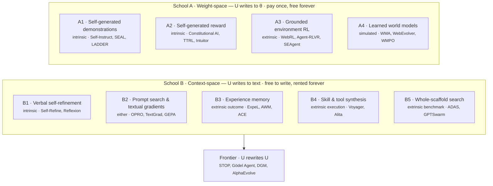
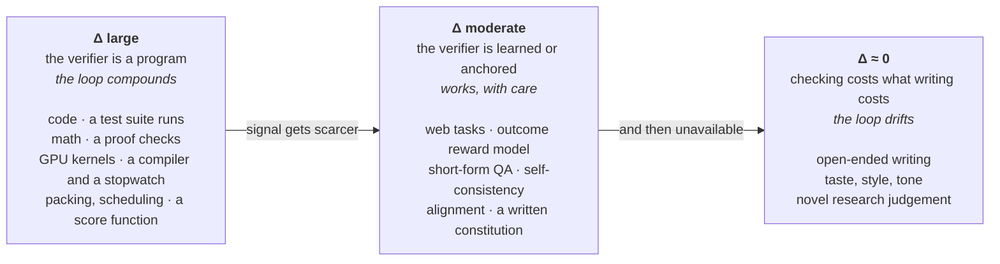

Every self-improving agent runs the same loop:

$$
\pi_{t+1} \;=\; U(\pi_t,\; \tau,\; r)
$$

An agent $$\pi$$ produces experience $$\tau$$, something assigns that experience a signal $$r$$, and an update operator $$U$$ folds it back in. Nobody disagrees about the loop. The field splits three ways on what goes in the slots.

## TL;DR

**The primary split is the substrate — where $$U$$ writes.** Into **weights**, or into **text**. Everything else about a method follows from that one choice, including its cost model, its failure mode, and whether you can roll it back.

| | **Weight-space** | **Context-space** |
| :-- | :-- | :-- |
| $$U$$ writes to | model parameters $$\theta$$ | prompt, memory, skills, tools, harness source |
| Loop latency | a training run | a forward pass |
| Cost profile | pay **once** at training, free at inference | free to write, pay **forever** at inference |
| Transfers across tasks | yes | rarely |
| Inspectable / reversible | no | yes — it is text, you can diff it |
| Ceiling | data and compute | the context window |
| Fails by | collapse, forgetting, reward hacking | context bloat, collapse into vagueness, stale memory |
| Papers in the survey | 77 | 176 |

**Why context-space won on volume.** Not because it is better — because it is the only school whose loop runs at inference cost. Weight-space needs a training run per iteration; context-space needs one forward pass. Four orders of magnitude of loop latency, and loop latency decides how many iterations you can afford. But the trade is real and usually unstated: **a weight update is amortized, a context update is rented.** Everything you learn in text is re-read, re-tokenized and re-paid on every subsequent call, forever.

**The second axis decides whether it works at all: who supplies $$r$$.** Intrinsic (the model grades itself) is unlimited and free but can only certify what the model can already recognize. Extrinsic (tests, compilers, environments) is grounded but scarce. This cuts across both schools and is the better predictor of whether a paper's numbers hold up.

**The one principle that explains the whole field.** Self-improvement works exactly to the extent that **verification is cheaper than generation.** Coding and math self-improve well because a test suite is a free, grounded verifier. Open-ended writing does not, because checking is as hard as writing. When the generation–verification gap goes to zero, the loop stalls — no amount of clever $$U$$ recovers it. Read every method below as a bet on where it can find that gap.

**The third axis is the frontier: how far $$U$$ reaches.** One artifact → the whole scaffold → $$U$$ itself. The last one is the Gödel-machine lineage, and it is where the interesting failures now live.

**What to be suspicious of.** A large share of results improve on the same distribution the improvement was fit to. The survey needed a whole third branch for evaluation, which is what a measurement crisis looks like from the outside.

---

What follows: two schools, nine routes, roughly thirty papers with one entry each. Every entry has the same four blocks — **loop**, **signal**, **what persists**, **why it is clever** — and closes with a one-line verdict. Every figure is the architecture figure from the original paper. Source map: the [Self-Improvements in Modern Agentic Systems](https://selfimproving-agent.github.io/) survey hub, 312 curated entries, whose taxonomy I have deliberately re-cut along different lines.

## 0 · The shared parts bin

Six primitives that nearly every method below is an assembly of. If these are unfamiliar the rest will not parse.

**Rejection sampling / STaR.** Sample $$k$$ candidates, keep the ones a filter accepts, train on those. The whole of weight-space route A1 is variations on what the filter is.

**RLVR — reinforcement learning from verifiable rewards.** Replace a learned reward model with a program that returns a binary correct/incorrect. Works wherever a checker exists. This is the single most consequential idea in the area, because it is what makes $$r$$ free and honest at the same time.

**LLM-as-judge / AI feedback.** Use a model as the reward function. Unlimited scale, and the origin of most of the field's credibility problems.

**Self-consistency.** Sample many chains, take the majority. A verifier you get for free, and the seed of the test-time-training methods.

**Evolutionary search.** Maintain a population, mutate, evaluate, select. When the artifact being mutated is text or code, an LLM is the mutation operator. Routes B2, B5 and the entire frontier section are this.

**Retrieval.** Fetch relevant past experience into the context. Context-space's entire delivery mechanism — an improvement written to memory only exists if retrieval finds it again.

## 1 · The two-axis map

Routes are ordered left-to-right within each school by increasing groundedness of $$r$$: the further right, the more expensive the signal and the more honest the result. Note that the axis is orthogonal to the school — both substrates run the full range from intrinsic to extrinsic, which is why the substrate alone never tells you whether a method works.

## 2 · School A — weight-space

> If the improvement is not in the weights, the model has not improved. It is just being reminded.

The position that self-improvement means changing the artifact that gets shipped. Slower, costlier, and the only school where the gain transfers to a task nobody wrote a prompt for.

### 2.1 · Route A1 — self-generated demonstrations

Generate your own training data, filter it, fine-tune on it. The oldest route and still the most reliable, because the filter can be made arbitrarily strict.

#### Self-Instruct

_University of Washington · 2022 · [arXiv:2212.10560](https://arxiv.org/abs/2212.10560) — Self-Instruct: Aligning Language Models with Self-Generated Instructions_

  

    
  

**Loop.** $$\pi_t$$ writes instructions, writes inputs and outputs for them, filters, and fine-tunes into $$\pi_{t+1}$$. One round, not a running loop.

**Signal.** Almost none — ROUGE-based deduplication against existing instructions plus heuristic filters. $$r$$ here is a diversity constraint, not a quality one.

**What persists.** Weights, plus a released 52k instruction dataset.

**Why it is clever.** It establishes that the bottleneck in alignment was never the model's latent ability but the *elicitation* of it, and that a model contains enough of a task distribution to draw its own curriculum from 175 seeds. The filter being weak is the point: at that time, diversity was the scarce thing, not correctness.

> The founding document of "the model is its own dataset," and the reason every subsequent route had to explain what its filter was.

#### Large Language Models Can Self-Improve

_Illinois / Google · 2022 · [arXiv:2210.11610](https://arxiv.org/abs/2210.11610)_

**Loop.** Sample multiple CoT paths per unlabeled question, take the self-consistent majority as the pseudo-label, fine-tune on those paths.

**Signal.** Intrinsic — self-consistency. The majority vote is the verifier.

**What persists.** Weights.

**Why it is clever.** It converts an inference-time trick into a training signal, and in doing so identifies the exact quantity self-improvement runs on: the gap between what one sample gets right and what forty samples agree on. That gap is free energy, and every intrinsic method since is a way of harvesting it.

> Self-consistency is a verifier you already own. This paper spent it.

#### Self-Adapting Language Models (SEAL)

_MIT · 2025 · [arXiv:2506.10943](https://arxiv.org/abs/2506.10943)_

  

    
  

**Loop.** The model generates a **self-edit**: not training data, but a *specification of its own finetuning* — which augmentations to apply, what optimizer settings to use. It then trains on that edit and is scored.

**Signal.** Extrinsic downstream accuracy, fed back by RL over the self-edit generation.

**What persists.** Weights, updated by a recipe the model wrote.

**Why it is clever.** Everything else in this route has the model produce *data* and a human produce the *training procedure*. SEAL moves the procedure into the model's output space, which makes the meta-level learnable. Its Figure 6 is also the most honest plot in the route: catastrophic forgetting from sequential self-edits, plotted rather than mentioned.

> The first route-A1 paper where the model writes the recipe rather than the ingredients.

**Also in this route.** *LADDER* ([2503.00735](https://arxiv.org/abs/2503.00735)) generates a curriculum of easier variants of a problem it cannot solve, which is self-improvement by recursive decomposition rather than by sampling. *TaskCraft* ([2506.10055](https://arxiv.org/abs/2506.10055)) generates agentic tasks with verifiable answers, addressing the data shortage that route A3 runs into. *Superficial Self-Improved Reasoners Benefit from Model Merging* ([2503.02103](https://arxiv.org/abs/2503.02103)) is the necessary counterweight: it argues much of the reported gain is shallow.

### 2.2 · Route A2 — self-generated reward

Have the model produce $$r$$ itself, then run RL. Removes the human labeling bottleneck and installs a different one.

#### Constitutional AI

_Anthropic · 2022 · [arXiv:2212.08073](https://arxiv.org/abs/2212.08073) — Harmlessness from AI Feedback_

  

    
  

**Loop.** Two stages. Supervised: the model critiques and revises its own harmful outputs against a written constitution, and is fine-tuned on the revisions. RL: the model generates preference comparisons, a preference model is trained on those, and policy optimization runs against it.

**Signal.** Intrinsic, but anchored — a short list of natural-language principles supplied by humans.

**What persists.** Weights, plus a preference model.

**Why it is clever.** It relocates human input from *labeling every example* to *writing the rules once*. The constitution is a compression of the human signal, which makes the human contribution auditable in a way a preference dataset never is. That auditability, not the scale saving, is the durable idea.

> Human oversight as a document rather than as a workforce.

#### TTRL — Test-Time Reinforcement Learning

_Tsinghua / Shanghai AI Lab · 2025 · [arXiv:2504.16084](https://arxiv.org/abs/2504.16084)_

**Loop.** At test time, on unlabeled inputs, sample many outputs, take the majority as the label, compute a reward against it, and run RL — during evaluation.

**Signal.** Intrinsic — majority vote, again.

**What persists.** Weights, updated on the test distribution itself.

**Why it is clever.** It collapses the train/test boundary. The provocation is that the loop keeps working even when the majority vote is *wrong*: the reward is dense and directionally right often enough to move the policy. That decouples "the verifier is accurate" from "the verifier is useful," which is a distinction the intrinsic camp needed.

> A verifier does not have to be correct to be a gradient.

**Also in this route.** *Learning to Reason without External Rewards* ([2505.19590](https://arxiv.org/abs/2505.19590)) uses the model's own confidence as the entire reward. *Maximizing Confidence Alone Improves Reasoning* ([2505.22660](https://arxiv.org/abs/2505.22660)) pushes that to its limit and is best read as an experiment in how far the intrinsic signal can be trusted before it becomes a self-licking loop. *Can Large Reasoning Models Self-Train?* ([2505.21444](https://arxiv.org/abs/2505.21444)) asks the question directly and finds the honest answer is "for a while."

### 2.3 · Route A3 — grounded environment RL

Put the agent in a real environment, let the environment supply $$r$$. The expensive, honest route.

#### WebRL

_Tsinghua · 2024 · [arXiv:2411.02337](https://arxiv.org/abs/2411.02337) — Training LLM Web Agents via Self-Evolving Online Curriculum RL_

  

    
  

**Loop.** Roll out on real websites; failures at phase $$t$$ are turned into new instructions for phase $$t+1$$; an outcome-supervised reward model scores trajectories; policy updates are KL-constrained with experience replay.

**Signal.** Extrinsic — task success in a live environment.

**What persists.** Weights, plus a growing curriculum.

**Why it is clever.** Two scarcities are solved with each other. Web RL has too few tasks and too much catastrophic forgetting; WebRL manufactures tasks *from its own failures* — the highest-information region of the distribution — and spends the KL budget on not forgetting what worked. The curriculum is not a schedule someone wrote, it is a function of the current policy's frontier.

> Failure is the only free source of well-targeted training data, and this is the paper that industrialized that.

**Also in this route.** *Agent-RLVR* ([2506.11425](https://arxiv.org/abs/2506.11425)) brings verifiable rewards to software engineering agents with environment feedback as guidance. *DeepResearcher* ([2504.03160](https://arxiv.org/abs/2504.03160)) scales RL in the open web rather than a sandbox, and reports the messiness honestly. *SEAgent* ([2508.04700](https://arxiv.org/abs/2508.04700)) learns to use unfamiliar software autonomously. *Kevin* ([2507.11948](https://arxiv.org/abs/2507.11948)) does multi-turn RL for CUDA kernel generation, where the verifier is a compiler and a stopwatch — the cleanest reward signal in the entire survey.

### 2.4 · Route A4 — learned world models as substrate

If real environments are too slow, learn one. This is where this area touches the [world-models literature](/blog/2026/two-schools-of-world-models/) directly.

#### Web Agents with World Models

_Yonsei / CMU · 2024 · [arXiv:2410.13232](https://arxiv.org/abs/2410.13232) — Learning and Leveraging Environment Dynamics in Web Navigation_

  

    
  

**Loop.** Harvest trajectories, abstract each transition into a description of what changed, train a world model on those, and at inference simulate each candidate action's next state and score it before acting.

**Signal.** Extrinsic once, then simulated — the model of the environment substitutes for the environment.

**What persists.** A separate world model; the policy stays fixed.

**Why it is clever.** The insight is in the *abstraction*, not the simulation. Predicting the next raw web page is hopeless; predicting a natural-language description of what the click changed is tractable. Choosing the right representation for the transition is what makes the world model learnable at all, and the paper's error taxonomy (counterfactual imagination, overly generic statements) is more useful than its headline numbers.

> The web is not predictable, but the *effect of an action* on it often is.

**Also in this route.** *WebEvolver* ([2504.21024](https://arxiv.org/abs/2504.21024)) co-evolves the world model with the agent so the simulator improves as the policy does. *WMPO* ([2511.09515](https://arxiv.org/abs/2511.09515)) does world-model-based policy optimization for VLA models. *General agents contain world models* ([2506.01622](https://arxiv.org/abs/2506.01622)) argues the model is implicit in any competent policy — which, if true, makes this whole route a question of whether you extract it or leave it latent.

## 3 · School B — context-space

> If the improvement is in the weights, you cannot read it, cannot diff it, and cannot take it back.

The position that the agent is not the model — the agent is the model *plus* its prompt, its memory, its skills, its tools, and the code that orchestrates them, and every one of those is a cheaper place to write.

### 3.1 · Route B1 — verbal self-refinement

The smallest possible loop: produce, critique, revise. No persistence at all — the improvement lives and dies inside one task.

#### Self-Refine

_CMU / Allen AI · 2023 · [arXiv:2303.17651](https://arxiv.org/abs/2303.17651) — Iterative Refinement with Self-Feedback_

  

    
  

**Loop.** Generate, feed the output back to the same model for critique, refine. Iterate.

**Signal.** Intrinsic, unanchored.

**What persists.** Nothing. $$\pi_{t+1} = \pi_t$$; only the output moves.

**Why it is clever.** It isolates the generation–verification gap as the only ingredient, and shows it is nonzero in a single model with no extra machinery. Everything else in School B is this loop plus a place to write the result down.

> The null model of self-improvement. If your method does not beat this, it is this.

#### Reflexion

_Northeastern / MIT / Princeton · 2023 · [arXiv:2303.11366](https://arxiv.org/abs/2303.11366) — Language Agents with Verbal Reinforcement Learning_

  

    
  

**Loop.** Attempt a task, receive a scalar or binary outcome, write a **verbal reflection** on why it failed, store it, retry with the reflection in context.

**Signal.** Extrinsic outcome — but converted to text rather than to a gradient.

**What persists.** An episodic buffer of reflections, within a task.

**Why it is clever.** It is the exact analogue of a policy gradient with the gradient replaced by natural language. A scalar reward carries one bit per trajectory; a written post-mortem carries hundreds. For a model that reads, the text is a far richer credit assignment than the number it came from — and that observation is what route B2 turns into an optimizer.

> Language is a higher-bandwidth channel for credit assignment than a scalar. That is the whole thesis of School B.

### 3.2 · Route B2 — prompt search and textual gradients

Treat the prompt as parameters. Then argue about what "gradient descent" means when the parameters are English.

#### TextGrad

_Stanford · 2024 · [arXiv:2406.07496](https://arxiv.org/abs/2406.07496) — Automatic "Differentiation" via Text_

  

    
  

**Loop.** Build a computation graph whose nodes are LLM calls. Define a loss in natural language. Backpropagate *textual criticism* through the graph and apply it to each variable.

**Signal.** Whatever the loss says — a test result, a metric, or another model's judgement.

**What persists.** The optimized variables: prompts, code, molecules, treatment plans.

**Why it is clever.** It takes the autodiff abstraction seriously rather than metaphorically — chain rule, optimizer, backward pass — and by doing so makes prompt optimization *composable* across a multi-stage system. The generality is the point: the same machinery optimizes a prompt, a snippet of code, and a chemical structure, because all three are strings a critic can comment on.

> PyTorch's API is a good abstraction even when the gradients are prose.

#### GEPA

_Berkeley / Stanford · 2025 · [arXiv:2507.19457](https://arxiv.org/abs/2507.19457) — Reflective Prompt Evolution Can Outperform Reinforcement Learning_

  

    
  

**Loop.** Maintain a Pareto frontier of prompt candidates. Each round, sample a candidate, read its full execution *trace*, reflect in natural language on what went wrong, mutate — or merge two candidates' strengths.

**Signal.** Extrinsic task metric, but the *reflection* reads the trace, not the score.

**What persists.** A prompt.

**Why it is clever.** The claim in the title is the finding: reflective prompt evolution beats GRPO on the same task budget, sometimes by a lot. The mechanism is a sample-efficiency argument that ought to have been obvious — an RL step extracts a scalar from a rollout, while a reflection step extracts a paragraph of diagnosis from the same rollout. Same environment cost, orders of magnitude more signal per unit of cost. Keeping a Pareto frontier rather than a single incumbent is what stops it collapsing into a local optimum.

> The strongest argument in the survey that School B is not merely cheaper than School A but sometimes strictly better per unit of environment interaction.

**Also in this route.** *APE* ([2211.01910](https://arxiv.org/abs/2211.01910)) established that a model can write its own instruction. *OPRO* ([2309.03409](https://arxiv.org/abs/2309.03409)) treats the LLM as the optimizer with the trajectory of past scores in context. *ProTeGi* ([2305.03495](https://arxiv.org/abs/2305.03495)) gave the "textual gradient descent + beam search" formulation first. *Promptbreeder* ([2309.16797](https://arxiv.org/abs/2309.16797)) evolves the mutation prompts as well as the task prompts, which makes it the earliest self-referential entry in School B. *MIPRO* ([2406.11695](https://arxiv.org/abs/2406.11695)) optimizes instructions and demonstrations jointly for multi-stage programs, and is the one most people actually run, via DSPy.

### 3.3 · Route B3 — experience memory

Write what worked to a store, retrieve it next time. The largest route in the survey by paper count, and the one where the failure modes are best documented.

#### ExpeL

_Tsinghua / NTU · 2023 · [arXiv:2308.10144](https://arxiv.org/abs/2308.10144) — LLM Agents Are Experiential Learners_

  

    
  

**Loop.** Collect successful and failed trajectories into a pool; **abstract cross-task insights** from comparisons between them; at inference, retrieve both similar trajectories and the distilled insights.

**Signal.** Extrinsic task outcome.

**What persists.** Two stores of different granularity — raw episodes and generalized rules.

**Why it is clever.** The two-level structure is the contribution. Raw episodes transfer poorly and insights alone are too vague; keeping both, and deriving the second from *contrasts* within the first, is what makes recall useful on a task the agent has not seen. It also learns from failures, which most memory systems quietly discard.

> Memory is not a log. It is a log plus what you concluded from it.

#### Agent Workflow Memory

_CMU · 2024 · [arXiv:2409.07429](https://arxiv.org/abs/2409.07429)_

  

    
  

**Loop.** Solve queries; induce **routines** from the successful trajectories; add them to the context; solve harder queries using them; induce again.

**Signal.** Extrinsic success, offline or online.

**What persists.** A library of workflows, which compose into more complex workflows over rounds.

**Why it is clever.** The unit of memory is a *procedure*, not an episode or a fact, and procedures compose. Its Figure 6 shows the workflow library getting structurally deeper over time rather than merely longer, which is the closest thing in School B to genuine capability accumulation rather than context accumulation.

> The only kind of memory that compounds is memory shaped like a function.

#### Agentic Context Engineering

_Stanford / SambaNova · 2025 · [arXiv:2510.04618](https://arxiv.org/abs/2510.04618) — Evolving Contexts for Self-Improving Language Models_

  

    
  

**Loop.** Separate the roles — a Generator acts, a Reflector diagnoses, a Curator writes. Updates are applied as **incremental delta items** to a structured playbook rather than by rewriting it.

**Signal.** Extrinsic execution feedback.

**What persists.** A structured, itemized context that grows by insertion rather than by regeneration.

**Why it is clever.** It names and fixes a failure everyone else had been suffering silently — see §5. The design consequence is precise: never let a model rewrite the whole context, because rewriting is lossy and the loss compounds. Append and curate instead.

> Context is a database, not a document. Do not `UPDATE` it with a summary.

**Also in this route.** *Generative Agents* ([2304.03442](https://arxiv.org/abs/2304.03442)) built the canonical memory-stream-plus-reflection architecture. *A-MEM* ([2502.12110](https://arxiv.org/abs/2502.12110)) organizes memory Zettelkasten-style with links the agent creates. *Mem0* ([2504.19413](https://arxiv.org/abs/2504.19413)) is the production-shaped one. *ReasoningBank* ([2509.25140](https://arxiv.org/abs/2509.25140)) stores reasoning strategies rather than outcomes. *Dynamic Cheatsheet* ([2504.07952](https://arxiv.org/abs/2504.07952)) is the minimal version and worth reading first.

### 3.4 · Route B4 — skill and tool synthesis

Write new code, verify it by running it, keep it. The route with the best verifier in School B, because the verifier is an interpreter.

#### Voyager

_NVIDIA / Caltech · 2023 · [arXiv:2305.16291](https://arxiv.org/abs/2305.16291) — An Open-Ended Embodied Agent with Large Language Models_

  

    
  

**Loop.** An automatic curriculum proposes the next task given current inventory; the agent writes JavaScript to accomplish it; the game engine executes it; errors and self-verification drive rewriting; verified programs enter a **skill library** indexed by embedding for later composition.

**Signal.** Extrinsic and immediate — the environment either produces the item or throws.

**What persists.** A library of executable, verified skills. Weights never change.

**Why it is clever.** Skills are *code*, which means they are verifiable by execution, composable by function call, and transferable by copying a file. That trio is why this route works when B3 struggles: a natural-language memory can be misremembered, but a program either runs or does not. The curriculum closing the loop against the skill library is what makes it open-ended rather than a fixed task list.

> Make the unit of learning something an interpreter can check, and the whole loop gets honest.

#### Alita

_Princeton / Tsinghua · 2025 · [arXiv:2505.20286](https://arxiv.org/abs/2505.20286) — Generalist Agent Enabling Scalable Agentic Reasoning with Minimal Predefinition_

  

    
  

**Loop.** On hitting a capability it lacks, the agent searches for relevant code, generates a **new MCP server**, sets up its environment, registers it, and continues — the tool becomes available to future runs.

**Signal.** Extrinsic — the tool works or it does not.

**What persists.** A growing set of self-authored MCP servers.

**Why it is clever.** It inverts the prevailing design. Everyone else predefines a large tool suite and teaches the agent to select from it; Alita predefines almost nothing and lets the agent manufacture what it needs, then keeps it. Choosing MCP as the target format is what makes the artifacts reusable across agents rather than trapped in one process.

> Minimal predefinition is a self-improvement strategy, not an ablation.

**Also in this route.** *LLMs as Tool Makers* ([2305.17126](https://arxiv.org/abs/2305.17126)) split tool-maker from tool-user first. *SkillWeaver* ([2504.07079](https://arxiv.org/abs/2504.07079)) has web agents discover and hone skills as APIs. *OS-Copilot* ([2402.07456](https://arxiv.org/abs/2402.07456)) does it at the operating-system level. *MetaAgent* ([2508.00271](https://arxiv.org/abs/2508.00271)) frames the whole thing as tool meta-learning.

### 3.5 · Route B5 — whole-scaffold search

Stop optimizing components; search the space of agent architectures.

#### ADAS — Automated Design of Agentic Systems

_UBC / Vector · 2024 · [arXiv:2408.08435](https://arxiv.org/abs/2408.08435)_

  

    
  

**Loop.** A meta agent writes a new agent **as code**, the agent is benchmarked, and it is appended to an archive that the meta agent reads before proposing the next one.

**Signal.** Extrinsic benchmark performance.

**What persists.** An archive of agent programs.

**Why it is clever.** Defining the search space as *code in a Turing-complete language* rather than as a configuration of predefined modules is what makes the space large enough to contain designs nobody would have written. The archive is doing evolutionary work — it is a population, and conditioning on it is what keeps proposals diverse.

> Once the agent is a program, agent design is program synthesis, and program synthesis has a literature.

**Also in this route.** *Language Agents as Optimizable Graphs* ([2402.16823](https://arxiv.org/abs/2402.16823)) makes the multi-agent topology itself the parameter. *Symbolic Learning Enables Self-Evolving Agents* ([2406.18532](https://arxiv.org/abs/2406.18532)) builds the full backprop analogue — language loss, language gradient, language optimizer — over the whole pipeline.

## 4 · The frontier — when $$U$$ rewrites $$U$$

Every method above holds the update operator fixed. Remove that assumption and the loop becomes self-referential: the thing being improved includes the thing doing the improving.

#### Darwin Gödel Machine

_Sakana AI / UBC · 2025 · [arXiv:2505.22954](https://arxiv.org/abs/2505.22954) — Open-Ended Evolution of Self-Improving Agents_

  

    
  

**Loop.** A coding agent modifies **its own source code**, the variant is evaluated on SWE-bench, and it is added to an archive; the next parent is sampled from the archive rather than being the current best.

**Signal.** Extrinsic benchmark score.

**What persists.** A tree of agent source versions.

**Why it is clever.** The original Gödel machine required a *proof* that a self-modification is beneficial, which is why nobody ever ran one. DGM swaps the proof for empirical evaluation and thereby makes the idea executable. The archive is the load-bearing part: its own ablation shows that always self-modifying the latest agent — the greedy version — performs worse, because the path to a good agent runs through variants that look bad at the time.

> Replacing "prove it is better" with "keep it around and find out" is what took the Gödel machine from thought experiment to a run you can afford.

#### AlphaEvolve

_Google DeepMind · 2025 · [arXiv:2506.13131](https://arxiv.org/abs/2506.13131) — A coding agent for scientific and algorithmic discovery_

  

    
  

**Loop.** An evolutionary controller: sample parents from a program database, prompt an ensemble of models for a diff, apply it, evaluate with a pool of evaluators, store.

**Signal.** Extrinsic and machine-checkable — a scoring function the user supplies.

**What persists.** A program database, and in several cases a mathematical construction that beat the previous state of the art.

**Why it is clever.** It is the clearest demonstration that the ceiling of this loop is set by the *evaluator*, not the model. Where the objective is a number a program can compute — matrix multiplication rank, packing density, datacenter scheduling — the loop discovers things people did not know. The system is not smarter than the models inside it; it is a way of spending them against a verifier.

> Wherever you can write the scoring function, this loop will out-search you. Wherever you cannot, it will not start.

**Also on the frontier.** *STOP* ([2310.02304](https://arxiv.org/abs/2310.02304)) was the first to recursively self-improve a scaffolding program and the first to report the safety-relevant behaviours that arise when you do. *Gödel Agent* ([2410.04444](https://arxiv.org/abs/2410.04444)) modifies its own runtime logic rather than its source. *Huxley-Gödel Machine* ([2510.21614](https://arxiv.org/abs/2510.21614)) attacks DGM's selection rule by approximating the *long-run* productivity of a branch instead of its current score — the metric problem made explicit. *ShinkaEvolve* ([2509.19349](https://arxiv.org/abs/2509.19349)) targets sample efficiency, which is the practical blocker. *Live-SWE-agent* ([2511.13646](https://arxiv.org/abs/2511.13646)) asks whether the self-evolution can happen during deployment rather than in a training phase.

## 5 · The fuel, and how it runs out

Everything above is an attempt to harvest one quantity:

$$
\Delta \;=\; \text{cost}(\text{generate a good answer}) \;-\; \text{cost}(\text{recognize a good answer})
$$

When $$\Delta > 0$$, you can convert compute into improvement: sample, check, keep, fold in. When $$\Delta \to 0$$, every method in this post stalls simultaneously, because they are all the same loop wearing different clothes.

This single quantity explains the distribution of results in the survey better than any taxonomy of methods does:

- **Route B4 works** because an interpreter is a perfect verifier at near-zero cost. **AlphaEvolve works** for the same reason and no other.
- **Route A2 is contested** because the model is both generator and verifier, so $$\Delta$$ is whatever the generation–verification gap is *within one network* — real, but small, and shrinking as models improve. The uncomfortable implication is that intrinsic self-improvement gets *harder* as models get better.
- **TTRL's finding is only surprising if you forget this.** A majority vote is a cheap verifier with nonzero accuracy. Cheap and slightly-right beats expensive and correct when you need millions of samples.
- **Nobody has a route for taste**, and the survey's thinness there is not an oversight.

## 6 · The measurement crisis

The survey needed a third top-level branch for evaluation, with 59 entries. That is what a field looks like when it is not sure its main claim is true.

Four failures are documented well enough to name.

**Context collapse.** The most legible one, from the ACE paper:

  

    {% include figure.liquid path="assets/img/self-evolving-agents/context-collapse.png" class="img-fluid rounded z-depth-1" zoomable=true caption="Figure 2 of Agentic Context Engineering (arXiv:2510.04618). A context grows to 18k tokens at 66.7% accuracy, is rewritten in one step down to 122 tokens, and accuracy drops to 57.1%." %}
  

An accumulated context reaches 18,282 tokens and 66.7% accuracy. One monolithic LLM rewrite compresses it to 122 tokens — and accuracy falls to 57.1%, below the no-context baseline. Every memory system that "consolidates" by asking a model to summarize is exposed to this, and most do not measure it.

**Superficial improvement.** *Superficial Self-Improved Reasoners* ([2503.02103](https://arxiv.org/abs/2503.02103)) finds self-training gains that do not survive distribution shift. The pattern is structural: the improvement is fit on the model's own output distribution, so in-distribution evaluation measures the fit rather than the capability.

**Memory as noise.** *From Knowledge to Noise: CTIM-Rover* ([2505.23422](https://arxiv.org/abs/2505.23422)) reports episodic memory *hurting* a software engineering agent. Retrieval has precision below one, and a confidently retrieved irrelevant experience is worse than none.

**Miscalibration.** *Beyond Accuracy: The Role of Calibration in Self-Improving LLMs* ([2504.02902](https://arxiv.org/abs/2504.02902)) makes the mechanism explicit: an intrinsic loop is a repeated bet on the model's own confidence, so if confidence is miscalibrated the loop amplifies the miscalibration rather than the capability. And *LLMs are Greedy Agents* ([2504.16078](https://arxiv.org/abs/2504.16078)) shows RL fine-tuning suppressing exploration, which is the same problem arriving from the other direction.

The methodological ask that follows is small and almost nobody does it: **report the held-out-distribution delta, and report the token cost of the context you accumulated.** School B's gains are rented, and a paper that does not price the rent has not reported its result.

## 7 · What I would bet on

**Verifier engineering is the field, and the methods are downstream.** Given the $$\Delta$$ argument, effort spent building a cheap grounded checker for a domain dominates effort spent choosing between the routes above. The highest-leverage work in this survey is not a new $$U$$ — it is *Kevin* deciding the reward is a compiler and a stopwatch.

**Procedures, not episodes.** Among context-space substrates, the ones that compound are the ones shaped like functions: Voyager's skills, AWM's workflows, Alita's MCP servers. Prose memory accumulates linearly and is re-paid on every call; a verified program is written once and invoked by name. If you are choosing a memory design, choose the one an interpreter can check.

**Append, never rewrite.** ACE's delta-item discipline should be the default for any accumulating context. Monolithic regeneration is lossy, and the loss compounds silently.

**The two schools will merge along one seam.** The natural architecture is School B in the fast loop and School A in the slow one: accumulate text improvements at inference cost, then periodically distill the stable ones into weights. Route B4's skill libraries are the obvious distillation corpus. Very few papers here run both loops, and I expect the next real result to.

**And the honest caveat.** The gap this whole field runs on is a property of the *current* generation–verification asymmetry, and that asymmetry is not a law of nature. A model that verifies as well as it generates cannot bootstrap from itself — it can only learn from the world. Which would mean the long-run winner is the least fashionable route in the survey: put the agent in a real environment and let it fail.

> Two substrates, nine routes, one loop. The loop was never the hard part — the verifier was.
