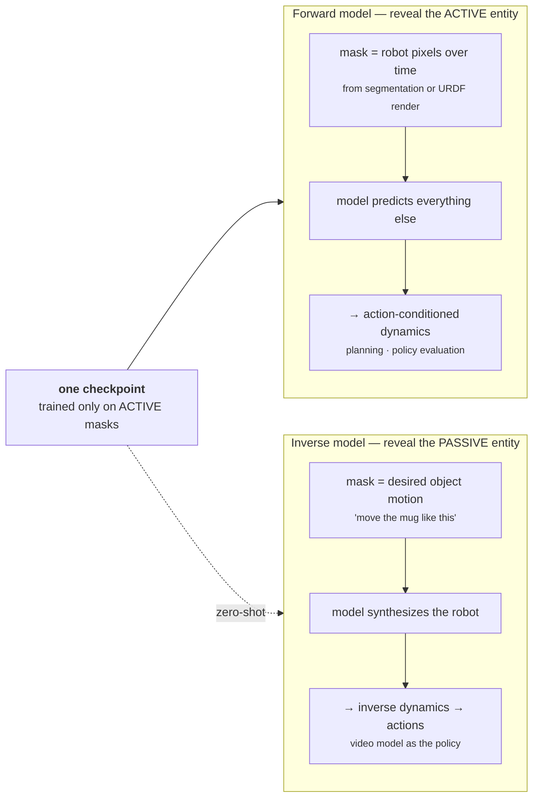
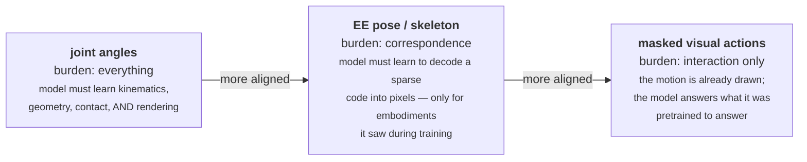

_Hadi Alzayer, Wenlong Huang, Haonan Chen, Christopher Luey, Lvmin Zhang, Maneesh Agrawala, Gordon Wetzstein, Li Fei-Fei, Yilun Du, Jiajun Wu, Jia-Bin Huang · Stanford / Maryland · July 2026 · [arXiv:2607.19343](https://arxiv.org/abs/2607.19343) · [project page](https://masked-visual-actions.github.io/) — Masked Visual Actions for Unified World Modeling_

A video model has already watched an enormous amount of the world moving, colliding, and responding to contact. That is exactly the prior a robot world model needs. The problem is the plug: **how do you tell a video model what action to take?**

Every answer so far has been some flavour of *telling it* — hand it a joint-angle vector, an end-effector pose, a skeleton overlay. This paper's answer is to stop telling and start **showing**: paint the robot's motion directly into the pixels, mask the rest, and ask the model to fill in what happens.

That one change turns a single LoRA-tuned checkpoint into four things at once.

## TL;DR

**The contribution is an interface, not a model.** No world model was trained from scratch. They took Wan-Fun-Control 2.2 14B off the shelf and LoRA-finetuned it (rank 256, 8× H200, ~10k steps, about four days) on **15 hours** of masked examples. Everything below follows from the conditioning format, not from capacity.

**The format: action as a partially revealed pixel trajectory.** Segment the robot out of a video (or render its URDF), show the model *only those pixels* over time, grey out everything else, and train it to complete the video. The action is now in the same space as everything else the model knows.

**The payoff nobody designed for.** They trained only on masks of the **robot**. At inference, masking an **object** instead — "here is how I want the teapot to move" — makes the same checkpoint run backwards and synthesize the robot motion that would cause it. Zero-shot. The paper says plainly: *"We initially expected this setting to require explicit inverse-modeling finetuning."*

**The baselines fail in a way that is more informative than the metrics.** Given an unfamiliar robot, skeleton conditioning makes the model **transform the robot into the one it saw in training**; end-effector conditioning makes it **insert a second robot into the scene**. Those are not degradations, they are the model overriding an input it cannot reconcile. Dense pixel conditioning has nothing to reconcile.

**The numbers.** On held-out DROID scenes, LPIPS 0.0945 vs 0.362 for Ctrl-World — and Ctrl-World was trained on all of DROID, including those scenes. On BEHAVIOR's unseen bimanual R1-Pro, Ctrl-World emits static or corrupted video; this model just works. Planning with Best-of-N gives **+7 to +26 points** of task success. Policy evaluation in imagination tracks reality at **r = 0.982**.

**The honest caveat, and it is the interesting one.** The imagined world is **optimistically biased** — it reports higher success than reality, consistently, in both sim and real. As a verifier it is well-*ordered* but mis-*calibrated*. That is exactly the right property for ranking candidates and exactly the wrong one for reading absolute success rates off it.

---

## 1 · The problem: the action interface

Everything in this paper hinges on one design question, and Figure 2 is the whole argument.

  

    
  

The paper's own framing of the trade-off:

> Low-dimensional robot actions are compact, but embodiment-specific and not aligned with the image observations used by video models. End-effector poses or robot skeletons are more visual, but remain sparse and require the model to infer geometry, contact, and interaction effects.

Read as a spectrum, the four options trade **precision** against **generality**:

| Representation | Aligned with video space | Embodiment-agnostic | Density | What the model must infer |
| :-- | :-- | :-- | :-- | :-- |
| joint angles | no | no | — | everything: geometry, kinematics, contact |
| end-effector pose | partly | no | very sparse | geometry, contact, interaction |
| skeleton overlay | partly | no | very sparse | geometry, contact, interaction |
| **masked visual actions** | **yes** | **yes** | **dense** | only the interaction with the rest of the scene |

The last column is the point. With a sparse signal, the model has to *learn a correspondence* between an abstract action encoding and the pixels it should produce — a mapping that is only valid for the embodiments it saw. With dense pixel conditioning, there is no correspondence to learn: **the robot's motion is already drawn**, and the model's only job is to answer *given this thing moving like this, what does the rest of the scene do?*

That is a question a video model was already trained to answer.

## 2 · The idea

Formally the setup is masked video completion. A scene is a set of entities $$e_i$$, each occupying some spatiotemporal region of pixels. A video model implicitly captures the joint distribution over all entity trajectories, including their interactions. Condition on a subset $$C$$ of entities and you get a conditional:

$$
p(\text{video} \mid \{e_i\}_{i \in C},\, I_{\text{ref}})
$$

realized by a binary mask $$M$$ over spatiotemporal pixels — revealed where the conditioned entities are, predicted everywhere else. The model sees the masked video plus a reference frame of the initial scene. The missing region is set to uniform grey.

> By varying $$C$$, the same model answers different questions about the same scene.

The lineage is explicit and worth noting: masked modeling in language (BERT) and masked-image prompting. Nothing exotic — the novelty is *what* gets masked.

## 3 · Active and passive, forward and inverse

The robotics move is to partition entities by role:

- **Active** — acts on the scene through its own agency: a robot arm, a human hand.
- **Passive** — its motion arises from interaction: the mug, the drawer, the cloth.

Reveal the active entity and you have a **forward model**: here is the robot's motion, predict the scene's response. Reveal the passive entity and you have an **inverse model**: here is how I want the mug to move, recover the robot behaviour consistent with it.

  

    
  

**The dashed arrow is the paper's best result.** They state the asymmetry directly:

> we trained our model only on masks depicting active robotic entities, yet it generalizes to queries conditioned on passive entities in a zero-shot manner

and they are careful to attribute it to the representation rather than to the model:

> this behavior is unique to our masked visual action conditioning, as conditioning the video model on sparser signals, such as low-level action commands or visualized skeletons, cannot achieve this level of generalization

Their own explanation — that inverse conditioning is "well-aligned with the model's learned representation" — is the right one and it is worth stating more strongly. **The active/passive distinction was never in the model.** The model learned "complete a masked video." Agency is a story the *user* tells about which region to reveal. Because the training objective never encoded the asymmetry, nothing in the model resists running it the other way.

There is a general design lesson in that. If you build a system whose training objective is *narrower than the interface it exposes*, you get capabilities you did not train for. Most robot world models train on `(observation, action) → next observation`, which bakes the direction of causation into the objective. This one does not, and gets the reverse direction free.

## 4 · How it is actually built

  

    
  

**Data.** DROID (real) plus RoboCasa (simulation), using **both success and failure trajectories** — which matters, because a forward model that has only seen successes cannot imagine a failure, and imagining failures is most of what planning is for.

**Two complementary ways to build the mask**, and the paper is clear that neither dominates:

*Segmentation.* Run SegmentAnything with the prompt "A robotic arm." No camera calibration required, no need to even know which robot is in the video. Maximum generality. Two problems, both stated: a user cannot easily supply an exact segmentation mask at test time, and occluded robot regions **leak information about scene dynamics** from the original video — a subtle contamination that would inflate results if unaddressed.

*Rendering.* Align the robot's URDF mesh to the video using recorded joint states and refined camera calibration. This lets you visualize *arbitrary* trajectories at inference, which is what planning requires. Costs you calibration and restricts you to rendering the robot.

**Two rendering details that are pure craft.** They render the robot **translucent** so the model can see the whole arm without self-occlusion, and set the **gripper fingers bright red** so the model can easily pick out the part that matters. Small choices, and exactly the kind that decide whether a conditioning signal is legible.

**Training.** Wan-Fun-Control 2.2 14B as the base. The masked conditioning video is encoded with the *same autoencoder* as the video model and fused by **concatenation** — appropriate precisely because the conditioning is spatially aligned with the desired output. LoRA rank 256, batch size 4, 8× H200, ~10,000 steps, ~4 days. Code, data and weights promised.

> Fifteen hours of data and four days on eight GPUs. The reason this is possible is that the format asks the base model to do something it already knows how to do.

## 5 · Results

### 5.1 · Controllability and fidelity

Baselines: **Ctrl-World** (raw end-effector state, prior SoTA), **Wan-Move** (track conditioning, given ground-truth tracks), and **Wan2.2 14B I2V** as a reference.

| Method | DROID LPIPS ↓ | SSIM ↑ | PSNR ↑ | BEHAVIOR LPIPS ↓ | SSIM ↑ | PSNR ↑ |
| :-- | --: | --: | --: | --: | --: | --: |
| Image-to-video | 0.521 | 0.548 | 12.42 | 0.602 | 0.457 | 10.22 |
| Wan-Move | 0.534 | 0.562 | 12.99 | 0.312 | 0.756 | 13.17 |
| Ctrl-World | 0.362 | 0.708 | 18.15 | 0.196 | 0.837 | 18.39 |
| **Masked Visual Actions** | **0.0945** | **0.887** | **23.74** | **0.123** | **0.843** | **22.90** |

A 3.8× LPIPS improvement over Ctrl-World on DROID — with a footnote the authors did not have to write:

> Ctrl-World was trained on the entirety of DROID, so it has seen our held out scenes during training.

That is a comparison run against a baseline with a data advantage, disclosed.

### 5.2 · Unseen embodiments

  

    
  

Ctrl-World "simply outputs static or corrupted videos for unseen embodiments." Raw action state is a code the model must have learned; a code it never learned decodes to noise.

### 5.3 · The ablation that carries the argument

They train the *same base model* on the *same DROID data* with three conditioning signals — end-effector visualization (IRASim-style), skeleton visualization (VAP-style), and masked visual actions.

| Conditioning | DROID LPIPS ↓ | Real-world LPIPS ↓ | BEHAVIOR LPIPS ↓ |
| :-- | --: | --: | --: |
| End-effector vis. | 0.107 | 0.183 | 0.171 |
| Skeleton vis. | 0.106 | 0.169 | 0.162 |
| **Masked Visual Actions** | **0.0945** | **0.148** | **0.123** |

On DROID all three are close — which is the honest reading, and the paper says so: *"we expect the varying action conditioning to perform similarly on the same domain as the training set."* The separation appears exactly where you leave the training distribution, and the *qualitative* failures are more informative than the deltas:

- On a Franka Panda with a **custom 3D-printed end-effector** — nearly the training embodiment, one part changed — skeleton conditioning makes the model **transform the robot to match the embodiment seen during training**.
- Under end-effector conditioning, the model **introduces another robot into the scene** that matches the training data.
- On BEHAVIOR's R1-Pro, both sparse variants "completely collapse and distort the robot."

Those are not blur or artifacting. **The model is discarding the input and substituting its prior**, because a sparse code that does not match anything it knows is best explained by assuming the familiar thing. Dense pixel conditioning cannot fail this way: there is no decoding step in which the evidence can be overruled.

### 5.4 · Planning, as test-time scaling

  

    
  

The loop: sample N candidate trajectories from a stochastic Diffusion Policy, roll each one out **inside the video model**, score each imagined rollout with **Gemini 3.1 Pro** on task success, interaction fidelity and physical realism, execute the winner. Best-of-N, ten scenes per task.

Gains over the base policy: **+24%** close microwave, **+26%** open drawer, **+21%** open dishwasher, **+11%** close fridge, **+9%** coffee setup mug, **+7%** close toaster. And the left panel is the clean part: success climbs monotonically from 1 to 10 rollouts.

The paper names the frame itself:

> This approach can be viewed as a form of test-time scaling, leveraging additional compute to achieve higher performance. In our case, the policy and video model act as the generator, and the VLM critic acts as the verifier.

### 5.5 · Policy evaluation — and the bias

  

    
  

Run a policy inside the world model, score the imagined rollouts against task rubrics, compare to the real environment. Correlation **r = 0.982**. Rollouts are additionally judged on *physical interaction realism* — "hallucinated task progress without contact is considered failure," which is a necessary rule and a revealing one to have needed.

Then the finding that matters most for anyone planning to use this:

> we observe that the video model shows a positive bias towards task progress, as evidenced by consistently higher task success rates in its imagination

Replicated in the real-world study: four tasks, 20 demonstrations each, per-task partial-progress rubrics, each simulated rollout paired with the demonstration it came from. The distributions closely match — and are shifted optimistic again.

**Well-ordered, mis-calibrated.** Look at the figure: the points track the diagonal tightly but sit above it. For ranking — which is all Best-of-N needs — that is fine, and it is why the planning results hold. For answering "is this policy good enough to deploy," it is not, and no amount of correlation fixes an offset.

### 5.6 · The video model as the policy

Give the model a desired object trajectory, let it synthesize the robot video, then recover executable actions with a learned inverse-dynamics model. Evaluated on RoboCasa's CoffeeServeMug — reach, grasp, transport, place, in a tight workspace — against Diffusion Policy, ACT and SmolVLA, all trained on 100 demonstrations. The paper's summary: *"even without task-specific video-model training, inverse modeling recovers competitive robot behavior."*

Competitive, not better. But it arrives through a completely different route, with no task-specific training of the generative model.

## 6 · Why this works, in one sentence

Every conditioning scheme is a claim about where the burden of inference sits.

Sparse conditioning asks the model to *decode*. Decoding is learned, and learned decoders fail off-distribution — usually by silently substituting something familiar, which is exactly the failure the ablation observed. Dense pixel conditioning removes the decoder. There is nothing left to be wrong about except the physics, and the physics is what the base model spent its pretraining on.

> The generality is not a property of the model. It is a property of not having asked the model to learn a code.

## 7 · Where this sits in the verifier ladder

[An earlier post](/blog/2026/the-verifier-ladder/) laid out five verifier tiers for programmatic 3D, ordered by cost — from *does it execute* up to *does a trained policy transfer*. Tier 4 is the only one that is truly the objective, and it is far too expensive to put in a loop.

**This paper's real product is a new rung between 3 and 4.**

| Rung | Verifier | Cost | Property |
| :-- | :-- | :-- | :-- |
| 3 | VLM looks at a render | one model call | noisy, single-frame |
| **3.5** | **rollout inside a learned world model, judged by a VLM** | **one video generation** | **r = 0.982 ordering, optimistic offset** |
| 4 | run the policy on the real robot | a real robot, real time | ground truth |

That is the rung the embodied line has been missing. And the two properties it comes with — reliable ordering, unreliable level — determine precisely what it may be used for. Rank candidate plans: yes, and the Best-of-N results prove it. Decide whether to ship: no.

The other consequence is more strategic. In the [world models taxonomy](/blog/2026/two-schools-of-world-models/) I split the field into a *generative* school (understand the world by generating it) and an *action-centric* school (understand it by acting in it). This paper is a bridge, and the bridge is exactly one design decision: **express the action in the generative school's native representation, and the action-centric school gets to borrow its priors.** Nothing else had to change — the base model was not retrained, only re-plugged.

## 8 · Limitations, and what I would want next

The paper's own two, both fairly stated:

**Correlation, not causation.** *"Our model, similarly to existing generative models, learns the correlation between object interaction rather than causal relationships, which remains an open research question."* This is the load-bearing caveat for planning. A model that has learned that arms-moving-toward-drawers co-occur with drawers-opening will confidently open a drawer that the gripper missed by two centimetres. Which is presumably why the evaluation rubric had to disqualify "hallucinated task progress without contact," and why the optimistic bias exists at all — those are the same phenomenon seen from two angles.

**Bounded by the base model.** In inference speed and in what it can express: the method *"re-purposes the model's prior rather than modifying its capabilities."* A cheerful reading is that this rides the video-model curve for free. A less cheerful one is that anything current video models are bad at — fine contact, small fast objects, precise force — this will be bad at too.

The article that pointed me here adds a third, and I think it is right: the visual representation is **coarse**, so this suits sorting, pouring, opening — and probably not dexterous hands, where the action space needs precision that pixels at video resolution do not carry.

**What I would want next, in order:**

**Calibrate the optimism.** The bias is consistent, which means it is probably learnable. A held-out set of (imagined progress, real progress) pairs and a one-parameter correction would move this from a ranker to an estimator, and that is the difference between a planning tool and an evaluation tool. It seems cheap relative to the value.

**Push the judge down the ladder.** The verifier is currently Gemini 3.1 Pro looking at generated video — tier 3, with tier-3 noise, now stacked on top of a generative model that is itself optimistic. Two noisy stages in series. In simulation you have the state; a deterministic check on the *imagined* rollout's inferred contacts would be cheaper and harder to fool.

**Test whether the failure data earns its place.** Training on both successes and failures is stated but not, as far as I can see, ablated. Given that the model's main flaw is optimism, whether the failure trajectories are actually damping that is the most interesting ablation not in the paper.

**Close the inverse loop.** Right now inverse modeling produces a video, which an inverse-dynamics model converts to actions. Executing those actions produces a real video that can be compared against the imagined one — a free, grounded, automatic error signal on the world model itself. That loop is not run here, and it is the one that would let this system improve itself.

> The interface was the whole problem, and the fix was to stop encoding actions and start drawing them. Everything downstream — forward, inverse, planning, evaluation, cross-embodiment transfer — falls out of a single checkpoint that was never told which entity was supposed to be in charge.
