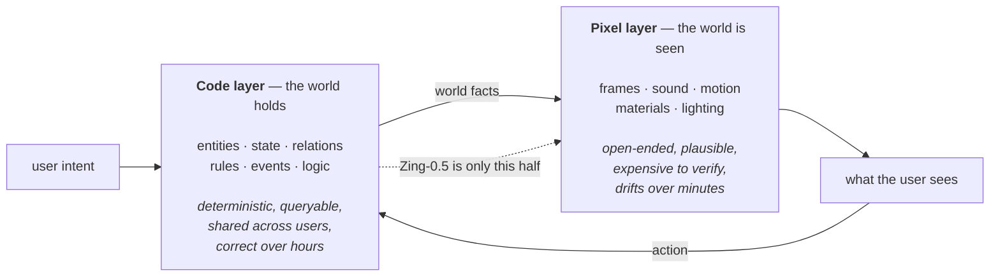
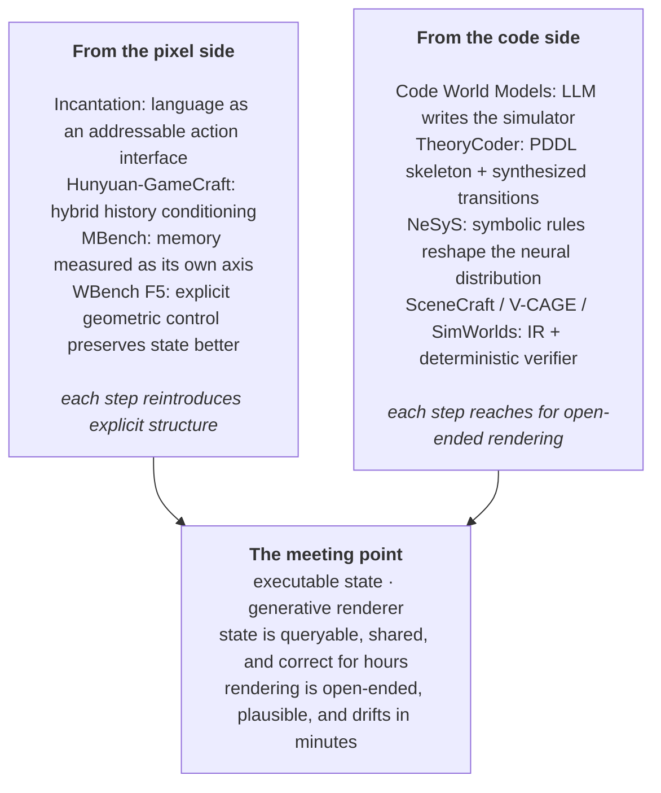

Real-time interactive video world models got crowded fast. PixVerse, LingBot, Alibaba's Happy Oyster, HiDream — all shipping demos in a few months, all pointing at the same first market: interactive entertainment. The story each tells is identical. When video can generate continuously and respond in real time, you stop watching content and start entering a world.

[Loopit](https://github.com/seedleap/zing-world-model) — a consumer app company best known as "playable TikTok," $100M raised, top of the US/EU entertainment charts — just open-sourced one of these models, **Zing-0.5**. And then used the launch to argue that the entire category, including their own model, cannot reach the endgame it is selling.

Their claim: **pure pixel streams do not become a world.** A persistent, multi-user, interactive world needs *code* to hold state, rules and causality, and *pixels* to do open-ended generative rendering. Hence the version number.

What makes this worth a post rather than a link is that the benchmark they topped had, three months earlier, published the empirical evidence for exactly this argument — and neither party seems to have connected the two.

## TL;DR

**Zing-0.5 is the pixel half of a two-half thesis, and it says so in its name.** A 5B causal DiT fine-tuned from Wan2.2-TI2V-5B, distilled to 4 steps with DMD, >24 FPS on a single RTX 5090, ~¥0.06 per minute of streamed video. Two control chains — an **action residual** for spatial control and text **cross-attention** for semantic control — enter the same continuous generation, so a new instruction *edits the running world* rather than replacing it with a new clip.

**Two training tricks are the interesting engineering.** Mid-rollout **prompt switching during training** (keep the generated visual and action history, swap the text condition, predict forward) makes mid-course rewriting a learned capability rather than an inference-time hack. And **history perturbation** — deliberately corrupting past frames with noise, blur, colour shift and view jitter while keeping the target clean — trains the model to distinguish real world state from its own accumulated drift, with no online corrector.

**The thesis: determinism from executable state, imagination from video generation.** Their tech co-founder's framing is the sharpest sentence in the release: *a bridge collapsing in the frame does not mean the system knows the bridge is gone; a thousand users each seeing a plausible frame does not mean they live in the same world.* The frame only has to look plausible. The world's facts have to stay correct.

**The benchmark already proved their point, in a finding nobody cites.** [WBench](https://arxiv.org/abs/2605.25874) reports that **physical correctness correlates with rendering quality at ρ = 0.82 and with control ability at near zero.** What these models score as "physics" is a *prettiness correlate*, not a causal property. That is the Code × Pixel argument stated as a measurement, by the people running the scoreboard.

**And the leaderboard claim needs one qualifier.** Zing-0.5 is **#2 overall** on WBench (81.0) behind JD's JoyAI-Echo-1.5 (81.6). The defensible claims are that it is **#1 among real-time causal models** — the model above it is bidirectional and non-real-time, which the release's own screenshot annotates in red — and that it is **#1 outright on the Physical dimension** (73.8). WBench's maintainers note that the overall leader "does not top any individual dimension."

**What I take from it.** This is the same architecture I argued for from the code side two posts ago, arrived at independently from the video side. Code-maintained state is a *deterministic verifier* for a generative renderer. The asymmetry that decides who wins: **the code half can check itself, and the pixel half cannot.**

---

## 1 · What Zing-0.5 actually is

### Joint control: two chains, one generation

An interactive world has to let you decide **where to go** and **what happens**. Most systems do one. Zing-0.5 runs both into the same causal DiT.

  

    
  

**The action chain** takes continuous signals — forward/back, strafe, look up/down/left/right — through sinusoidal encoding and a causal temporal convolution into a **per-frame action residual** aligned with the video tokens. It is a small module, under 10M parameters, and it runs continuously.

**The text chain** enters by cross-attention and changes only when the user types something.

The consequence is the thing the demos are built to show: because the action residual keeps running while the text condition changes, **the dragon can keep flying while it starts breathing fire.** The cave, the waterfall and the distant light source do not reset. The instruction is written *into* the current world.

**The training detail that makes this real.** During autoregressive training, Zing-0.5 **switches the prompt mid-rollout**: it keeps the already-generated visual history and action history, then predicts the continuation under a *new* text condition. So mid-course rewriting is learned during training, not concatenated at inference. That is a small change with a large consequence — it is the difference between a model that can be re-prompted and a model that has been trained on what re-prompting feels like from the inside.

### Drift: train on your own corrupted history

The universal failure of autoregressive video is that the first few seconds are stunning and minute two is a different world. The cause is structural: after the opening, the "history" the model conditions on is no longer real video — it is the model's own output, errors included.

  

    
  

Zing-0.5 perturbs a portion of the history during training while keeping the target clean, so the model learns to treat its own history as unreliable evidence and predict a stable future anyway. It costs nothing at inference — no corrector model in the loop — and it targets consistency of characters, structure and style over a long run rather than single-frame quality.

This is the same problem Self-Forcing and its successors attack from the other direction, and it is worth naming the difference. **Self-Forcing aligns training with inference by rolling out the student's own generations during the distillation stage**, fixing the train/test mismatch that CausVid's diffusion-forcing-on-real-data left open. Zing-0.5's history perturbation instead *simulates* the corruption without a full rollout. Cheaper, and less exact.

### The economics, which are the actual product constraint

- 5B parameters, fine-tuned from **Wan2.2-TI2V-5B** (verified on the model card)
- **DMD** distillation from many-step to **4 steps**
- incremental KV cache reuse for visual history; the text condition is only recomputed when the user changes the instruction
- **>24 FPS on one RTX 5090**; ~**¥0.06 per minute** of streamed video at their serving configuration

The 5B choice is stated as product-driven rather than research-driven: joint control, consistency, real-time latency and cost put into one constraint set instead of trading them for parameters. For a category whose entire premise is that people play with it for hours, that is the right objective function — an interactive world that costs a dollar a minute is a demo, not a product.

## 2 · The thesis: next frame, or next state

Having shipped the real-time video model, the team then argues against the category it belongs to.

> Multi-user, persistent, interactive digital worlds need stable state, rules, memory and multi-user consistency. These cannot all be handed to a visual model today. At this stage, **Code carries world state, Pixel does generative rendering** — get the world actually running first.
>
> — Henry, Loopit tech co-founder, formerly post-training lead on Seedance

The argument in its compressed form, and it is a good one:

> A bridge collapsing in the frame does not mean the system knows the bridge no longer exists. A thousand users each seeing a plausible frame does not mean they live in the same world.
>
> **The frame only needs to look plausible. The world's facts must stay correct.**

The positive claim is that a long-running world must know: which entities exist, what state each is in, what has already happened, which rules still hold, what a given action changed, and whether different users share the same outcome. If all of that is implicit in a video context window, then every frame is a fresh inference about *what would most plausibly come next* — which produces an extremely strong sense of world in the short run and cannot hold facts in the long run.

Their formulation:

> A video model can only predict the next frame. Code can maintain and execute the next world **state**.
>
> Determinism comes from executable state; imagination comes from video generation. **AI Coding makes the world hold; video models make the world seen.**

**Zing-0.5 is the right-hand box.** That is what the 0.5 means, and saying so out loud while shipping is unusual enough to note.

**The companion claim is about data, not architecture.** Their CEO — a Baichuan co-founder — splits the world by data maturity: domains with abundant data (text, text-to-video) favour a pure-model route; domains without it (autonomous driving, interactive world models) favour building model and application together. Interactive worlds need *"what the user wanted the world to become → how the system responded → whether the user was satisfied → what they did next"* — full trajectories that exist in no dataset and cannot practically be annotated. Their number: 5M registered users, ~15M interactive works, 2B plays, **~50B interaction trajectories.**

I find the architectural argument stronger than the data argument. The data argument is real but it is also the argument an incumbent app would make regardless; the architectural one is falsifiable, and §3 is where it gets tested.

## 3 · The benchmark already published the evidence

[WBench](https://arxiv.org/abs/2605.25874) is the Meituan LongCat × Fudan benchmark Zing-0.5 was evaluated on: 289 cases, 1,058 interaction turns, five dimensions (video quality, setting adherence, interaction adherence, consistency, physics compliance), four interaction types, 22 automatic sub-metrics validated against human judgement, 33 models evaluated.

  

    
  

Its published findings read, in retrospect, like a technical brief for the Code × Pixel position.

**Finding 4 is the one that matters, and I have not seen anyone quote it:**

> **Physical correctness follows rendering quality, not control ability.** Models with higher video quality tend to produce more physically plausible outputs (correlation ρ = 0.82), while control ability (navigation, interaction) shows near-zero correlation with physics scores.

  

    
  

Read that carefully. **What these models score as "physics" is a rendering-quality correlate.** Prettier frames read as more physically plausible to the metric — and, the human-validation study implies, to people. It is not measuring whether your action had the right consequence, because if it were, it would correlate with control.

This is Henry's distinction, measured: *looks plausible* and *is factually correct* are not merely different, they are **statistically independent** in current systems. And it has a hard corollary for the scaling argument — you cannot fix causal correctness by improving the renderer, because scaling the pixel model moves quality (and therefore apparent physics) along an axis that is orthogonal to control.

The other four findings sharpen it:

**Finding 1 — no model dominates.** Across 33 models including Genie 3, Kling 3.0, Seedance 1.5, Wan 2.7 and Cosmos 2.5, "JoyAI-Echo-1.5 (WM) leads overall but does not top any individual dimension."

**Finding 2 — navigation is largely independent of everything else.** YUME 1.5 tops navigation (72.0) and sits near the bottom on event editing (57.8) and perspective switching (16.7). Wan 2.7 inverts it. The maintainers' conclusion: navigation and semantic interaction "require fundamentally different internal representations." This is the empirical basis for Loopit's claim that joint control is only the *entry ticket* — the two capabilities do not come together for free.

**Finding 3 — camera control does not imply subject control.** HY-World 1.5 is #1 in navigation (87.5) and scores 62.5 on perspective consistency; LingBot-World is the reverse.

**Finding 5 — multi-turn interactions compound errors.** Navigation accuracy drops **−21 points from turn 1 to turn 4**. And the diagnostic matters: dedicated world models degrade far less than text-conditioned ones, "suggesting explicit geometric control better preserves spatial state than text-based prompting."

Finding 5 is the drift problem quantified, and it points the same way. The models that hold state better are the ones with an *explicit* representation of it. Extrapolate one step and you get: the model that holds state best is the one where state is not in the model at all.

## 4 · Survey — the real-time interactive video line

Where Zing-0.5 sits. The line has converged on a recognizable recipe in about eighteen months.

| System | Origin | What it contributed |
| :-- | :-- | :-- |
| **GameNGen / Oasis** | Google / Decart | proof that a diffusion model can *be* the game loop |
| **Genie 2 → 3** | DeepMind | photorealistic, promptable, persistent-ish; **SIMA 2 trains inside it** |
| **[Matrix-Game](https://arxiv.org/abs/2506.18701) → [2.0](https://arxiv.org/abs/2508.13009)** | Skywork | open weights; UE + GTA5 data pipeline (~1,200 h); frame-level mouse/keyboard injection; 25 FPS |
| **[Hunyuan-GameCraft](https://arxiv.org/abs/2506.17201)** | Tencent | 1M+ recordings across 100+ AAA games; **hybrid history condition**; −55% interaction error cross-domain |
| **[Incantation](https://arxiv.org/abs/2605.18601)** | — | **natural language as the action interface**, per-latent-frame (0.25 s); multi-entity control; 89% vs 43% cross-entity transfer |
| **Zing-0.5** | Loopit | joint action+language control; history perturbation; 4-step DMD; ¥0.06/min |

  

    
  

**The shared recipe**, visible in that figure and in Zing-0.5 alike: a bidirectional video backbone, an action-conditioning module bolted on, causal/autoregressive conversion, then few-step distillation for real-time streaming. The [Self-Forcing](https://self-forcing.github.io/) lineage — CausVid's ODE-init + asymmetric DMD, then Self-Forcing's replacement of diffusion-forcing with student self-rollout — is the engine underneath essentially all of them.

**Where the frontier is moving.** Incantation is the most interesting recent one for anyone thinking about control interfaces: it argues the *action interface itself* is the bottleneck, because animation IDs, device inputs and scene-level captions all bind action semantics to a specific entity or engine at design time. Natural language per-frame unlocks multi-entity control and cross-entity transfer — 90% vs 0% on out-of-vocabulary prompts. That is a strong result, and note what it implies: it is the pixel line reinventing an *addressable, symbolic* action space, which is what a code layer gives you for free.

**And the memory line is now benchmarked separately.** [MBench](https://arxiv.org/abs/2606.00793) decomposes world-model memory into entity, environment and causal consistency across 12 sub-dimensions, and reports "critical systemic limitations of existing methods in long-term state retention." Memory is being measured as its own axis because it is not arriving as a side effect of scale.

## 5 · Survey — the code/state line

The other half of the thesis has its own literature, and it is older and less glamorous.

**[Code World Models](https://openreview.net/forum?id=1UoB7IWiku)** (ICLR 2026) compiles natural-language game rules into an executable Python implementation supporting MCTS planning. **TheoryCoder** extends this to bilevel planning, with PDDL operators giving high-level structure and LLM-synthesized Python functions implementing low-level transitions. The pattern — have an LLM write the *simulator* rather than *predict the next state* — is exactly "Code maintains and executes the next world state," and it predates the video framing.

**[Neuro-Symbolic Synergy](https://arxiv.org/abs/2602.10480)** is the most directly relevant hybrid. Its diagnosis of LLM world models is the same one Loopit makes of video world models: they "frequently hallucinate... where strict compliance with deterministic transition rules — particularly in corner cases — is essential," while symbolic world models "provide logical consistency but lack semantic expressivity." Its mechanism is worth stealing: the symbolic model **directly constrains the neural one by modifying its output probability distribution**, and the neural model is fine-tuned only on trajectories the symbolic rules do not cover — halving training data with no accuracy loss.

That last detail is the general shape of the answer. **The deterministic component should not merely post-check the generative one; it should shape its distribution, and the generative one should only be trained on what the deterministic one cannot express.**

**Related lines worth tracking:** hybrid planners that route between an agent world model and a parametric one, and the growing "agentic world modeling" framing that treats the world model as something an agent *constructs and maintains* rather than something it merely samples from.

## 6 · Where the two lines meet

The convergence is already visible from both directions, which is usually a sign the architecture is right.

The pixel line keeps reinventing symbolic structure — an addressable action vocabulary, an explicit history condition, a separately-measured memory axis. The code line keeps reaching for generative rendering because hand-authored assets cannot cover an open world. Neither is going to get there alone, and the interesting question is which side you start from.

**My read, and it is the argument from [the verifier ladder](/blog/2026/the-verifier-ladder/):** start from code, because **the code half can verify itself and the pixel half cannot.** An executable world state is a deterministic checker — you can query whether the bridge exists, whether two users see the same inventory, whether an action was legal — at zero marginal cost, thousands of times inside a search. A rendered frame can only be judged by another model, expensively and noisily. WBench's ρ = 0.82 is what happens when the only available critic is a perceptual one: it measures beauty and calls it physics.

That asymmetry says the state machine should be the *system of record* and the renderer should be downstream of it — which is, in different words, exactly what Loopit concluded.

## 7 · What to check before repeating the claims

The release is a strong technical contribution with a promotional wrapper, and the two should be separated.

**The "#1 on WBench" headline.** On the leaderboard as published, Zing-0.5 scores **81.0 average — second**, behind JD Future Academy's JoyAI-Echo-1.5 at 81.6. The release's own screenshot annotates the row above it in red: *bidirectional model, non-real-time interaction.* So the honest statements are:

- **#1 among real-time causal models** — a real and meaningful category, since the model above it cannot be played
- **#1 outright on the Physical dimension** (73.8), which given Finding 4 is the least gameable column on the board
- #4 consistency (88.5), #5 interaction (84.2), #8 quality (80.6), #14 setting adherence (77.8)

And WBench's own maintainers add the caveat that the overall leader "does not top any individual dimension" — on a benchmark where nobody dominates, "first" is a claim about an average, not a capability.

**The "0.5" is doing honest work, and should be held to.** Everything argued in §2 describes Zing-**1.0**. What exists is the renderer. The hard part — an AI-coding layer that turns intent into entities, rules and events, updates world facts under user action, and stays consistent across many users — has not been demonstrated by anyone, including them.

**The data moat argument is unfalsifiable in the direction it is pointed.** 50B interaction trajectories is a real asset. But "you must build the app to get the data" is also precisely what a company with an app and no model would say, and the load-bearing question — *does that trajectory data actually train a better world model?* — has no public evidence attached to it yet.

**And one thing I could not verify.** The claim of >24 FPS on a single RTX 5090 at ~¥0.06/min is from internal testing. The weights are on Hugging Face under Apache-2.0, so it is checkable, and worth checking before planning around it.

## 8 · What I take from this

**The frame/state distinction is the most useful sentence in the release**, and it generalizes past video. *The frame only needs to look plausible; the world's facts must stay correct.* Substitute "render" for frame and "scene graph" for facts and you have the argument for programmatic 3D. Substitute "output" and "execution state" and you have the argument for coding agents. It is the same claim about where truth lives.

**WBench Finding 4 should be more famous than it is.** ρ = 0.82 between quality and physics, ~0 between control and physics, is the clearest published evidence that scaling generative video does not buy causal correctness. Anyone whose plan is "the video model will eventually learn physics" should have to answer it.

**The two lines are converging and the code side has the better starting position.** Not because code is more expressive — it is much less — but because it is the half that comes with a free verifier. Every capability the pixel line has recently added (addressable actions, explicit history, measured memory) is a step toward something the code layer already has.

**And the reversal in the framing is the part worth sitting with.** The industry default is *train the world model, then find the application*. Loopit's bet is the inverse: put the model in a real product, accumulate the intent→action→consequence→feedback loop that exists nowhere else, and let the model grow out of it. Whether or not the data moat argument holds, that is the same loop this whole blog has been circling — a system that improves because something outside the model keeps telling it what actually happened.

> A video model predicts the next frame. A world has to survive the next hour. Those are not the same objective, and the benchmark now has a number for the difference.
