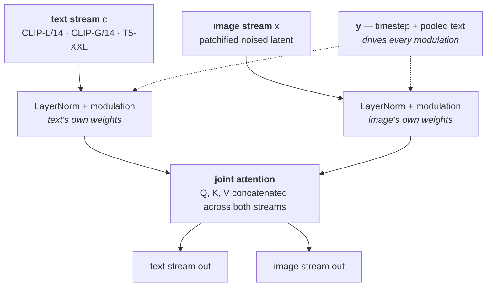
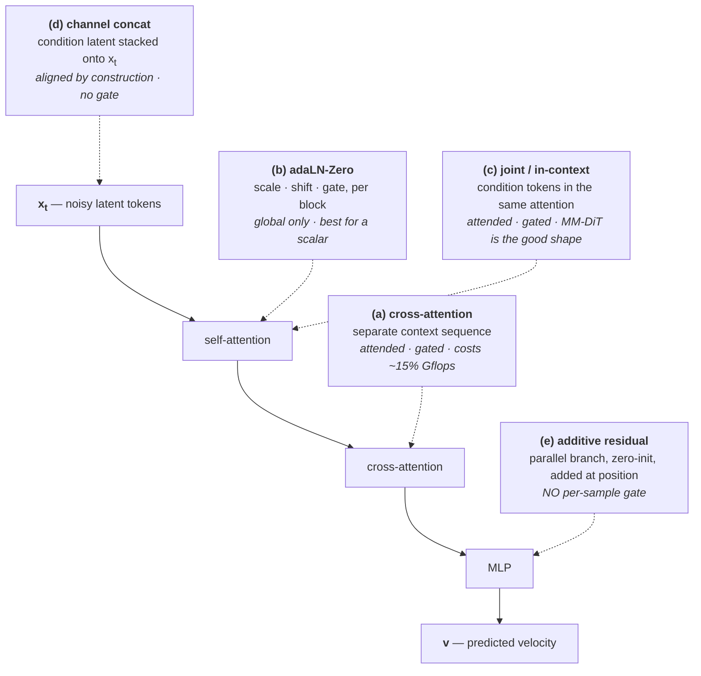

## TL;DR

**Every current video model is the same machine.** A 3D VAE compresses pixels; the latent volume is cut into spatiotemporal patches; a Transformer predicts a velocity; an ODE solver integrates it. Sora, Wan, HunyuanVideo, CogVideoX, MiniMax-H3, Zing-0.5 — one architecture, five papers deep.

**The training objective is a single L2 regression.** Interpolate a straight line from noise to data, regress the network onto that line's velocity. No adversarial term, no KL, no auxiliary loss. Everything these models know was bought with one squared error, which is why adding a second loss term is a larger decision than it looks.

**The argument the whole interactive-world field is currently having — where should state enter the model? — was enumerated in DiT's Figure 3 in 2022, and ablated.** Four conditioning sites, same backbone, same budget. The spread is not subtle: **FID 35.24 for token concatenation versus 19.47 for a zero-initialised modulation**, at identical training steps.

**But that ablation conditions on a class label, and it does not settle the spatial case** — you cannot push a proxy video through a per-block scale-and-shift. That gap is exactly why ControlNet exists, and why the modern answer is *different sites for different payloads* rather than one winner.

**One nuance corrects a story I told earlier.** DiT's in-context loser appends conditioning as two extra tokens with shared weights. SD3's MM-DiT gives each modality its own full-width stream with **separate weights and joint attention** — and that scales better than cross-attention. So "token concatenation" names two very different things, and [Code World Model]() uses the good one.

---

## 0 · Why these five

Read the method section of any interactive world model — [Code World Model](), Zing-0.5, Matrix-Game — and the parts that differ between them are small. The backbone is shared, the objective is shared, the distillation recipe is shared. What differs is **where the control signal is spliced in**, and that is a decision with a fifteen-year literature and hard numbers attached.

These five papers are the ones that fixed each layer. Together they leave no black box in any current system's implementation details.

| Paper | What it fixed |
| :-- | :-- |
| [DiT](https://arxiv.org/abs/2212.09748) | the backbone, and the taxonomy of conditioning sites |
| [Rectified Flow](https://arxiv.org/abs/2209.03003) | the objective |
| [SD3](https://arxiv.org/abs/2403.03206) | what actually scales, and the multimodal block shape |
| [ControlNet](https://arxiv.org/abs/2302.05543) | spatial conditioning, and zero-initialisation |
| [CFG](https://arxiv.org/abs/2207.12598) | the strength dial |
| [Self-Forcing](https://arxiv.org/abs/2506.08009) | real-time autoregressive generation |

---

## 1 · DiT — the backbone, and the question

*Peebles & Xie, UC Berkeley / NYU.* Replaces the U-Net denoiser with a Transformer, and in doing so has to decide something a U-Net never made explicit: **where does the conditioning go?**

### Patchify: where "visual tokens" come from

The noised latent, $I \times I \times C$, is cut into $p \times p$ patches and each is linearly projected to one token. So the sequence length is

$$T = (I/p)^2$$

  

    
  

This is the arithmetic behind every token-budget claim in the current literature. When Code World Model reports that its proxy video, rendered at one quarter resolution per spatial dimension, costs "1/16 as many visual tokens," it is this formula: $(1/4)^2$.

### Figure 3 is the whole conditioning debate, drawn in 2022

  

    {% include figure.liquid path="assets/img/video-model-primer/dit_block.png" class="img-fluid rounded z-depth-1" zoomable=true caption="Figure 3 of DiT. Left: the latent diffusion transformer. Then three ways to feed it a condition — adaLN-Zero (per-block scale, shift and gate regressed from the condition), cross-attention (an extra attention layer attending to the condition), in-context (condition appended to the token sequence). Every conditioning argument in interactive world models today is a choice among these plus ControlNet's fourth." %}
  

**adaLN-Zero** deserves its own sentence, because our whole residual design descends from it. Beyond regressing the usual scale $\gamma$ and shift $\beta$ for layer norm, it also regresses a **per-dimension gate $\alpha$ applied immediately before each residual connection**, and initialises the MLP producing $\alpha$ to zero. At step zero every block is exactly the identity function; training starts from the unmodified network and the only available direction is improvement.

### The ablation, with numbers

Four DiT-XL/2 models, same data, 400K steps, FID-50K without guidance:

| Block design | Gflops | Params | FID-50K |
| :-- | --: | --: | --: |
| In-context (token concat) | 119.4 | 449M | **35.24** |
| Cross-attention | 137.6 | 598M | **26.14** |
| adaLN | 118.6 | 600M | **25.21** |
| **adaLN-Zero** | 118.6 | 675M | **19.47** |

Three readings, in order of how much they matter.

**Site matters enormously.** Nearly a factor of two in FID between the best and worst way of feeding in *the same information*, at the same compute. The authors' own summary: "the conditioning mechanism critically affects model quality."

**Zero-initialisation alone is worth 25.21 → 19.47.** Same architecture, same parameters, same everything — the difference is whether the block starts as the identity. A 23% improvement from an initialisation choice.

**Cross-attention is the expensive option.** It adds ~15% Gflops and still loses to adaLN-Zero.

> **The caveat that keeps this honest:** the condition here is an ImageNet class label — one low-dimensional global vector. adaLN can only apply *the same function to every token*, so it is structurally incapable of carrying a depth map, a pose skeleton, or a proxy video. This ablation proves the site matters. It does not tell you which site to use for a spatially varying condition, because two of the four contenders cannot represent one at all.

That gap is the next paper.

---

## 2 · ControlNet — the spatial case, and zero convolutions

*Zhang, Rao & Agrawala.* The condition is now an image aligned pixel-for-pixel with the output — edges, depth, pose, segmentation. None of DiT's three sites fit: adaLN is global, cross-attention discards the alignment, and token concatenation pays quadratic attention cost for information that is already positionally matched.

The answer is a fourth site: **a parallel branch whose output is added back at the matching spatial position.**

  

    
  

**The zero convolution is the same idea as adaLN-Zero, in a different shape.** A 1×1 convolution with weights and bias initialised to zero. At step zero the entire branch contributes nothing, so the locked model is bit-for-bit unchanged, and no noise from an untrained branch is injected into a working network.

  

    
  

**The property that matters for world models, and that nothing in the paper is written to advertise:** this site has **no per-sample gate**. Attention weights are computed from the input and can be small for one sample and large for another. An added residual is added unconditionally. To suppress it, the projection must go to zero for *every* sample — which also destroys it on the samples where it helps.

> The question was never whether a conditioning channel can be ignored. It is whether it can be ignored **selectively** — and a model whose objective is *continue this video plausibly* will reach for a selective gate exactly when the condition disagrees with the history.

---

## 3 · Rectified Flow — the objective

*Liu, Gong & Liu, UT Austin.* Replaces the DDPM noise-prediction objective with something almost embarrassingly simple.

Take data $x_1$, noise $x_0 \sim \mathcal{N}(0,I)$, a random time $t \sim U[0,1]$. Interpolate on a **straight line**:

$$x_t = (1-t)\,x_0 + t\,x_1$$

The velocity along a straight line is constant, $x_1 - x_0$, so the network just regresses onto it:

$$\mathcal{L} = \mathbb{E}_{t,\,x_0,\,x_1}\Big\|\,v_\theta(x_t,\,t,\,c) - (x_1 - x_0)\,\Big\|^2$$

  

    
  

The reason to care beyond elegance: **straight paths are cheap to integrate**. A curved probability-flow ODE needs many small steps; a straight one tolerates few large ones. Every real-time system downstream depends on this.

Sampling is Euler integration, $x \leftarrow x + v_\theta(x,t,c)\,\Delta t$, typically 20–50 steps before distillation.

> **Note the shape of this loss, because it is the constraint on everything else.** One squared error is the entire source of a video model's prior — how objects move, how light falls, what plausibly comes next. Any auxiliary term added later moves the optimum off the thing you were trying to keep.

(Conventions differ on direction. Here $t{=}0$ is noise and $t{=}1$ is data; SD3 runs it the other way. Check before porting a formula.)

---

## 4 · SD3 — what scales, and the two-stream block

*Esser et al., Stability AI.* The paper that took rectified flow to 8B and reported what survived contact with scale. Two results matter here.

**A timestep sampling schedule.** Uniform $t$ wastes capacity — the middle of the path is where the hard prediction lives. Logit-normal sampling of $t$ concentrates training there, and it is now standard.

**MM-DiT, which changes what "token concatenation" means.** Text tokens and image tokens go into **one joint attention operation** — queries, keys and values concatenated across modalities — but each modality gets **its own projection and MLP weights**. Not cross-attention, not naive appending. Two full-width streams that attend to each other.

  

    
  

**This is the correction I owe from an earlier discussion.** I have been treating "token concatenation" as one thing and using DiT's in-context result to argue against it. But DiT's in-context variant appends *two* conditioning tokens to the image sequence and processes them with shared weights — a class label crammed into the wrong container. MM-DiT gives the condition a full stream with its own parameters, and it beats cross-attention.

So the taxonomy needs the distinction:

| | Shape | Result |
| :-- | :-- | :-- |
| DiT in-context | condition appended as a couple of tokens, shared weights | worst of four |
| MM-DiT | condition is a full modality stream, separate weights, joint attention | best-scaling for text |

Code World Model's proxy enters a multimodal encoder — the MM-DiT-shaped version, not the DiT in-context version. **The open question about it is authority under contradiction, not whether the site works.**

---

## 5 · CFG — where the dial comes from

*Ho & Salimans.* Two pages, no architecture, and every text-to-image system ships with it on.

Train with the condition replaced by a learned null embedding $\varnothing$ some fraction of the time, so the model learns both conditional and unconditional prediction. At inference, extrapolate:

$$\tilde v = \underbrace{v(x,t,\varnothing)}_{\text{unconditional}} + w \cdot \Big(\underbrace{v(x,t,c)}_{\text{conditional}} - v(x,t,\varnothing)\Big)$$

$w = 1$ is ordinary conditional generation. **$w > 1$ pushes past the model's own conditional estimate** — more obedient to the condition than the model thinks it should be.

  

    
  

That picture is worth holding onto, because it is what "turn up the guidance" costs. The distribution does not just get more obedient; it gets **narrower**. In images this reads as oversaturation and oversharpening; in a world model it would read as a scene that follows its state faithfully and looks progressively less like a scene.

**Why this matters structurally:** guidance is available for *any* conditioning channel, for free, the moment that channel is trained with dropout. Make world state a conditioning variable and you get a scalar knob for how hard the state overrides the model's prior — one number, set at inference, no retraining. Nothing in the prompt-based approaches has an equivalent.

---

## 6 · Self-Forcing — the train/test gap, and real-time

*Huang, Li, He, Zhou & Shechtman, Adobe Research / UT Austin.* The last layer: turning a 50-step bidirectional model into something that streams.

The problem is **exposure bias**. An autoregressive video model trained with teacher forcing always sees ground-truth context; at inference it sees its own imperfect output. Errors compound. Diffusion forcing helps but still denoises frames conditioned on clean context.

  

    
  

The fix is to train the way you sample: **self-rollout**, generating the sequence autoregressively during training, with a **holistic distribution-matching loss over the completed rollout** rather than a per-frame objective. The model is optimised on its own error distribution instead of on a distribution it will never see.

  

    
  

This lineage — CausVid, DMD, Self-Forcing — is the engine under essentially every real-time interactive video system, Zing-0.5 included. It is also what [Code World Model]() does *not* implement, which is why that paper states plainly that it is not real-time.

---

## 7 · The taxonomy, assembled

| | Site | Natural payload | Gated per sample | Fixed by |
| :-- | :-- | :-- | :-- | :-- |
| **(a)** | cross-attention | text, variable length | yes | DiT |
| **(b)** | adaLN-Zero | timestep, class, pooled vectors | partly | DiT |
| **(c)** | joint / in-context attention | reference images, multimodal streams | yes | DiT → SD3 |
| **(d)** | channel concat | first-frame image-to-video | no | LDM lineage |
| **(e)** | additive residual | depth, pose, action, proxy | **no** | ControlNet |

**Two operator properties do most of the work.** Cross-attention is permutation-invariant — shuffle the context and the output is unchanged — which makes it right for *which entities exist* and wrong for *where they are on screen*. An additive residual is spatially anchored, and is the reverse. That is a fact about the operators, not a design preference, and it is why a system carrying both kinds of information ends up with two branches rather than one.

### Where the current systems land

| | Payload | Site | Trained |
| :-- | :-- | :-- | :-- |
| **Zing-0.5** | 8-DoF action → sin/cos → causal temporal conv | **(e)** per-frame residual, <10M params | action module |
| | text instruction | **(a)** cross-attention | — |
| **[Code World Model](https://arxiv.org/abs/2608.25927)** | proxy video, 11 frames of 124 | **(c)** multimodal encoder | rank-128 LoRA, 50 blocks, ~596M |
| | text description | **(c)** same sequence | — |

They take **opposite sides for different payloads**, and neither has published the experiment that separates them: does the channel win when it *contradicts* the model's own continuation prior? DiT showed that site choice is worth a factor of two on a class label. Nobody has run the equivalent for a spatial world-state condition.

That experiment is cheap, and it is the one I would want first.

**Related:** [The Proxy Is the Contract]() on Code World Model · [The Frame Is Not the World]() on Zing-0.5 and the persistence benchmarks · [Two Schools of World Models]() for the landscape.
