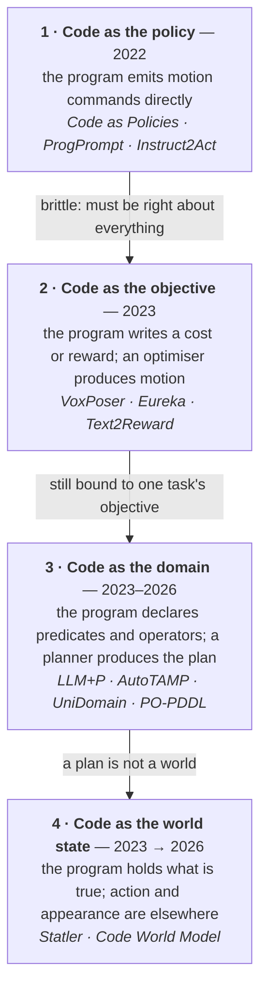
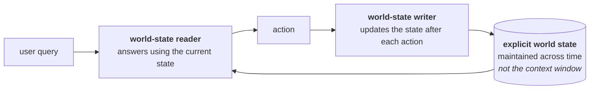

Four years of people asking language models to write programs for robots. The papers look scattered until you ask one question of each: **what is the code actually *for*?** Then they sort into four levels, and the field's movement through those levels is a single argument being made over and over.

## TL;DR

**The code has been retreating from the actuator.** In 2022 the code *was* the policy. Then it became the cost function a classical optimizer solves. Then the domain model a planner solves. Now it is the world state itself, with neither actions nor pixels inside it.

**Every retreat was forced by the same failure.** A program that specifies *motion* has to be right about everything. A program that specifies *facts* only has to be right about facts. [RoboInspector](https://arxiv.org/abs/2508.21378) is the reckoning: across 216 task-instruction-model combinations, generated policy code is unreliable in four characterisable ways, and **reliability varies with how the user phrases the same task**.

**What separates the systems that work from the demos is not the LLM — it is whether anything checks the code.** Every level that survived contact with real robots paired generation with a checker: a planner, a simulator, an RL loop, a type system.

**The counter-current worth knowing:** LLMs are [measurably bad at writing PDDL directly](https://arxiv.org/abs/2502.20175), yet LLM+planner systems work well. That is not a contradiction — it is the whole design principle. Propose with the model, verify with the machinery.

**Where the open ground is:** the perception→symbol step. Every level above 1 assumes someone can turn pixels into the symbols the program refers to, and that assumption is where the systems actually break. §8.

---

## 1 · The four levels

The axis is **distance from the actuator**, and it is also **how much has to be correct for the system to work**. At level 1 a wrong line crashes the robot. At level 4 a wrong line makes a fact wrong, and a fact can be checked.

A fifth cluster sits off this axis — code that generates *training tasks* rather than participating in control — and it gets §6.

## 2 · Level 1 — code as the policy

### The founding pair

**[Code as Policies](https://arxiv.org/abs/2209.07753)** (Liang et al., 2022) is the paper that started it. Give an LLM a natural-language command and API documentation for the robot's perception and control primitives; it writes Python that calls them. The insight was that code is a *better action representation than free text*: it composes, it has control flow, it can express "repeat until", and it is inspectable before it runs.

**[ProgPrompt](https://arxiv.org/abs/2209.11302)** (Singh et al., 2022) arrived simultaneously with the complementary trick: put the available actions in the prompt as **Pythonic function signatures**, so the model's plan is grounded in what the robot can actually do by construction. State of the art on VirtualHome at the time.

**[Instruct2Act](https://arxiv.org/abs/2305.11176)** extended this by having the generated code call specialist perception models — SAM for segmentation, CLIP for open-vocabulary classification — rather than assuming a perception API exists.

The context these grew out of matters: **[SayCan](https://arxiv.org/abs/2204.01691)** had just shown that LLM plans need grounding in affordances, and **[Inner Monologue](https://arxiv.org/abs/2207.05608)** that they need feedback from execution. Code was the natural next step because it made the plan *executable* rather than a list of strings.

### The reckoning

**[RoboInspector](https://arxiv.org/abs/2508.21378)** (Ying, Du, Cheng, Shu) is the paper this level needed and did not get for three years. It runs **216 combinations of task, instruction and LLM across two prominent frameworks**, in simulation and on hardware, and characterises four distinct unreliable behaviours in the generated policy code.

The finding that should change how people build at this level:

> Generated control code varies **when different users describe identical tasks**. Reliability degrades with task complexity and with instruction granularity.

Their refinement approach recovers up to 35% reliability — which is a useful result and also an admission of how much there is to recover. A [NeurIPS 2025 neuro-symbolic paper](https://papers.neurips.cc/paper_files/paper/2025/file/6d13ce54347c65845614d01ced1dbe23-Paper-Conference.pdf) attacks the same problem from the verification side.

**Verdict on level 1:** the right idea about representation, at the wrong altitude. Code as an action space is genuinely better than text as an action space. But a program that has to be correct about geometry, timing, contact and control simultaneously has too many ways to be wrong, and the failure is silent — syntactically valid code that does the wrong thing.

### The level-1 revival

Worth noting that level 1 is not dead; it came back with agents. **[Act-Observe-Rewrite](https://arxiv.org/abs/2603.04466)** treats a multimodal coding agent as an in-context policy learner — write code, run it, look at what happened, rewrite. That is level 1 plus the one thing level 1 lacked: **a closed loop with a checker**, where the checker is the robot itself. It is the same correction every level in this survey eventually makes.

## 3 · Level 2 — code as the objective

The first retreat. Stop writing the motion; write the thing motion is optimised against, and let a solver that is actually good at optimisation produce the motion.

**[VoxPoser](https://arxiv.org/abs/2307.05973)** (Huang et al., 2023) is the cleanest statement. The LLM writes code that composes **3D value maps** — affordance and constraint fields over the workspace — and a model-based planner synthesises trajectories through them. The LLM never emits a waypoint. It emits a landscape, and something else rolls downhill.

Why this is a real improvement and not a reshuffle: **a wrong value map degrades gracefully.** A wrong waypoint does not.

**[Eureka](https://arxiv.org/abs/2310.12931)** (2023) applies the same move to reinforcement learning: the LLM writes **reward functions** in Python, given the environment source as context, inside an evolutionary loop — generate a population, train RL agents in parallel, feed the training statistics back as "reward reflection", regenerate. **[Text2Reward](https://arxiv.org/abs/2309.11489)** does dense reward shaping with human feedback in the loop; **[DrEureka](https://arxiv.org/abs/2406.01967)** extends it to sim-to-real by having the LLM also write the domain-randomisation configuration.

**What makes this level work is that the checker is free and quantitative.** An RL training curve is a verifier. A trajectory optimiser either converges or does not. The LLM is proposing into a space where being wrong is *cheap and immediately visible*, which is the condition under which LLM generation is reliable and the condition level 1 lacked.

**Verdict:** the highest ratio of working systems to papers in this whole lineage, precisely because the feedback signal is built in.

## 4 · Level 3 — code as the domain

The second retreat. Do not write the objective; write the **model of what actions exist and what they do**, then hand it to fifty years of planning research.

**[LLM+P](https://arxiv.org/abs/2304.11477)** (2023) established the pattern: translate the natural-language problem into a PDDL *problem* file against a predefined domain, call a classical planner, translate the plan back. The LLM does translation, never search. **[LLM+MAP](https://arxiv.org/abs/2503.17309)** extends this to bimanual planning, **[SPAR](https://arxiv.org/abs/2509.13691)** to aerial robots, and **[T³ Planner](https://arxiv.org/abs/2510.16767)** adds temporal logic with self-correction.

**[Leveraging Pre-trained LLMs to Construct and Utilize World Models](https://arxiv.org/abs/2305.14909)** (2023) took the harder step: have the LLM write the **domain**, not just the problem — the predicates and operators themselves — with human correction in the loop.

**[AutoTAMP](https://arxiv.org/abs/2306.06531)** pairs LLM translation with automated checking, closing the loop that task-and-motion planning always needed.

### The bottleneck, and the 2026 answer

Hand-written domains were the thing holding this level back — they need a PDDL expert per environment and they do not transfer. Three recent papers attack it directly:

| Work | Approach |
| :-- | :-- |
| **[UniDomain](https://arxiv.org/abs/2507.21545)** | Pretrain one unified PDDL domain from **12,393 manipulation videos**, yielding 3,137 operators and 2,875 predicates |
| **[PO-PDDL](https://arxiv.org/abs/2606.15654)** | Learn symbolic **POMDPs** from visual demonstrations — planning under uncertainty, not just full observability |
| **PDDLLM** | Induce predicates and actions from demonstration trajectories, combining LLM reasoning with simulation rollouts |

UniDomain is the interesting one strategically: it treats the symbolic domain as **something you pretrain once at scale**, exactly as you would a foundation model, rather than something you author per environment. That is the bet that a growing library of verified, reusable pieces — pretrained once, composed per environment — beats authoring a domain per environment, which is the same shape as every other foundation-model argument.

### The counter-current

**[An Extensive Evaluation of PDDL Capabilities in off-the-shelf LLMs](https://arxiv.org/abs/2502.20175)** (2026) is the necessary corrective: LLMs are *measurably bad* at producing valid PDDL directly.

This looks like it should sink the level, and it does not, for a reason worth stating plainly:

> **Nobody who builds a working level-3 system asks the LLM for a correct domain. They ask for a candidate and check it.** The planner is a total verifier — a domain either admits a plan or it does not, and a plan either satisfies the goal or it does not, both decidable in milliseconds.

That is the same structure as level 2's RL loop and level 1's missing checker. **Generation quality has never been the binding constraint in this lineage. Verification availability has.**

## 5 · Level 4 — code as the world state

The third retreat, and the one that changes what the code is *about*. Levels 1–3 all write programs about **what to do**. Level 4 writes a program about **what is true**.

**[Statler](https://arxiv.org/abs/2306.17840)** (Yoneda et al., 2023) is the origin and is underrated. It splits the LLM into two roles:

The claim is that an **explicit, maintained state representation is a form of memory** that removes the dependence on context length for long-horizon reasoning — and it beat Code as Policies on exactly the long-horizon tasks where level 1 falls apart.

Read that against the four-level arc and Statler is the hinge: it is the first system in the lineage where the program's job is *not* to act.

**[Code World Model](https://arxiv.org/abs/2608.25927)** (Chen, Lin, Zhang, this week) completes the move. A coding agent maintains persistent world state as executable Python; a deterministic compiler rasterises that state into a coarse **proxy** — capsule skeletons, wireframes, flat semantic regions; a video model renders the proxy into pixels. The state decomposes as $$S_t = (S_t^{exe}, S_t^{vis})$$ with

$$S_{t+1}^{exe} = T_{AC}(S_t^{exe}, A_t), \qquad S_{t+1}^{vis} \sim G_\theta(S_t^{vis}, S_{t+1}^{exe})$$

One half computed, one half sampled. I wrote it up separately in [The Proxy Is the Contract](); the short version is that the architecture is right and the paper ships no quantitative results.

**What level 4 buys that levels 1–3 do not:** the code no longer has to be right about how to do anything. It has to be right about what is the case. Those are very different burdens, and only the second one is checkable by a database.

**What it costs:** you now need something else to produce the action *and* something else to produce the appearance. Level 4 is not a complete system; it is a component that makes other components verifiable.

## 6 · Off the axis — code as the task generator

A separate cluster, easy to confuse with the above because it looks identical from the outside. Here the program is not in the control loop at all — it *manufactures the data or the environment*.

- **[GenSim](https://arxiv.org/abs/2310.01361)** — LLMs generate robotic simulation *tasks*
- **[RoboGen](https://arxiv.org/abs/2311.01455)** — one pipeline for task proposal, scene generation, supervision generation, and skill learning
- **Eureka's environment-as-context** — arguably the same idea applied to reward curricula

**Why this cluster is the most commercially underrated.** It has the cleanest verification story of anything in this survey: a generated task either instantiates in the simulator or it does not, and a generated environment either trains a policy or it does not. The feedback is total, automatic and free — which is exactly the condition §4 identified as the one that matters.

It is also the cluster with the least glamorous papers and the most obvious path to compounding value.

## 7 · What four years actually taught

Reading the whole lineage at once, four things repeat.

**One — verification availability, not generation quality, is the binding constraint.** Level 1 had the best LLMs relative to its task and the worst outcomes, because nothing checked the output. Level 2 works because RL curves check it. Level 3 works despite LLMs being bad at PDDL because planners check it. This is the Δ argument from [the verifier ladder](), confirmed by four years of natural experiment.

**Two — the altitude determines what a bug costs.** The same model error is a crashed robot at level 1, a slightly suboptimal trajectory at level 2, an unsolvable plan at level 3 (caught instantly), and a wrong fact at level 4 (queryable). The retreat up the levels is really a retreat toward *cheaper failure*.

**Three — every level eventually grows a loop.** CaP → Act-Observe-Rewrite. Reward synthesis → Eureka's evolutionary reflection. Domain synthesis → AutoTAMP's automated critic. The one-shot-generation version of each idea is always the first paper and never the working system.

**Four — the perception→symbol step is where all of them actually break**, and almost none of them study it. Which is §8.

## 8 · The open ground

Everything above level 1 depends on a step that this literature mostly assumes: **somebody has to turn pixels into the symbols the program refers to.**

Level 3 says `on(cup, shelf)`. Level 4 says `cup.at = (0.30, 0.10)`. Both are exactly checkable and both are *exactly wrong* if perception put the cup 5 cm to the left. The symbolic layer's great virtue — that it is decisive — becomes its worst failure mode when it is decisively wrong, because unlike a learned critic it does not degrade into uncertainty. **It fails silently and confidently.**

Three things I would want to see, none of which I found in this lineage:

1. **Grounding-error sensitivity curves.** Take any level-3 or level-4 system, inject calibrated perception noise into the symbol layer, and plot task success against it. Nobody reports this. Without it, every "exact verification" claim is conditional on an unstated assumption.

2. **Joint inference over the program, the instruction and the action** — rather than treating the synthesised program as fixed context. [CodeDiffuser](https://arxiv.org/abs/2506.16652) (RSS 2025) is the closest thing: a VLM writes task-specific code that produces **3D attention maps**, resolving instruction ambiguity — "hang a mug on the mug tree" when several mugs qualify — by making the referent a spatial computation rather than a guess. That is instruction and program being resolved together. Extending it to actions is open ground.

3. **The symbolic layer used as a test-time verifier in a best-of-N loop.** Levels 2–4 use programs to *produce* behaviour. Almost nobody uses them to *filter* behaviour a neural policy already proposed — which is strange, because the cost asymmetry is extreme: a learned verifier costs a forward pass, `assert not collides(a)` costs microseconds. I sketched why this matters for the latency budget in [Thinking Between Frames]().

**The direction of travel says where this ends.** Four years moved the code from the actuator to the world. The remaining distance is the perception gap, and it is now the only thing between this lineage and a system where the expensive part is neural and the correct part is not.

**Further reading:** [Awesome-LLM-Robotics](https://github.com/GT-RIPL/Awesome-LLM-Robotics) is the maintained bibliography for this area and considerably more complete than any single survey, this one included.

**Related:** [The Proxy Is the Contract]() on level 4's current frontier · [Thinking Between Frames]() on test-time optimization, where these programs could serve as verifiers · [The Verifier Ladder]() for why verification availability keeps turning out to be the thing that matters.
