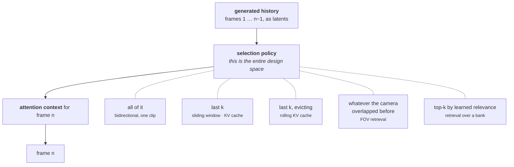

## TL;DR

**Every "memory" mechanism in every current video world model is the same thing: attention over frames the model already produced.** Sliding windows, KV caches, FOV retrieval, learned block retrieval, compressed context banks — five variants of *find a past frame that looked like now*.

**The durations are real and they have improved fast.** Oasis remembered 8 frames. MineWorld, 32. Genie 3 claims visual memory reaching back about a minute, at 24 FPS and 720p. Matrix-Game 3.0 claims minute-long consistency at up to 40 FPS with a 5B model. Minute-scale is genuinely the 2026 state of the art.

**But the numbers hide a cliff.** Inside the training horizon these models are good; a step past it they collapse. Oasis: PSNR **24.13 → 13.42**. MineWorld: **20.30 → 14.61**. WorldMem, the best of the retrieval baselines: **26.54 → 19.14**. Memory that evaporates at the edge of the training window is not memory, it is interpolation.

**And the deeper problem is not duration at all.** A retrieval bank can only return something that was *observed*. When the cat knocks the cup off the counter while the camera is turned away, **no frame in the bank shows the cup on the floor** — because no frame was ever taken of it. Enlarging the bank cannot fix this. The mechanism is structurally incapable, at any size.

**Two benchmarks now measure exactly this**, and both find the same hole: [MBench](https://arxiv.org/abs/2606.00793) makes causal consistency a first-class axis, and [WRBench](https://arxiv.org/abs/2606.20545) reserves two of its six diagnostics (D5, D6) for what happens when out-of-view content returns to frame.

---

## 1 · What "memory" means mechanically

Strip the word of its connotations. A video model generating frame $n$ has exactly one way to know anything about the past: **some representation of earlier frames is in its attention context.** That is the entire mechanism. There is no store, no variable, no fact that persists outside the token stream.

So every memory design in the literature answers one question — *which past tokens get to be in context, and at what cost?* — and the answers differ only in the selection policy.

Note what is *not* on that diagram: anything that is not a past frame. That absence is the subject of this post.

---

## 2 · The five mechanisms

### (1) Full context — the whole clip

Bidirectional diffusion transformers attend over every frame of the clip at once. This is "memory" in the strongest possible form and the least useful one: it is bounded by the training clip length, typically around five seconds, and it cannot stream because frame 1 depends on frame 124.

### (2) Sliding window + KV cache

Causal conversion makes streaming possible. Keep the last $k$ frames' keys and values; drop the rest. The numbers here are smaller than people expect:

| Model | Window |
| :-- | :-- |
| Oasis | **8 frames** |
| MineWorld | **32 frames** |

At 16–24 FPS that is roughly half a second to two seconds. Anything older is simply gone.

### (3) Rolling KV cache

[Self-Forcing](https://arxiv.org/abs/2506.08009) makes the window roll so generation can continue indefinitely without quadratic cost. Worth being precise about what this buys: it makes the video *arbitrarily long*, not the memory *arbitrarily deep*. The horizon is still $k$; it just slides.

### (4) Geometric / FOV retrieval

WorldMem's idea: index past frames by camera pose, and when the camera returns to a region, retrieve the frames that saw it. This is the first mechanism that is genuinely about *revisiting* rather than *continuing*, and it is a real improvement — best extrapolation PSNR of the pre-2026 baselines.

Matrix-Game 3.0 ships the mature version, described in its abstract as **"camera-aware memory retrieval and injection"**, reaching "stable memory consistency over minute-long sequences" at up to 40 FPS, 720p, on a 5B model.

### (5) Learned retrieval over a growing bank

The current frontier. [Context-as-Memory](https://arxiv.org/abs/2506.03141) keeps all historical context and learns what to pull. [DecMem](https://arxiv.org/abs/2605.31336) splits the job in two: **Sparse Global Memory** divides each frame into 6 blocks, pools them, and retrieves the top-80 most relevant historical blocks by attention score; **Anchored Local Memory** is a plain sliding window over the last 8 frame latents. The two fuse through a learned gate, with the local branch acting as a stable baseline so long-tail attention cannot dilute the signal.

  

    
  

  

    
  

**Block-level rather than frame-level granularity is the genuine advance here**, and it is worth noting why: a frame is rarely the right unit. When you turn back toward a corner of a room, you need *that corner* from a past frame, not the whole frame, and not the twelve frames around it.

---

## 3 · How long, actually

Two answers, and they disagree.

**The headline answer: about a minute.** Genie 3 reports environments that stay largely consistent for several minutes with visual memory reaching back roughly one minute, at 24 FPS and 720p. Matrix-Game 3.0 claims minute-long consistency. DecMem demonstrates 120 frames generated beyond a 221-frame bank, with ablations holding quality past 600 frames — around a minute at 10 FPS.

**The honest answer: it falls off a cliff at the training horizon.** DecMem's own baseline table, split into *within* the trained rollout length and *extrapolated* beyond it:

| Method | Memory design | PSNR within | PSNR extrapolated | Δ |
| :-- | :-- | --: | --: | --: |
| MineWorld | sliding window, 32 frames | 20.30 | 14.61 | **−5.69** |
| Oasis | sliding window, 8 frames | 24.13 | 13.42 | **−10.71** |
| WorldMem | FOV retrieval | 26.54 | 19.14 | **−7.40** |
| **DecMem** | sparse global + anchored local | **30.08** | **25.23** | **−4.85** |

> Every one of these models is competent inside the horizon it was trained on and degrades sharply one step outside it. Oasis loses **10.7 dB**. The best current design still loses 4.9.

This is the shape of a system that has learned to *continue* rather than to *remember*. A memory that works within the training window and not beyond it is describing the training distribution, not a retained state.

Two caveats worth keeping. These baselines are Minecraft-domain models, so absolute PSNR does not transfer to open-domain video. And DecMem is reporting numbers that make DecMem look good — the relative ordering is more trustworthy than the magnitudes.

---

## 4 · The blind spot

Now the part duration does not address.

WRBench's [Natural-25](https://arxiv.org/abs/2606.20545) suite is built from twenty-five ordinary domestic scenes. Take `kitchen_cat_cup_knock`, in the benchmark's own words:

> **T0** — A house cat stands at one end of the kitchen counter, facing a ceramic cup near the counter edge.
> **T1** — The cat walks along the counter toward the cup.
> **T2** — *The cat knocks the cup off the counter onto the floor.*

Now script the camera to pan away during T1 and return after T2. What should be in frame is a cup on the floor and a cat looking pleased with itself. What these models produce is the cup still on the counter.

The benchmark's diagnosis, quoted:

> Models maintain the observed world as a tracking shot, resuming a returning target in the state at which it was abandoned rather than advancing the event while it went unseen.

WRBench reserves two of its six diagnostics for precisely this, and they are scored **only** when out-of-view content comes back into frame:

| ID | Diagnostic |
| :-- | :-- |
| D3 | Visible spatial consistency |
| D4 | Visible state consistency |
| **D5** | **Re-observation spatial consistency** |
| **D6** | **Re-observation event-state consistency** |

The D3/D4 versus D5/D6 split is the whole point of the contract: *is the world consistent while you watch it*, versus *was it consistent while you did not*.

MBench finds the same hole from a different direction — a camera that pans around a room and back, with the room not surviving the trip:

  

    
  

---

## 5 · Why a bigger bank cannot fix it

This is the structural argument, and it is short.

**Retrieval returns things that were stored. Storage requires observation.**

When the cup falls off-camera, there is no frame anywhere in the history showing a cup on the floor. Every mechanism in §2 — window, cache, FOV index, learned top-k — is a policy for choosing *among frames that exist*. None of them can return a frame that was never generated, and none of them can compute what should have happened in one.

So the model is left doing the only thing it can: predicting the most plausible continuation from the last frame that *did* show the cup. That frame shows it on the counter. The prior does the rest.

> Scaling the bank makes the model better at remembering **what it drew**. The failure is about what it **never drew**. These are different quantities, and no amount of the first produces the second.

Two corollaries follow, and they explain the benchmark results better than any capacity argument.

**Longer memory can make the failure worse, not better.** A model that confidently retrieves the last observed frame of the cup — sharp, well-attended, high-relevance — has *more* reason to redraw the cup on the counter than a model that forgot the cup entirely. Retrieval strengthens the wrong answer.

**The failures are not slow drift.** MBench's revisited living room breaks in seconds. WRBench's gap conditions are on the order of a second to five. If these were capacity problems the errors would grow with time; instead they appear the moment the camera looks away, which is the signature of a missing mechanism rather than an insufficient one.

---

## 6 · What the benchmarks now measure

  

    
  

MBench decomposes memory into three dimensions across twelve sub-dimensions, built on real-captured videos from 5 seconds to 15 minutes, evaluating 8 text-conditioned generators and 6 action-conditioned world models over ~25-second rollouts.

| Dimension | Sub-dimensions | What it asks |
| :-- | :-- | :-- |
| **Entity consistency** | object geometry, texture; human identity, appearance | do things stay themselves |
| **Environment consistency** | epipolar geometry, reprojection; lighting, style | does the room stay the room |
| **Causal consistency** | state evolution, evolution correctness; text- and action-conditioned interaction | do things change *correctly* |

The third row is the new one, and its finding is the same as WRBench's, arrived at independently:

> A reliable world model should continue hidden physical processes, remember their intermediate consequences, and reveal a plausible later state when the camera returns. Current models often lack this capability: hidden events may be ignored, reset, or replaced by visually plausible but causally unrelated content.

"Ignored, reset, or replaced by visually plausible but causally unrelated content" is a precise description of what a next-frame prior does when asked a question it has no mechanism to answer.

---

## 7 · What would actually fix it

Not a bigger bank. The requirement is something that **advances while unobserved**, which means something that is not a function of the frames drawn.

Three ways that could be true, in increasing order of how much of the current stack they discard:

**Simulate the gap in pixels.** Keep generating the off-camera region and simply do not display it. Honest, and absurd: you would pay full generation cost for everything outside the frustum, forever.

**Learn a latent state that persists across occlusion.** Keep a recurrent or slot-structured state that updates on every step whether or not the corresponding region is visible. Nobody has demonstrated this holding up at video scale, and the training signal is hard to construct — the model has to be *forced* to use the state, which means data where the visible history is genuinely insufficient.

**Put the state outside the model.** Let a deterministic program hold what is true and let the video model render it. The cup is on the floor because a kernel executed `cup.on = floor` at $t{=}2.4$s, on its own clock, with no camera in the loop. This is the [Code World Model]() direction, and its case does not rest on being elegant — it rests on being the only one of the three where the answer is *computed* rather than *recalled*.

The honest scoreboard: the first is wasteful, the second is unproven, the third has been built once with no benchmarks attached. What is no longer in doubt is that the retrieval family cannot get there, and it is worth being precise about why. It is not failing at its job. **Its job is to recall what was seen, and it does that increasingly well — a minute of it now. The world simply does not stop when you look away, and nothing in that mechanism was ever going to notice.**

**Related:** [The Proxy Is the Contract]() · [Five Papers Under Every Video Model]() · [The Frame Is Not the World]()
