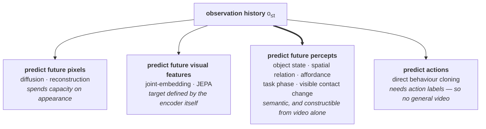
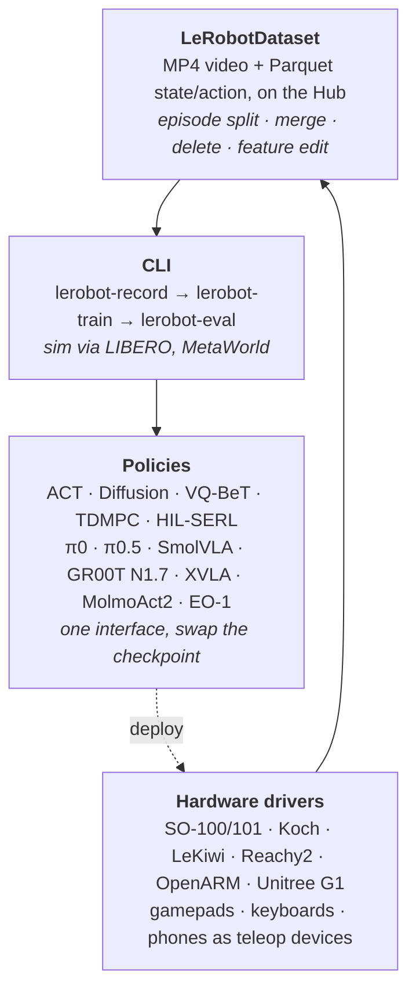

[Isaac 0.5: Percepts Scale Control](https://pub-d90b81cad7254a1aa6b148ac18153c0c.r2.dev/isaac-0.5.pdf) · [weights](https://huggingface.co/PerceptronAI/Isaac-0.5) · [code](https://github.com/perceptron-ai-inc/isaac) · [blog](https://www.perceptron.inc/blog/introducing-isaac-0-5) · Perceptron, 26 August 2026

## TL;DR

**Teleoperation is the most expensive line item in embodied AI, and Isaac 0.5 is the first open attempt to price what replaces it.** Hold general:egocentric:UMI video at 80:30:30, sweep video budgets from 1k to 1M hours against teleoperation budgets, and read off how much teleoperation you need to hit a fixed action loss.

**The headline: 5,884 hours → 28 hours, a 210.3× reduction.** That is a real measurement and it is also the most favourable of several numbers the report itself provides.

**Three caveats, all in the paper, none in the announcement.** The measured rungs bracket the ratio at **83×–300×**. Moving the loss threshold moves the ratio to **5.7×** (τ=3.00), **27.6×** (τ=2.75), or **undefined** (τ=2.45). And the exchange rate is *conditional*: below ~100 teleoperation hours, video buys you almost nothing — at 1 hour, 10× more video is worth 0.006 loss.

**The $1M build plan is the most useful table in the paper, and it undercuts the cheap-video framing.** General video is $3.0k of the $1M. Egocentric and UMI are $683k. Teleoperation is $304k. The video that actually displaces teleoperation costs **$30/hour, not $0.10/hour** — it is head-mounted and handheld capture, not YouTube.

**Everything above is offline action loss on held-out trajectories, not task success.** The scaling grid contains no closed-loop numbers.

**It ships inference through [LeRobot](https://github.com/huggingface/lerobot)** — which is the part of the release with the longest half-life, and §6 is about why.

---

## 1 · What Isaac 0.5 is

A **36B-parameter sparse** open-weight model that does video perception, embodied reasoning, and robot control from *one shared backbone*. Forty decoder layers, Qwen-family, thirty gated-delta-net layers interleaved with ten full-attention layers, null-routed MoE feed-forward in all forty.

Every output reads from the same representation:

| Interface | Mechanism |
| :-- | :-- |
| language, grounding, coordinates | autoregressive |
| **discrete** actions | FAST tokens, 2,048-token action vocabulary, same AR objective |
| **continuous** actions | a 36-block DiT Flow expert, width 768, cross-attending to backbone states |

Training data: **1,000,000 h** general action-free video, **375,000 h** egocentric, **375,000 h** UMI handheld-gripper, **100,000 h** robot experience across 35+ embodiment configurations, 3T native tokens, 529 source streams.

  

    {% include figure.liquid loading="eager" path="assets/img/isaac-05/fig1_mixture.png" class="img-fluid rounded z-depth-1" zoomable=true caption="Figure 1. Direct scheduler mass across 529 streams. Video understanding 30.0%, robotics and control 30.3%, visual Q&A and reasoning 23.7%. Note the reported unit — this is draw probability, not packed-token exposure, and the two disagree sharply: robotics is 30.3% of draws but 79.6% of realised tokens." %}
  

That last gap is a good sign of a carefully written paper. Reporting only sampler mass would understate how action-centred the recipe is; reporting only packed exposure would hide the scheduler policy. They give both.

  

    
  

## 2 · The scaling law, and what the announcement left out

The measurement is a two-factor grid: seven general-video budgets from 1k to 1M hours, crossed with teleoperation budgets over a common 2–10,000-hour support, one run per cell. Loss is a single held-out offline action objective, identical across every cell.

  

    
  

**Panel B is the one to read carefully**, because it is where the honest version of the claim lives:

> At one teleoperation hour, six video budgets span only 0.050 loss, and 10× more video is associated with a change of −0.006. From roughly 100 teleoperation hours onward, the per-rung changes cluster near −0.21 for each 10× increase in video.

So video and teleoperation are **complements below ~100 hours and substitutes above it.** The paper says this plainly — "at the smallest teleoperation budgets the two inputs behave as complements" — and it is the opposite of the reading most people will take from "210× less teleoperation".

### The three numbers that qualify the headline

**One — the bracket.** The 210.3× is a *within-grid interpolated crossing*. The crossings lie between measured rungs: 2,500 and 6,000 hours at 1k video, 20 and 30 hours at 1M. Those endpoints bound the substitution factor at **83× to 300×**.

**Two — threshold sensitivity, which is severe.** The ratio depends on where you draw the loss line:

| Threshold τ | 1k → 1M substitution |
| :-- | --: |
| 3.00 | **5.7×** |
| 2.75 | **27.6×** |
| **2.50** (headline) | **210.3×** |
| 2.45 | undefined — no 1k run reaches it |

A factor of 37 separates the second row from the third. τ = 2.50 is defended as "the strictest contour both the 1k and 1M budgets reach within their measured teleoperation support" — which is a principled choice, and also the choice that maximises the number.

**Three — it is offline action loss, not task success.** Nothing in the scaling grid is closed-loop. Action-prediction loss on held-out trajectories is a reasonable proxy and it is not the thing anyone actually wants; the gap between them is the whole subject of [the verifier ladder]().

**None of this makes the result uninteresting.** Video elasticity is positive at every supported threshold, and 83× is still a large number. It makes the result *conditional*, which is exactly what a planning tool should be.

## 3 · The $1M build plan

This is the part the announcement skipped and the part a team can act on. The report prices the fixed 1:10:3.75:3.75 mix and turns a dollar budget into a purchase order.

  

    
  

**Planning prices:** teleoperation **$100/h**, passive egocentric **$30/h**, UMI handheld **$30/h**, general video **$0.10/h**, H100 **$2.10/GPU-h**. One "recipe unit" — one accepted teleoperation hour plus its linked video — costs **κ = $329.30**.

At $1M:

| Resource | Mix | Quantity | Spend |
| :-- | --: | --: | --: |
| Task-specific teleoperation | 1 | 3,037 h | $303.7k |
| **General video** | 10 | 30,367 h | **$3.0k** |
| Passive egocentric | 3.75 | 11,388 h | $341.6k |
| UMI-style handheld | 3.75 | 11,388 h | $341.6k |
| H100 video-side compute | — | 4,773 GPU-h | $10.0k |
| | | | **$1.0M** |

> **Read the general-video row against the headline.** The cheap input everyone will quote is **0.3% of the budget**. Sixty-eight percent goes to egocentric and UMI capture at $30/hour — humans wearing cameras and carrying instrumented grippers.

"Video substitutes for teleoperation" is true. But the video doing the substituting is not free web video; it is a *second data-collection operation* that costs 30% of what teleoperation costs and requires people, rigs and quality assurance. That is a real and large saving. It is not the same claim as "scrape YouTube instead".

**And the budget elasticity is brutal.** The fitted loss–budget law is

$$\widehat{L}_\text{mix}(B) = 2.246\left(\frac{B}{\$1\text{M}}\right)^{-0.07224}$$

with $$R^2 = 0.9961$$. **Doubling the budget reduces fitted loss by 4.9%.** Going from $1M to $10M buys about 15%. Whatever gets embodied AI to reliability, on this curve it is not money.

## 4 · Percepts: the third thing you can predict

The conceptual contribution, and where Isaac 0.5 splits from both the diffusion and JEPA camps.

A **percept** is a task-relevant visible state or change: an object is now grasped, a drawer is open, a contact is about to occur. The objective is

$$\mathcal{L}_\text{sem}=\mathbb{E}_{(o_{\le t},\,z_{t+\Delta})}\big[\ell\big(g_\theta(o_{\le t}),\,z_{t+\Delta}\big)\big]$$

and the load-bearing property is that **targets are constructed automatically from future observations, with no human annotation and no action labels** — which is what lets a million hours of action-free video train the same backbone that produces actions.

**Two things to be clear-eyed about.** The report states directly that *"the target construction and loss implementation remain proprietary"*. So the central scientific claim of the paper is not reproducible from the paper. And Figure 10C — seven non-perceptive runs, none reaching 2.75 — is suggestive rather than conclusive; the authors decline to turn it into an objective-effect coefficient because those runs do not span the same teleoperation rungs. That is the correct call and it is worth noting that they made it.

The full training objective, for reference:

$$\mathcal{L}_\text{train}=\mathcal{L}_\text{NTP}+\mathcal{L}_\text{sem}+10^{-4}\mathcal{L}_z^\text{LM}+\mathcal{L}_\text{Flow}+0.02\,\mathcal{L}_\text{MoE-LB}+10^{-3}\mathcal{L}_z^\text{router}$$

Note that unlike the knowledge-insulated $$\pi_{0.5}$$+KI recipe, the Flow loss is **not** detached from the backbone — control gradients update the shared representation.

## 5 · Null experts: compute that scales with difficulty

Real-time control has kept policy models small and dense, which blocks the scale-up route. MoE gives you total parameters decoupled from active parameters; null-expert routing goes further and lets *each token* choose how many experts to use.

  

    
  

Each token uses **0 to 8 of 256 routed experts**. The consequence at the systems level: **null routing leaves 2.5B of 36B active per token**, and end-to-end MFU is 24% in this hyper-sparse setting against 48% dense — a real efficiency cost, paid for a real capability.

The interpretability result is the fun part. On a geometry angle problem, 24.3% of patches route to null and the average token calls 6.06 experts. On a count-the-aeroplanes image, 68.2% route to null and the average is 2.55. **The model spends compute where the question is hard, not where the pixels are busy.**

  

    
  

## 6 · What LeRobot is, and why shipping through it matters

The release says checkpoints, training code, "and inference code via LeRobot". That clause is doing more work than its length suggests.

**[LeRobot](https://github.com/huggingface/lerobot) is Hugging Face's open robotics stack** — models, datasets and tools for real-world robotics in PyTorch, ~27k stars. It is trying to be to robotics what `transformers` was to NLP, and the structure of the bet is the same: standardise the artefact formats, and the ecosystem accretes around you.

Four pieces:

**The dataset format is the real asset.** `LeRobotDataset` is synchronised MP4 for vision plus Parquet for state and action, versioned on the Hub. It means a trajectory recorded on a $100 SO-101 arm in one lab is loadable, inspectable and trainable by anyone else without a conversion script — which is precisely the thing that did not exist in robotics for twenty years and which every lab wasted months rebuilding.

**Why it matters for a model release.** Shipping Isaac through LeRobot means a team with an SO-101 on the desk can run a 36B embodied foundation model against hardware they already own, on datasets they already have, without writing an integration. Compare the counterfactual: weights on the Hub plus a bespoke inference repo, and adoption is gated on every lab writing its own driver glue.

**And it is where the competition now happens.** LeRobot already ships π0, π0.5, SmolVLA, GR00T N1.7 and a dozen others behind one interface. That makes swapping policies a config change — which is excellent for the field and uncomfortable for anyone whose moat was integration difficulty. Isaac 0.5 joining that list is a bet that it wins on merit in a fair fight.

For anyone doing simulation environments or policy brains, the practical read is: **LeRobotDataset is the format to emit.** Not because it is technically ideal, but because it is where the models and the community already are.

## 7 · Verdict

**The most valuable thing here is not the model — it is that someone published a price list.** "How much video should I buy instead of teleoperation" was previously answered by intuition. Now there is a grid, an elasticity, a cost model and a $1M worked example. Even if every number moves, the *shape* of the analysis is reusable, and that is a genuine contribution to a field that mostly reports task success rates on its own demos.

**What I would hold loosely:** the 210× headline, which is the most favourable reading of a range that runs to 5.7× at a stricter threshold; and the percept objective, which is the claimed source of the effect and is not disclosed.

**What I would take seriously:** the complements-then-substitutes structure, which tells you not to buy a million hours of video before you have a hundred hours of teleoperation. The budget exponent of −0.072, which says this is not a problem money solves. And the fact that 68% of a well-designed $1M data plan goes to *humans wearing cameras* — the cheapest useful embodied data is not on the internet and not on a robot, but somewhere in between.

**Related:** [The Verifier Ladder]() on why offline loss and task success come apart · [Two Schools of World Models]() for where percept prediction sits between pixel reconstruction and joint embedding.
