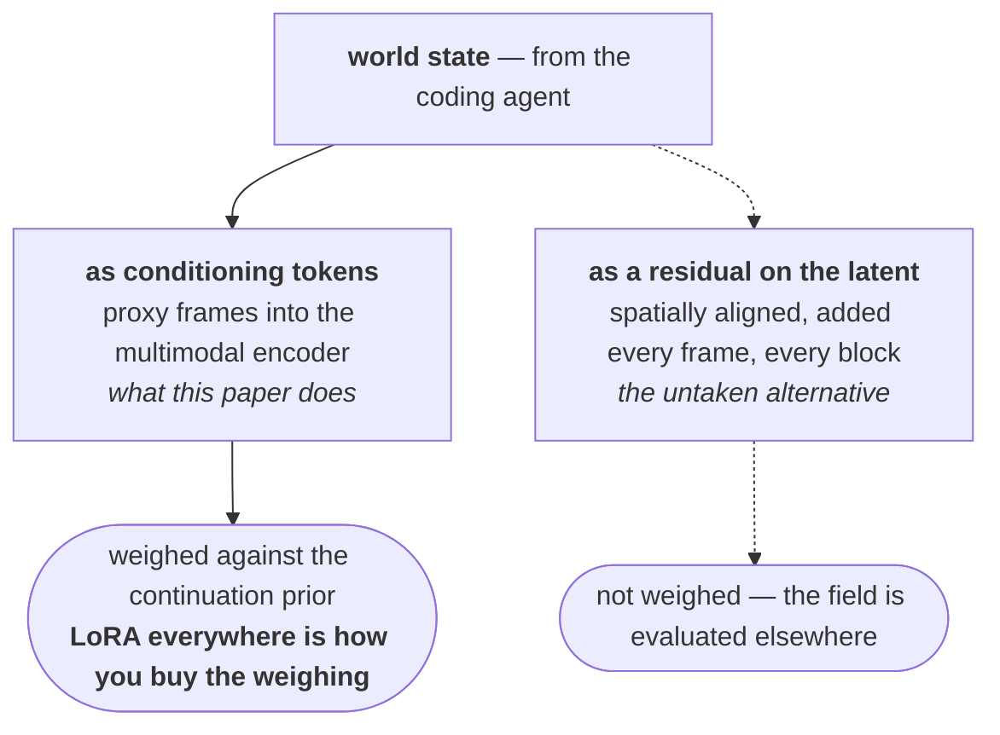

[arXiv:2608.25927](https://arxiv.org/abs/2608.25927) · Yiwen Chen, Guosheng Lin, Chi Zhang · AGI Lab, Westlake University and Nanyang Technological University · submitted 26 August 2026

## TL;DR

**A coding agent writes the world, a compiler draws a crude version of it, a video model makes it look real.** Executable Python holds persistent world state; a lightweight deterministic rasteriser turns that state into a *proxy video* — capsule skeletons, wireframe boxes, flat semantic regions; a video model consumes the proxy plus text and emits pixels.

**The contribution is the interface, not the parts.** Coding agents exist. Video models exist. What this paper does is name the thing between them, specify what belongs in it, and demonstrate it is cheap to build — a few lines of code per primitive, one-sixteenth the visual tokens of the target.

**There are no quantitative results.** No benchmark, no baseline, no metric, no user study. Five point six hours of gameplay, 8×H800, three epochs, and five qualitative scenarios. The thesis is shipped; the evidence is not, and the authors say so.

**The most contestable decision is condition bandwidth**, and it is the one the paper cannot test without metrics. The proxy enters as **11 subsampled frames of conditioning tokens** through a multimodal encoder — an argument the model weighs against its own continuation prior, rather than a term inside the latent it is denoising. That is a real bet with a real alternative, and the paper takes it silently.

**The property the architecture exists for is never measured.** The entire case for persistent code state is that the world stays correct while nobody is looking. Nothing in this paper evaluates occlusion, re-observation, or state survival. See [The Frame Is Not the World]() for the benchmark that does.

  

    
  

## 1 · What it actually builds

The formulation is two equations and an asymmetry, and the asymmetry is the paper.

State decomposes into an executable half and a visual half, $$S_t = (S_t^{exe}, S_t^{vis})$$, which then evolve by completely different means:

$$S_{t+1}^{exe} = T_{AC}\left(S_t^{exe}, A_t\right)$$

$$S_{t+1}^{vis} \sim G_\theta\left(S_t^{vis}, S_{t+1}^{exe}\right)$$

The first is a deterministic transition applied by the agent's code. The second is *sampled*. One half of the world is computed and the other is imagined, and the imagined half is conditioned on the computed half rather than the reverse.

> Determinism and imagination are not blended. They are assigned to different symbols in different equations, and only one of them has a $$\sim$$.

The executable state holds "the evolving world program, entity attributes, rules, relations, event history, and other variables that can be directly operated on." The coding agent reads it, decides whether to call existing code or locally modify the world program, and writes the update. It is a *world brain* in the sense that it decides consequences, not appearances.

  

    
  

## 2 · The proxy, concretely

This is the part worth stealing.

The proxy is a **coarse programmable world representation** encoding "camera motion, entity location, occlusion, relative relations, and trajectories directly in image coordinates." Its primitives are deliberately impoverished: capsule skeletons for people, wireframes for vehicles, bounding boxes for complex objects, flat colour for terrain and sky. Each primitive is a few lines of code.

What it explicitly excludes: complete 3D models, textures, materials, fine animation.

  

    
  

  

    
  

The proxy renders at one quarter of the target's resolution along each spatial dimension, so it costs **one sixteenth as many visual tokens**. That number is the reason the design is practical rather than merely correct.

And the design rule the authors state for what belongs in it is the sharpest sentence in the paper:

> The minimum sufficient state that the current observation must obey, while leaving final appearance and fine-grained dynamics to the video model.

They call the trade-off **condition bandwidth**: a richer proxy with joint-level motion buys control but costs agent maintenance; a sparser one is easier to author but surrenders precision. Framing it as a bandwidth budget rather than a fidelity target is the right frame, and it generalises well beyond this paper.

**Verdict:** the proxy specification is the durable contribution. It is the first crisp answer to *what exactly does code hand to a renderer*, and the answer — geometry and identity, never appearance — is correct and cheap.

## 3 · The decision worth arguing with

Here is what the implementation actually does:

- The multimodal encoder receives a system instruction, a clip-specific text description, and **11 proxy frames sampled at offsets 0, 12, 24, …, 120** — out of 124 frames.
- Backbone is MiniMax-H3 Ref2VA, an omni-modal diffusion transformer.
- **Rank-128 LoRA across all 50 transformer blocks**, ~596M trainable parameters; other weights frozen; audio loss disabled.

Two things follow that the paper does not comment on.

**The condition is sparse in time.** Roughly one proxy frame every half second, for a 24 FPS target. Everything between two proxy frames is the video model's own interpolation. For camera motion and gross trajectory this is likely fine. For the class of event the architecture exists to protect — a state change that completes between samples — it is exactly the wrong sampling rate, and nothing in the paper measures what falls through.

**The condition enters as an argument, not as the thing being denoised.** Proxy frames become tokens in the multimodal encoder, alongside the text. They are a term the model weighs against what its own prior says should come next.

To be fair to the paper: rank-128 LoRA across *all fifty blocks* is not a naive choice. Fine-tuning the whole stack is precisely how you teach a model to weigh a conditioning signal more heavily than it did at pretraining, and 596M trainable parameters is a serious adaptation budget. The authors have not ignored the authority problem; they have spent parameters on it.

But spending parameters is not the same as demonstrating the result, and with no metric on any axis there is no way to tell from this paper whether the proxy wins when it contradicts the prior. That is the single experiment I would want, and it is cheap: construct clips where the proxy specifies an outcome the naive continuation would not produce, and report how often the generation follows the proxy. The paper's own qualitative figures cannot answer it, because every case shown is one where proxy and prior agree.

**Verdict:** defensible engineering, untested where it matters most.

## 4 · The data construction is quietly the best part

Two pipelines, and the game one contains a trick worth reusing.

**Game data.** Target video and runtime state — camera, entity positions and orientations, scene layout — are "recorded synchronously from the same execution." Because the recording rig *is* the engine, the state labels are exact rather than estimated. 157 takes, ~5.6 hours, yielding **9,420 five-second clips** sampled at two-second intervals, each 124 frames at 1344×768, 24 FPS.

The trick: a pixel-wise **ground-truth instance map** identifying which identity occupies each pixel, used to bind text descriptions to proxy regions. That is what stops "the woman in the red coat" from being a free-floating phrase and makes it an annotation attached to a specific capsule. Cheap to produce when you own the engine, and it does a lot of work.

**Real-world data.** KITTI-360, as a proof of concept that proxies need not come from a game. Calibrated camera poses, an accumulated semantic 3D reconstruction and 3D object annotations are used *only during offline data construction*; geometry is projected into the calibrated view and rasterised. Notably, **no action labels are required** — which is the property that makes real footage usable at all here.

  

    
  

  

    
  

**Verdict:** owning the engine is the unfair advantage, and the instance map is the specific mechanism that converts that ownership into supervision. This is the most transferable part of the paper.

## 5 · What the paper claims versus what it shows

| Claim | Evidence in the paper |
| :-- | :-- |
| Code can hold persistent world state | Architecture built and running |
| A coarse proxy is sufficient conditioning | Five qualitative scenarios, all cooperative |
| Proxy beats text for spatial control | Asserted; text-only ablation not run |
| Generalises across characters, scenes, motion | Qualitative, five cases |
| State survives while unobserved | **Not evaluated** |
| Multiple observers see one world | **Not addressed** |
| Real-time interactive generation | **Explicitly not implemented** |
| Agent builds complex mechanisms unaided | **Explicitly not demonstrated** |

The authors are candid about the bottom half. Limitations name compute directly — "the training scale therefore remains small, and the resulting generation quality is still limited" — plus no autoregressive real-time generation, and the observation that "current coding agents still struggle to implement highly complex game mechanisms reliably from scratch."

One line in the limitations is worth flagging because it points the other way from the paper's own thesis:

> As video model control improves, the proxy may become sparser or disappear in selected situations.

That is a bet that the interface is scaffolding to be removed rather than the architecture's load-bearing member. If the proxy disappears, so does the guarantee that two observers see the same world — which is the reason to have built any of this. I think this sentence is a mistake, but it is an honest one and it is stated openly.

## 6 · Verdict

The right architecture, built end to end, with none of the hard claims measured.

That is a more useful paper than it sounds. Architecture papers with no numbers age badly when the architecture is wrong and age extremely well when it is right, and the division of labour here — deterministic state by code, appearance by generation, a deliberately impoverished geometric interface between them — is the one that follows from what video models actually fail at rather than from what would be elegant.

What it leaves open is a clean list, and every item on it is an experiment rather than an argument:

1. Does the proxy win when it **contradicts** the model's continuation prior? Nobody has reported this.
2. Is 11 frames per 124 the right condition rate, or does the sampling gap swallow exactly the events the design exists for?
3. Does conditioning-token injection have enough authority, or does the signal need to enter the latent stream itself?
4. Does state actually survive occlusion — the property that motivates the whole design and that no figure in the paper touches?

Nothing about the paper's thesis is refuted by its lack of evidence. But nothing is established either, and the gap between those two is where the next year of this line of work sits.

**Related:** [The Frame Is Not the World]() on the benchmark that measures persistence and the model that argued for this thesis without building it · [Show, Don't Tell]() on another paper whose real contribution turned out to be an interface rather than a model · [Two Schools of World Models]() for where this sits in the landscape.
