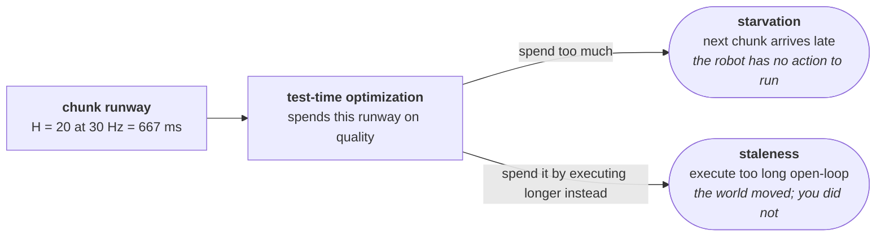
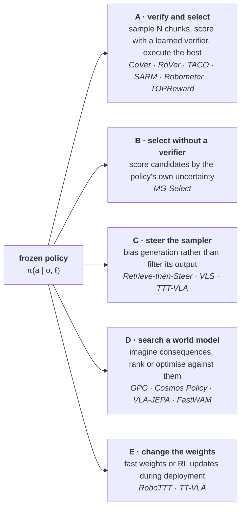

Test-time optimization has been the dominant story in language models for two years. It is now arriving in robot policies, and it arrives with a constraint that changes the whole shape of the problem.

## TL;DR

**In LLMs, test-time compute is bought with patience. In robotics, it is bought from the control loop, and the control loop is not selling.** A 30 Hz loop gives you 33 ms per decision. One forward pass of π0.5 on an L40S costs [73 ms](https://arxiv.org/abs/2608.00337). You are over budget before you sample anything.

**Everything in this survey is a strategy for buying quality inside that budget** — or for cheating it, which is what action chunking is.

**Five families**, ordered by what they spend: sample-and-select with a learned verifier; verifier-free selection using the policy's own uncertainty; steering the sampler instead of filtering its output; searching against a world model; and updating weights during deployment.

**The headline result of the area** is [CoVer](https://arxiv.org/abs/2602.12281): on matched data, scaling *verification* beat scaling *policy pretraining* — reported as 22% in-distribution and 45% in real-world experiments. That is the embodied instance of the argument in [the verifier ladder](): self-improvement works to the extent verification is cheaper than generation.

**The field's blind spot is that almost nobody reports success-per-millisecond.** [GPC](https://arxiv.org/abs/2502.00622) buys ~25% on Push-T and costs **374 seconds per decision cycle** against a 0.457 s baseline. Both numbers are in the paper; only one is in the abstract.

**If you are on LeRobot**, the practical surface is `lerobot.rewards` — four reward models behind one interface as of [v0.6.0](https://huggingface.co/blog/lerobot-release-v060) — and §8 is about what that does and does not get you.

---

## 1 · The budget

Start with the number, because it disciplines everything else.

| Quantity | Value | Source |
| :-- | --: | :-- |
| Control period at 30 Hz | **33 ms** | — |
| π0.5 forward pass, batch 1, L40S | **73 ms** | [Armory](https://arxiv.org/abs/2608.00337) |
| batch 3 | 142 ms | " |
| batch 5 | 211 ms | " |

A single decision already costs more than two control periods. **The only reason robot foundation models run at all is action chunking**: predict $$H$$ actions, execute them open-loop while the next chunk is computed. At $$H = 20$$ and 30 Hz, a chunk buys **667 ms** of runway.

That runway is the actual test-time compute budget, and it is where the two failure modes live:

Armory's framing is the sharpest statement of it: *"batching improves GPU efficiency at the cost of robot responsiveness"* — and unlike LLM serving, where latency is a service metric, **robot latency changes what the robot actually does.** Their lookahead scheduler recovers up to 18% throughput on a heterogeneous 10-arm fleet by modelling each robot's buffer explicitly.

Doing the arithmetic on their table: **best-of-8 batched costs roughly 300 ms** and fits inside a 667 ms chunk. Best-of-8 *sequentially* costs 584 ms and does not, once you add the verifier. That single distinction — batch your candidates, never loop them — determines which of the methods below are deployable.

> **Every method in this survey is answering the same question: what is the highest-value thing to do with 600 milliseconds?**

## 2 · Five families

The ordering is roughly by cost and by how much machinery you must build first. A, B and C leave the policy frozen and need no environment interaction. D needs a world model. E needs a reward signal at deployment and gives up the guarantee that your policy tomorrow is the policy you tested today.

## 3 · Family A — verify, then select

The dominant family, and the one with the strongest result.

### CoVer — verification scales better than policy learning

[arXiv:2602.12281](https://arxiv.org/abs/2602.12281) · Kwok, Zhang, Xu, Liu, Mirhoseini, Finn, Pavone

The paper's contribution is not the verifier; it is the **scaling law**. They characterise test-time scaling for embodied instruction following and find that **jointly scaling rephrased instructions and generated actions beats scaling either alone** — the two axes produce diversity that neither produces on its own.

The pipeline: precompute a set of rephrased instructions from a VLM, generate action candidates for each, and use a contrastive verifier to select both the high-level prompt and the low-level chunk.

| Setting | Gain over scaling policy pretraining on the same data |
| :-- | --: |
| SIMPLER, in-distribution | 22% |
| SIMPLER, out-of-distribution | 13% |
| Real-world | 45% |
| PolaRiS, task progress / success | 14% / 9% |

**Why this is the anchor paper.** It runs the comparison everyone else skips: *hold the data fixed, and spend it on a verifier instead of on the policy.* The verifier wins. That is a claim about where the marginal parameter should go, and it is the embodied version of the Δ argument — verification is cheaper than generation, so buy verification.

**What I would want before believing it fully:** whether "22% gains" is relative or absolute is not resolvable from the abstract, and the comparison is against pretraining scaling on *that* data budget, which is not the same as against a frontier policy.

### RoVer — a process reward model that also points

[arXiv:2510.10975](https://arxiv.org/abs/2510.10975). The interesting move: the PRM does **two** jobs. It assigns a scalar reliability score *and* predicts a direction in action space along which candidates should be expanded. So the search is not pure rejection sampling — the verifier proposes where to look.

The engineering detail worth stealing: **caching shared perception features across candidates**, which amortises the expensive half of the forward pass and lets you evaluate more candidates within a fixed budget. Given §1, this is the difference between best-of-4 and best-of-16.

### TACO — anti-exploration as a verifier

[arXiv:2512.02834](https://arxiv.org/abs/2512.02834). A different diagnosis. VLAs trained on mixed-quality data contain competing action modes; the paper observes **"inference-time fragility"** — different noise seeds give unstable predictions. Rather than asking "which candidate is best", it asks "which candidate is most *familiar*", using a lightweight pseudo-count estimator and executing the max-pseudo-count chunk.

The framing is borrowed from offline RL, and it is a good one: **test-time sampling is exploration, and at deployment you do not want to explore.** Evaluated on RoboTwin 2.0, RoboTwin, LIBERO and SimplerEnv plus a dual-arm platform; the abstract reports no numbers, which is a mark against it.

### The reward models you can actually download

This is where the family becomes practical, because [LeRobot v0.6.0](https://huggingface.co/blog/lerobot-release-v060) shipped a unified `lerobot.rewards` API:

| Model | Kind | What it needs |
| :-- | :-- | :-- |
| HIL-SERL classifier | task-specific | your labelled successes |
| [SARM](https://arxiv.org/abs/2606.10305) / SARM2 | task-specific, **stage-aware** | predicts task stage plus fine-grained progress 0→1 |
| [Robometer](https://huggingface.co/docs/lerobot/main/en/robometer) | **general-purpose, pretrained** | nothing — Qwen3-VL-4B trained on 1M+ trajectories via trajectory comparison |
| [TOPReward](https://huggingface.co/docs/lerobot/main/en/topreward) | **zero-shot** | any capable VLM — reads the log-probability of the "True" token |

**TOPReward is the one to try first**, purely because it costs nothing to set up: hand a VLM the video and the instruction, read off the log-likelihood that the instruction is satisfied. It is a weak verifier, but §1 says your first question is not "is my verifier good" but "can I afford to call it at all".

**Robometer is the more interesting artefact.** A pretrained, task-agnostic progress-and-success scorer is exactly the missing piece for best-of-N on new tasks, and it is the component that makes the CoVer result reproducible outside a lab with a bespoke verifier.

## 4 · Family B — selecting without a verifier

[MG-Select](https://arxiv.org/abs/2510.05681) (Jang, Kim, Kim, Kim, Shin; ICLR 2026) asks whether you need the extra module at all. Its answer: score candidates by **the KL divergence between the policy's conditional distribution and the same policy with states and language randomly masked.**

If you read [the previous post on conditioning](), that construction should look familiar. The masked-condition branch *is* the unconditional branch of classifier-free guidance. MG-Select trains with condition dropout for exactly the reason CFG does, then uses the divergence between the two as a confidence signal rather than as a guidance direction.

> Same machinery, different use. CFG spends the conditional-versus-unconditional gap on **steering**. MG-Select spends it on **ranking**.

**Why it matters practically:** no verifier means no second model in the loop, which given §1 is worth a lot. **Why it might not be enough:** an under-trained policy that is confidently wrong is exactly the case a self-scoring method cannot catch, and it is the common case in robotics.

## 5 · Family C — steer, do not filter

Selection throws away $$N-1$$ samples. Steering biases generation so the first sample is better.

**[Retrieve-then-Steer](https://arxiv.org/abs/2605.10094)** is the cleanest instance and my pick of this family. It keeps an **online success memory**: during deployment, segments whose progress a critic verifies are stored; at inference, similar chunks are retrieved, filtered with dynamic time warping, aggregated into an "elite prior", and used to *initialise the flow-matching sampler mid-trajectory*:

$$x_{t_0} = (1-t_0)\,a_\text{elite} + t_0\,\epsilon$$

with $$t_0$$ set by retrieval confidence. **No weights are updated** — it is entirely non-parametric adaptation.

| Benchmark | Baseline → with method |
| :-- | :-- |
| LIBERO-10, π0 | 81.6% → 84.4% |
| LIBERO-10, π0.5 | 92.4% → 94.4% |
| SimplerEnv, CogACT | 75.8% → 79.5% |
| Real, cube handoff | 40.0% → **52.0%** |
| Real, T-shirt folding, out-of-domain | 36.0% → **46.0%** |

**Read the shape of that table, not the top of it.** Simulation gains are 2–4 points; real-world and out-of-domain gains are 8–12. **Test-time optimization pays most where the policy is furthest from its training distribution**, which is both intuitive and the opposite of how it gets benchmarked.

Also in this family: [VLS](https://arxiv.org/abs/2602.03973) steers pretrained policies with a VLM, and [TTT-VLA](https://arxiv.org/abs/2606.03127) optimises a latent prompt at test time rather than selecting among outputs.

## 6 · Family D — search against a world model

The most powerful and the most expensive: instead of scoring an action directly, **predict what it will do**, then score that.

**[GPC](https://arxiv.org/abs/2502.00622)** (Qi, Yin, Zhu, Du, Yang) couples a frozen diffusion policy with an action-conditioned world model in two modes — `RANK` samples $$K$$ proposals and picks the highest predicted reward; `OPT` takes one proposal as a warm start and refines it by gradient descent *through* the world model.

On state-based Push-T it essentially reaches the ground-truth simulator:

| Method | IoU |
| :-- | --: |
| Behaviour cloning | 0.812 |
| GPC-RANK (K=100) | 0.898 |
| GPC-OPT (K=1, M=30) | 0.932 |
| **GPC-RANK+OPT** | **0.952** |
| *ground-truth simulator* | *0.934* |

And then the other table, which is the one this survey exists to point at:

| Configuration | Seconds per decision |
| :-- | --: |
| Behaviour cloning | **0.457** |
| GPC-RANK (K=50) | 5.835 |
| GPC-RANK (K=100) | 11.745 |
| GPC-OPT (K=1, M=25) | 39.061 |
| GPC-RANK+OPT (K=10, M=25) | **374.102** |

**818× the compute for roughly 25% more success**, with the authors noting world-model rollouts are 90–95% of runtime. They are candid about it as a limitation. But set it against §1: this is three orders of magnitude outside a control loop.

Two implementation details worth carrying regardless:

- **Freeze the diffusion world model's noise to zero at inference.** The paper's Remark 1 says GPC-OPT simply fails otherwise — stochastic gradients destabilise the reward optimisation.
- **The prior is load-bearing.** Planning without the generative policy prior scores below 0.2 on vision-based Push-T. The world model is not a planner; it is a critic for a good proposal distribution.

**LeRobot's answer to the cost problem is to move the imagination to training time.** Its three world models — VLA-JEPA, LingBot-VA, FastWAM — mostly *dream during training and skip dreaming at inference*; VLA-JEPA is described as "world-model supervision at zero extra inference cost", and FastWAM "learns to dream its own rollouts" but at deployment directly denoises action chunks. That is a defensible trade and it is also, precisely, **not** test-time optimization. [Cosmos Policy](https://arxiv.org/abs/2601.16163) keeps the option open: it encodes future states and values as extra latent frames, usable for ranking in planning mode and ignorable in direct policy mode.

## 7 · Family E — change the weights

**[RoboTTT](https://arxiv.org/abs/2607.15275)** (Jiang, Chebotar, Zheng, … Fei-Fei, Zhu, Fan) is the most ambitious entry. It builds visuomotor policies on **Test-Time Training layers** — layers whose "fast weights" are updated by gradient descent *during inference as well as training*, so the recurrent state functions as learned memory. This lets context run to **8,000 timesteps** without the inference cost of attention over that window.

What it buys: one-shot imitation from a human video held in context, on-the-fly refinement during deployment, and the first reported completion of a five-minute ten-stage assembly task. Reported gains: 87% over single-step baselines on real manipulation, 62% for 8K versus 1K timesteps of context.

The framing claim is the interesting one — **context length as a third scaling axis** for robot foundation models, alongside parameters and data.

**[TT-VLA](https://arxiv.org/abs/2601.06748)** takes the RL route: a dense reward from step-by-step task-progress signals, used to refine the policy during deployment while preserving the SFT priors. Related: [weight-space meta-learning](https://arxiv.org/abs/2606.07217) for policy adaptation.

**The cost of this family is not compute, it is testability.** A policy that updates itself in the field is not the policy you validated. For anything safety-adjacent that is a governance problem before it is a research problem, and none of these papers address it.

## 8 · What this means if you are on LeRobot

Concretely, today:

**You have the verifier layer.** `lerobot.rewards` gives you four scorers behind one interface, two of which (Robometer, TOPReward) need no task-specific training. That is Family A's hard prerequisite, already solved.

**You do not have a sample-and-select loop.** The rollout path (`lerobot-rollout`, with `base` / `sentry` / `highlight` / `episodic` / `dagger` strategies) is built for **recording and intervention**, not for best-of-N. Reward models in v0.6.0 are pointed at *reward-aware behaviour cloning* and dataset labelling — offline uses. Wiring a reward model into the action-selection path is work you would be doing yourself, and it is the obvious contribution to upstream.

**Order I would run it in:**

1. **Measure your own §1 numbers first** — forward-pass latency at batch 1/4/8 on your GPU, your chunk horizon, your control rate. Everything below is decided by that table, and nobody else's table applies to your hardware.
2. **TOPReward + best-of-N, batched**, with $$N$$ set by what fits in the runway. This is the cheapest thing that could work and it establishes whether verification helps *on your task* before you invest in a verifier.
3. **Swap in Robometer** if the zero-shot signal is too noisy. Same loop, better scorer, no new plumbing.
4. **Then Retrieve-then-Steer**, because it is non-parametric, adds no second model, and its gains concentrate exactly where you need them — out of distribution.
5. **World-model search last, if ever**, at least until someone shows the GPC gains at 1% of the GPC cost.

**And report success-per-millisecond.** Which brings us to the field's problem.

## 9 · The missing axis

Almost every paper here reports success rate against a baseline. Almost none reports it against a **compute-matched** baseline.

That matters because the obvious control is not "the same policy without test-time optimization" — it is **the same policy given the same compute, spent differently.** Best-of-8 costs roughly what a model 2–4× larger costs per decision. Is the verifier the best use of that compute, or would a bigger policy have done better? CoVer is the only paper in this survey that runs a version of that comparison, which is why it is the one worth reading first.

Three things I would want the field to standardise:

1. **Latency alongside every success rate**, on named hardware. GPC does this and is the better paper for it.
2. **A compute-matched policy baseline**, not just a same-policy baseline.
3. **Separate in-distribution from out-of-distribution reporting.** The Retrieve-then-Steer table shows the effect is 3–4× larger out of distribution. Aggregating them hides the entire story.

Until then the honest summary of the area is: **test-time optimization for robot policies works, gains are real but mostly single-digit in distribution and low-double-digit out of it, and the cost is almost always underreported.** The one strong claim — that verification scales better than policy learning — rests on a single paper, and it is a claim important enough to deserve replication.

**Related:** [The Verifier Ladder]() on when self-improvement works at all · [Where the Condition Enters]() for the CFG machinery MG-Select repurposes · [The Exchange Rate]() on the data economics these policies are trained under.
