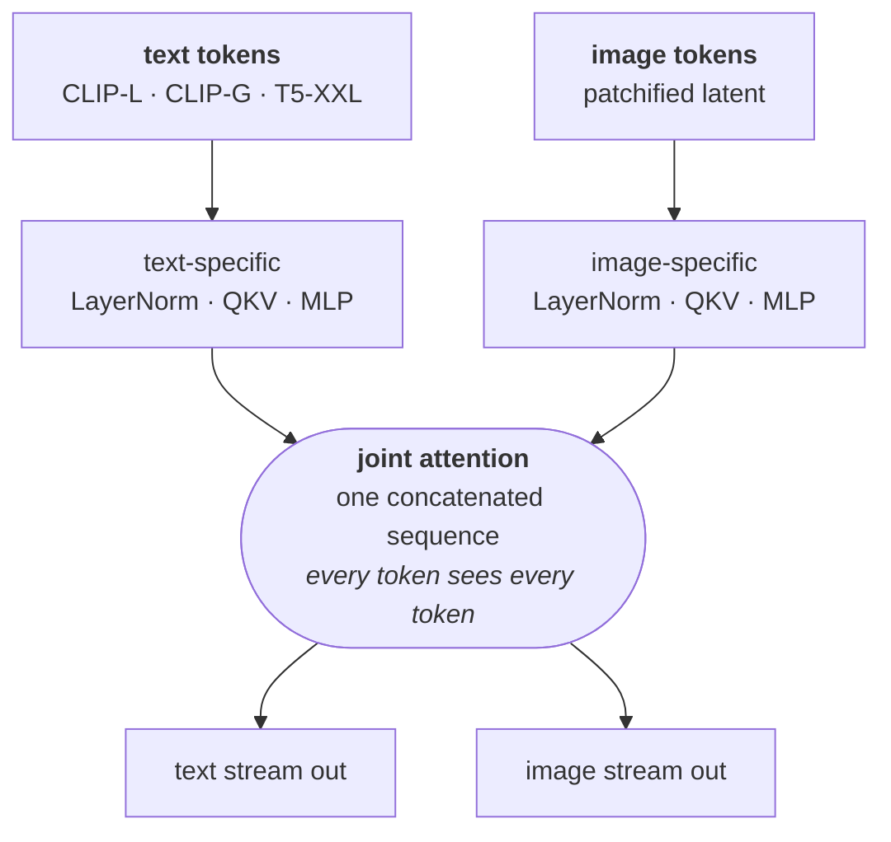
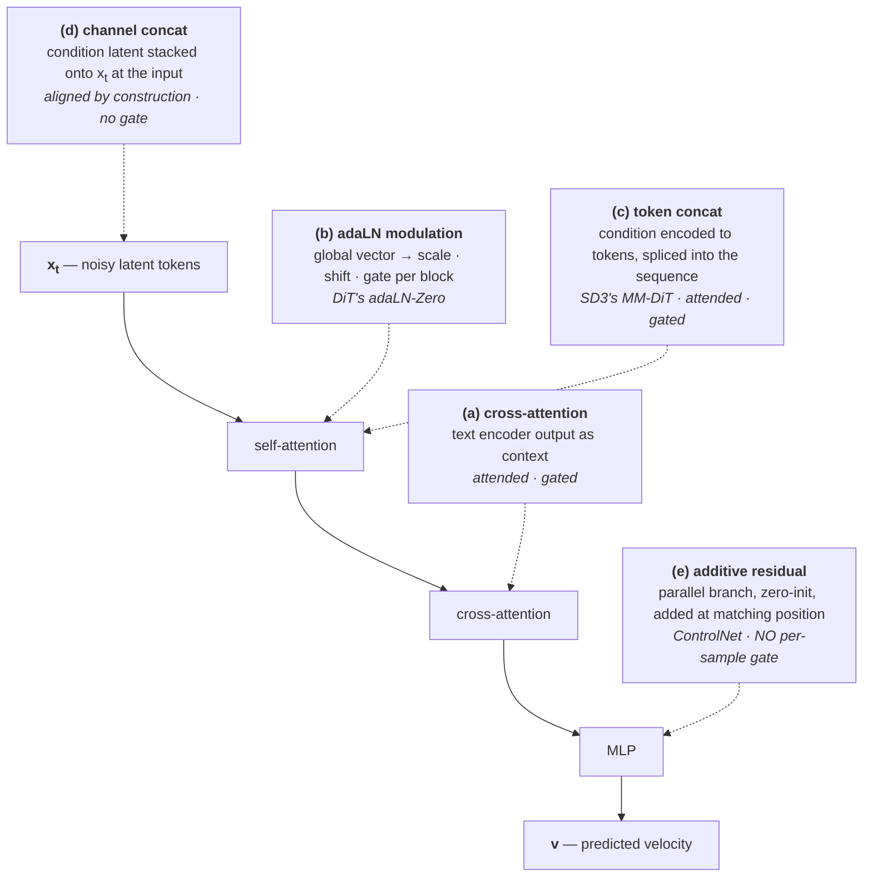

Background for [The Proxy Is the Contract](), which argues about an injection site without ever explaining what one is. Five papers, each with what it changed, what it optimises, and its main figure.

## TL;DR

**A video model is a learned vector field**, $$v_\theta(x_t, t, c)$$ — a function assigning a direction to every point in a compressed latent space. Generation drops a random point in and follows the arrows. $$c$$ selects *which* field; $$x_t$$ is *where you stand on it*. That distinction turns out to carry most of the weight.

**The stack converged in 2023 and nothing has moved since:** a 3D VAE compresses pixels ~8× spatially and ~4× temporally, the latent is cut into spatiotemporal patches, a Transformer predicts velocity, an ODE solver integrates it.

**The objective is one L2 regression.** Rectified flow: draw a straight line from noise to data, regress the network onto that line's velocity. No adversarial term, no KL, no auxiliaries. Everything a video model knows was bought with this single term.

**Conditioning has five structurally different entry points**, and DiT's own Figure 3 — the founding paper — puts three of them side by side. The distinction that matters is whether the site carries an *input-dependent gate*: cross-attention and token concatenation do, additive residuals do not.

**A model trained to "continue this video plausibly" will use that gate whenever the condition disagrees with the history.** This is why the choice of door is not an implementation detail, and why the two most interesting recent world models — Zing-0.5 and Code World Model — pick opposite doors and neither has run the experiment that separates them.

---

## 1 · What "the field" means

A generative model turns noise into data. Flow matching does it by defining a path between the two and learning, for any position at any time, which direction to move:

$$v_\theta(x_t,\,t) \;\approx\; \frac{dx}{dt}$$

Picture a wind map: every point in space carries an arrow. Generation releases a particle at a random location and lets the wind carry it somewhere plausible. Conditioning makes it $$v_\theta(x_t, t, c)$$ — a different wind map per prompt.

> $$c$$ selects which map. $$x_t$$ is where you stand on it. Changing the map is a request the model already learned how to weigh. Changing your position is not a request.

---

## 2 · DiT — the architecture

[arXiv:2212.09748](https://arxiv.org/abs/2212.09748) · Peebles & Xie · ICCV 2023

**What it changed.** Diffusion denoisers were U-Nets. DiT showed a plain Transformer works better and — the actual argument of the paper — *scales predictably*, with Gflops tracking FID cleanly. Every video model listed in this post is a DiT descendant.

**Architecture.** The noised VAE latent is patchified into a token sequence, run through N identical Transformer blocks, and projected back. Patch size $$p$$ controls sequence length: an $$I \times I$$ latent becomes $$T = (I/p)^2$$ tokens, so halving $$p$$ quadruples compute.

  

    
  

**Objective.** Still DDPM at this point, not flow matching: predict the noise $$\epsilon$$ with an MSE, plus a KL term for the learned covariance $$\Sigma$$. The flow-matching switch comes in §3.

**The main figure is the reason this paper leads the post.** Peebles & Xie tried four ways of feeding the conditioning signal in, and drew three of them next to each other:

  

    
  

Two things to take from it.

**adaLN-Zero.** The conditioning vector is passed through an MLP producing per-block scale, shift and *gate* parameters, and the gate ($$\alpha$$) is **initialised to zero** — so every block starts as an identity function and the network begins training as the unmodified residual stream. This is the ancestor of every zero-initialised adapter since, ControlNet included.

**Their ablation, and its scope.** Figure 5 reports adaLN-Zero beating cross-attention, which beats in-context conditioning, at every point in training. That is real evidence that *where* you inject changes outcomes a lot. But be careful transferring it: the condition being tested is an **ImageNet class label** — one low-bandwidth global scalar, exactly the payload modulation is best at. It says nothing directly about a dense spatial map, where the ordering is different. What it does establish is that the choice matters.

**Verdict:** the architecture everything is built on, and the origin of both zero-initialisation and the injection-site question.

---

## 3 · Rectified Flow — the objective

[arXiv:2209.03003](https://arxiv.org/abs/2209.03003) · Liu, Gong & Liu · ICLR 2023

**What it changed.** Replaced the diffusion SDE's curved probability paths with the simplest possible thing: a straight line. Fewer sampling steps, simpler math, better distillation behaviour.

**The objective, in four lines.** Convention: $$t{=}0$$ is noise, $$t{=}1$$ is data. Papers differ on direction — check before porting.

1. Take data $$x_1$$, noise $$x_0 \sim \mathcal{N}(0, I)$$, time $$t \sim U[0,1]$$
2. Interpolate on a straight line: $$x_t = (1-t)\,x_0 + t\,x_1$$
3. That line's velocity is constant: $$\text{target} = x_1 - x_0$$
4. Regress onto it:

$$\mathcal{L}=\mathbb{E}_{t,\,x_0,\,x_1}\Big\|\,v_\theta\big(x_t,\,t,\,c\big)-\big(x_1-x_0\big)\,\Big\|^2$$

That is the entire pretraining objective of a modern video model. One squared error.

  

    
  

**Reflow**, the paper's second idea: retrain on the model's own noise-data pairs to straighten paths further, enabling one- and two-step generation. This is the conceptual ancestor of the distillation work in §6.

> **Everything a video model knows was purchased by one regression term.** Its entire prior — how objects move, how light falls, what plausibly comes next — is the minimiser of that L2. Which is why adding a second loss term is a bigger decision than it looks: it moves the optimum away from the thing you were trying to keep.

**Verdict:** the objective. Read §1–2 and skip the rest unless you care about the theory.

---

## 4 · SD3 — where text and image meet

[arXiv:2403.03206](https://arxiv.org/abs/2403.03206) · Esser et al. · ICML 2024

**What it changed.** Two things: it settled rectified flow as the production objective for large-scale text-to-image, and it introduced **MM-DiT**, the block design behind essentially every "omni" multimodal model since — including the MiniMax-H3 backbone Code World Model builds on.

**MM-DiT.** Instead of image tokens cross-attending to a frozen text sequence, text and image tokens are concatenated into **one sequence and attend jointly** — but each modality keeps its *own* projection and MLP weights. Two sets of parameters, one attention operation:

The consequence is that **text and image representations influence each other in both directions**, rather than text being a fixed context the image queries. That is what turns "conditioning" into "in-context multimodality", and it is exactly the door Code World Model pushes its proxy frames through.

  

    
  

**Also worth knowing:** timestep sampling is **logit-normal** rather than uniform, concentrating training on middle noise levels where the task is hardest; and QK-normalisation prevents the attention-logit blowup that otherwise kills large-scale mixed-precision runs. Both are the kind of detail that is invisible in a method diagram and mandatory in an implementation.

**Verdict:** read §2 for the objective in production form and §3 for MM-DiT. The scaling study is optional.

---

## 5 · ControlNet — the other door

[arXiv:2302.05543](https://arxiv.org/abs/2302.05543) · Zhang, Rao & Agrawala · ICCV 2023

**What it changed.** Made spatially-dense conditioning — depth, pose, edges, segmentation — work on a frozen pretrained model without destroying it. It is the canonical instance of the *additive residual* injection site.

**Architecture.** Lock the original block. Make a trainable copy. Connect them with **zero convolutions** — 1×1 convs with weights and bias initialised to zero — on both the input and output of the copy.

  

    
  

  

    
  

**Objective.** Unchanged — the same diffusion loss the base model was pretrained with, with the control map as an extra input. **No auxiliary reconstruction term.** That restraint is the point and it is worth copying.

**Why zero init is the whole trick.** At step zero the added branch outputs exactly zero, so the network *is* the pretrained network and training starts from unharmed weights. The paper documents the resulting **"sudden convergence phenomenon"**: output looks like the unconditioned base model for thousands of steps, then abruptly starts obeying the control — the gate opening, visibly.

> The learned residual converges to *what the condition says that the base model did not already know*. That decomposition is architectural, not something written into the loss.

**Verdict:** the single most transferable paper here. Zero-init additive residual is the mechanism, and the argument for it generalises far past image control maps.

---

## 6 · Self-Forcing — how it gets to real time

[arXiv:2506.08009](https://arxiv.org/abs/2506.08009) · Huang et al. · 2025

**What it changed.** Autoregressive video models were trained on ground-truth context and then asked, at inference, to condition on **their own** generated frames. Self-Forcing closes that gap by training the way inference actually runs.

  

    
  

**Objective.** Not the plain diffusion loss. A **distribution-matching** objective (DMD lineage) computed over self-generated rollouts, which is what makes few-step generation viable — the student is scored on the distribution it produces, not on per-sample reconstruction.

**The systems half.** A **rolling KV cache** lets generation extend indefinitely without recomputing attention over the whole history, which is what turns "few-step" into "streaming".

  

    
  

This lineage — CausVid, Self-Forcing, DMD — is the engine under **every** real-time interactive world model, Zing-0.5 included. It is also exactly what Code World Model does *not* implement, which is why that paper states plainly that it has no autoregressive real-time generation.

**Verdict:** read Figure 1 and §3. The train/test distribution gap it names is a general lesson, not a video-specific one.

---

## 7 · The five doors

Assembling it. A conditioning signal can enter a DiT in five structurally different ways.

| | Site | Natural payload | Selectively ignorable |
| :-- | :-- | :-- | :-- |
| **(a)** | cross-attention | text — variable length, no spatial correspondence | **yes** |
| **(b)** | adaLN modulation | timestep, class, pooled text — one global vector | partly |
| **(c)** | token concat | reference images, proxy video, omni multimodal | **yes** |
| **(d)** | channel concat | first-frame image-to-video, where alignment is exact | no |
| **(e)** | additive residual | depth, pose, action — anything aligned to the output | **no** |

### The distinction that carries the weight

It is tempting to say attended conditioning "can be ignored" and additive conditioning cannot. Too strong. The precise version:

- **(a) and (c) carry an input-dependent gate.** Attention weights are computed per sample. When the condition disagrees with what the visual history implies, the model *can* attend to it less on that sample and more on others.
- **(e) has no per-sample gate.** The residual is added unconditionally. Suppressing it means driving the projection to zero for *every* sample — which also removes it where it helps.

> The question is not **whether** a channel can be ignored. It is whether it can be ignored **selectively**.
>
> A model whose entire objective is *continue this video plausibly* will reach for a selective gate exactly when the condition and the history disagree — which is exactly when a world model needs the condition to win.

Two observations line up, neither a controlled test of injection site, both pointing the same way:

- **Zing-0.5's headline demo is this argument.** The dragon keeps flying while it starts breathing fire, because the action residual keeps running while the text condition changes.
- **[WBench](https://arxiv.org/abs/2605.25874) Finding 5** measures the decay: navigation accuracy drops 21 points from turn 1 to turn 4, and dedicated world models degrade far less than text-conditioned ones — "explicit geometric control better preserves spatial state than text-based prompting."

### Why the modality picks the door

Not stylistic. It follows from whether the condition has a spatial correspondence to the output, and from what the operators are:

> **Cross-attention is permutation-invariant.** Shuffle the context tokens, get the same output. Right for *which entities exist*, wrong for *where they are on screen*.
>
> **An additive residual is spatially anchored.** It is added *at a position*. Exactly the reverse.

---

## 8 · Where the world models land

| | What it injects | Door | Trained |
| :-- | :-- | :-- | :-- |
| **Zing-0.5** (Loopit) | 8-DoF action → sin/cos → causal temporal conv | **(e)** per-frame residual, <10M params | action module |
| | text instruction | **(a)** cross-attention | — |
| **[Code World Model](https://arxiv.org/abs/2608.25927)** | proxy video, 11 frames sampled from 124 | **(c)** token concat into the multimodal encoder | rank-128 LoRA, all 50 blocks, ~596M |
| | text description | **(c)** same sequence | — |

**They take opposite sides**, for different payloads, and neither has published the experiment that separates them: *does the channel win when it contradicts the model's own continuation prior?*

That experiment is cheap. Construct clips where the condition specifies an outcome the naive continuation would not produce, and report how often the generation follows the condition rather than the history. Every qualitative figure in both papers shows cases where condition and prior agree, which is precisely the regime that cannot answer it.

---

## Appendix · CFG, and where an authority dial comes from

[arXiv:2207.12598](https://arxiv.org/abs/2207.12598) · Ho & Salimans · 2022. Two pages, and the reason every conditioning channel has a knob.

**Training:** with probability $$p_\text{uncond}$$, replace the condition with a learned null embedding $$\varnothing$$. One model, both behaviours.

**Sampling:** extrapolate away from the unconditional prediction, through the conditional one, and past it:

$$\tilde v = v(x,t,\varnothing) + w\cdot\big(v(x,t,c) - v(x,t,\varnothing)\big)$$

  

    
  

A convention warning: the original paper writes $$\tilde\epsilon = (1+w)\epsilon(z,c) - w\,\epsilon(z)$$, so their $$w{=}0$$ is ordinary conditional sampling. Most codebases expose $$1+w$$ and call it "guidance scale", typically 5–7.

**The cost is documented in the original and is not a caveat anyone invented later:** the paper's own Figure 3 notes that strongly guided samples "display saturated colors", and its tables show FID *worsening* monotonically as IS improves — 1.80 → 24.83 on ImageNet 64 as $$w$$ goes 0 → 3. Obedience is bought with realism, and the exchange rate is steep.

Applied to a state channel rather than a text prompt, this is a single scalar for *how hard the world's state overrides the renderer's prior* — low for cinematic content, high for simulation. It comes free with the conditioning-variable formulation, which is a large part of why that formulation is worth having.
